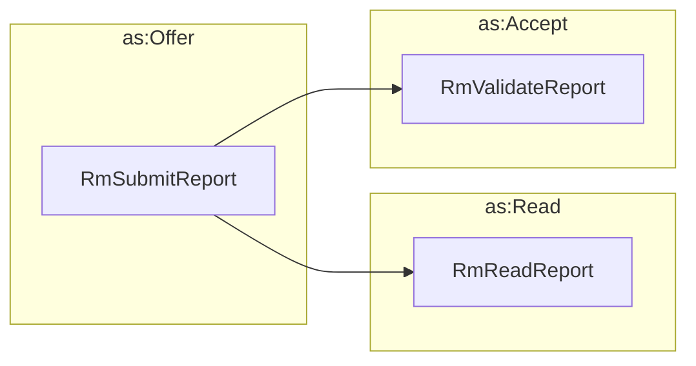

# Acknowledging Other Messages

The ActivityStreams vocabulary includes several activities that can be used to
indicate that a message or object has been read or acknowledged. These include:

- `as:Read`
- `as:View`
- `as:Listen`

Since most CVD cases are text-centric, we expect that the `as:Read` activity
will be the most commonly used. However, we also expect that the `as:View` and
`as:Listen` activities will be used in some cases, such as when a case
participant views a video or listens to an audio recording.

We specifically defined `RmReadReport` as a subclass of `as:Read` to indicate
that a report has been read. This allows the receiver of a report to
acknowledge receipt without indicating anything more than that the report has
been read. That leaves `RmValidateReport` and `RmInvalidateReport` to indicate
a more specific action on the part of the receiver.

!!! info "More Acknowledgements in the Ontology"

    The [Vultron AS ontology](../../reference/ontology/vultron_as.md) defines a
    number of ActivityStreams activities that can serve as the various acknowledgements that are used in the Vultron
    protocol. These include messages that are specifically `as:inReplyTo` a
    message defined as one of the core protocol message types.

    For example, it is not necessary to send a separate `RmReadReport` message
    if the `RmValidateReport` message is sent as a reply to the `RmSubmitReport`
    message. The `RmValidateReport` message logically indicates that the
    report has been read in order to have been validated.

!!! tip "Like, Dislike and Flag"

    ActivityStreams vocabulary also includes actions that indicate an opinion 
    about a message or object, such as `as:Like`, `as:Dislike`, and `as:Flag`.
    While these may be relevant to implementations of the Vultron protocol, we
    do not have specific use cases for them at this time.
