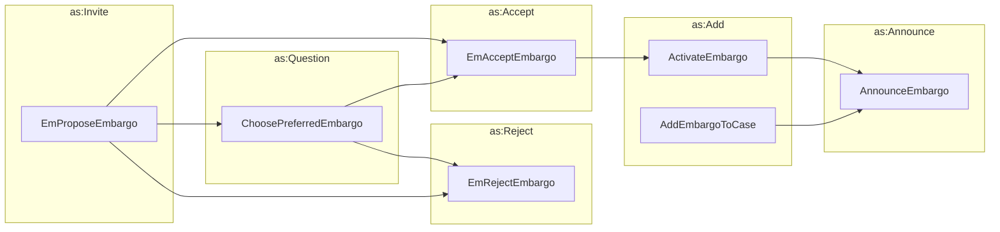

# Establishing an Embargo

```mermaid
flowchart LR
    subgraph as:Invite
        EmProposeEmbargo
    end
    subgraph as:Question
        ChoosePreferredEmbargo
    end
    subgraph as:Accept
        EmAcceptEmbargo
    end
    subgraph as:Reject
        EmRejectEmbargo
    end
    subgraph as:Announce
        AnnounceEmbargo
    end
    subgraph as:Add
        ActivateEmbargo
        AddEmbargoToCase
    end
    EmProposeEmbargo --> EmAcceptEmbargo
    EmProposeEmbargo --> ChoosePreferredEmbargo
    ChoosePreferredEmbargo --> EmAcceptEmbargo
    EmProposeEmbargo --> EmRejectEmbargo
    ChoosePreferredEmbargo --> EmRejectEmbargo
    EmAcceptEmbargo --> ActivateEmbargo
    AddEmbargoToCase --> AnnounceEmbargo
    ActivateEmbargo --> AnnounceEmbargo
```
