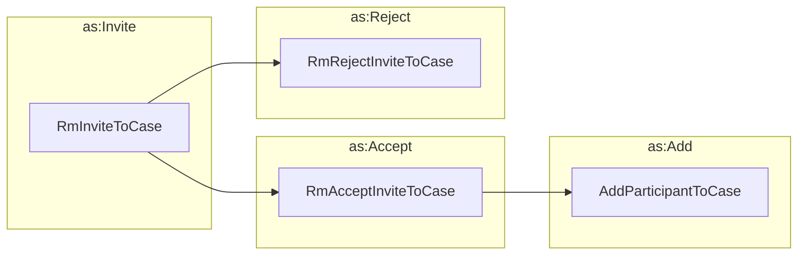

# Inviting an Actor to a Case

```mermaid
flowchart LR
    subgraph as:Invite
        RmInviteToCase
    end
    subgraph as:Accept
        RmAcceptInviteToCase
    end
    subgraph as:Reject
        RmRejectInviteToCase
    end
    subgraph as:Add
        AddParticipantToCase
    end
    RmInviteToCase --> RmAcceptInviteToCase
    RmInviteToCase --> RmRejectInviteToCase
    RmAcceptInviteToCase --> AddParticipantToCase
```
