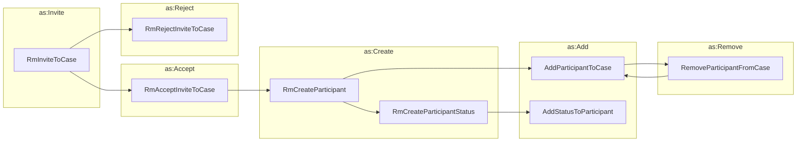

# Managing Case Participants

Typically most cases involve multiple participants, having various roles
within the case. While the most common activities are inviting and adding
participants, we've also included activities for removing participants.

create, add, remove, status updates

!!! tip "Create or Add, once again"

    Again, there appears to be some logical interchangeability of `as:Create` 
    with `as:Add` since both include a `target` property that can be used to
    specify the object to which the new object is being added. We chose to 
    represent them separately here to acknowledge the difference between
    creating a new object and adding an existing object to another object, but
    in an actual implementation it may be acceptable to use either activity for
    both cases.
