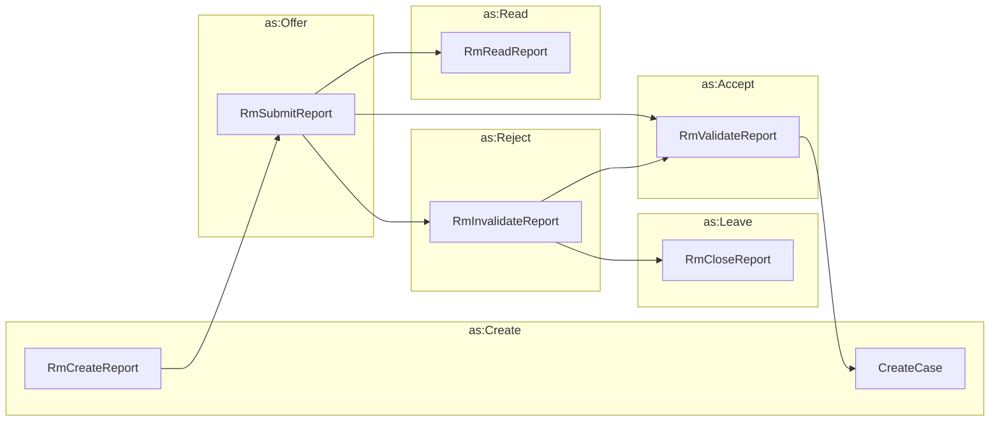

# Reporting a Vulnerability

```mermaid
flowchart LR
    subgraph as:Create
        RmCreateReport
        CreateCase
    end
    subgraph as:Read
        RmReadReport
    end
    subgraph as:Offer
        RmSubmitReport
    end
    subgraph as:Accept
        RmValidateReport
    end
    subgraph as:Reject
        RmInvalidateReport
    end
    subgraph as:Leave
        RmCloseReport
    end
    
    RmCreateReport --> RmSubmitReport
    RmSubmitReport --> RmReadReport
    RmSubmitReport --> RmValidateReport
    RmSubmitReport --> RmInvalidateReport
    RmInvalidateReport --> RmValidateReport
    RmValidateReport --> CreateCase
    RmInvalidateReport --> RmCloseReport
```
