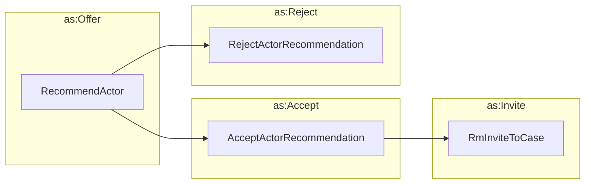

# Suggesting an Actor for a Case

```mermaid
flowchart LR
    subgraph as:Offer
        RecommendActor
    end
    subgraph as:Accept
        AcceptActorRecommendation
    end
    subgraph as:Reject
        RejectActorRecommendation
    end
    subgraph as:Invite
        RmInviteToCase
    end
    RecommendActor --> AcceptActorRecommendation
    RecommendActor --> RejectActorRecommendation
    AcceptActorRecommendation --> RmInviteToCase
```
