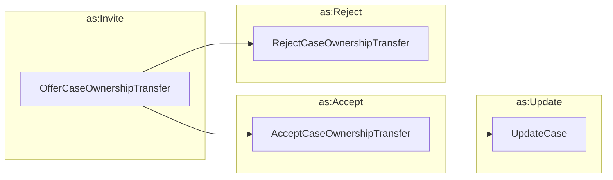

# Transferring Case Ownership

This was not part of the original Vultron protocol, but it seems like a
reasonable extension that could be useful in some cases, such as transferring a
case

- from a researcher to a vendor
- from a vendor to an upstream vendor
- from a vendor to a coordinator
- from a coordinator to a vendor
- between coordinators

