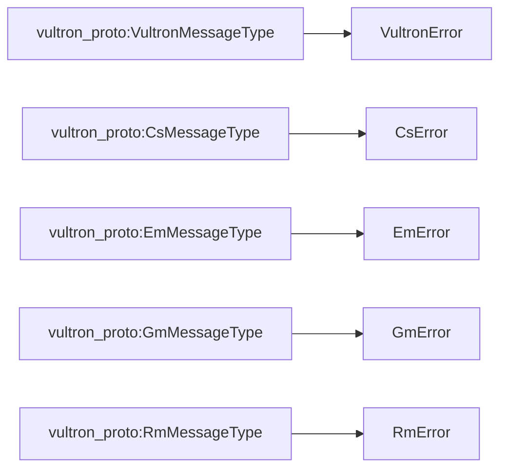

# Error Handling

While the ActivityStreams vocabulary doesn't include any specific error messages,
we can use the `as:Reject` activity to indicate that a message has been rejected
for some reason. We specify a number of specific error messages that can be
indicated based on what kind of message they are `as:inReplyTo`.

