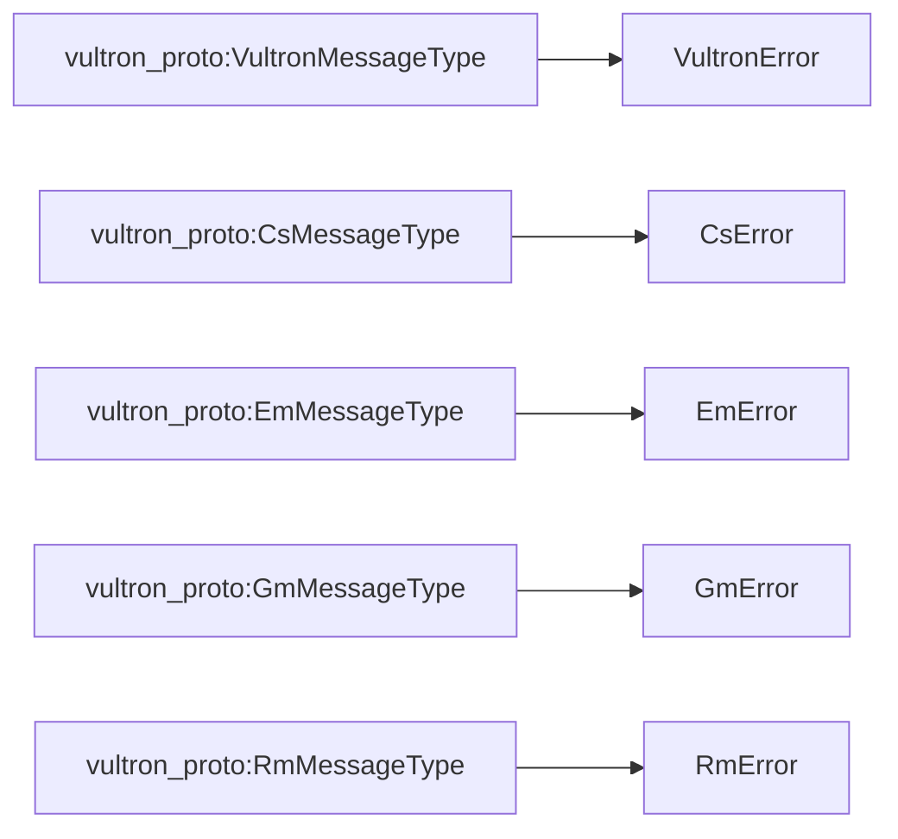

# Error Handling

While the ActivityStreams vocabulary doesn't include any specific error messages,
the `as:Reject` activity indicates that a message has been rejected
for some reason. A number of specific error messages are defined
based on what kind of message they are `as:inReplyTo`.

```mermaid
flowchart LR

    vultron_proto:VultronMessageType --> VultronError
    vultron_proto:CsMessageType --> CsError
    vultron_proto:EmMessageType --> EmError
    vultron_proto:GmMessageType --> GmError
    vultron_proto:RmMessageType --> RmError
```
