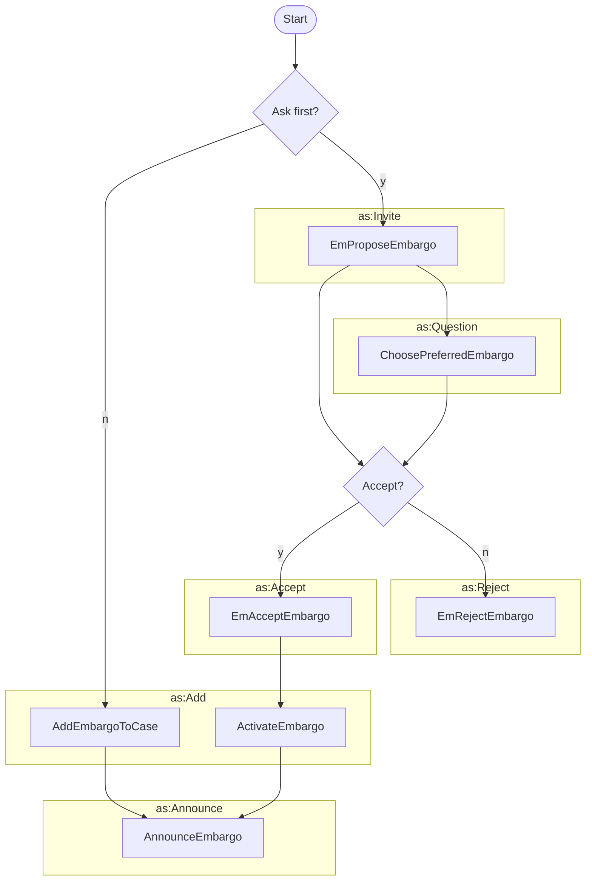

# Establishing an Embargo



The process to establish an embargo for a case can start in
one of two ways:

- Any participant can propose an embargo for a case. This is the most common
  way to establish an embargo.
- The case owner can add an embargo to a case without proposing it first. In some circumstances, this might be an
  appropriate way to establish an embargo.

<!-- for vertical spacing -->
 



!!! question "Why would you add an embargo without asking first?"

    There are a few reasons why you might want to add an embargo to a case without
    asking first. For example, when the finder is also the case owner and hasn't invited any other participants to join
    the case yet, the finder can just add an embargo. Then when the finder invites others to join the case, the invited
    participants can
    decide whether to accept the embargo or not. This could be an appropriate way to address the concept of
    [Default Embargoes](../../../topics/process_models/em/defaults.md).








