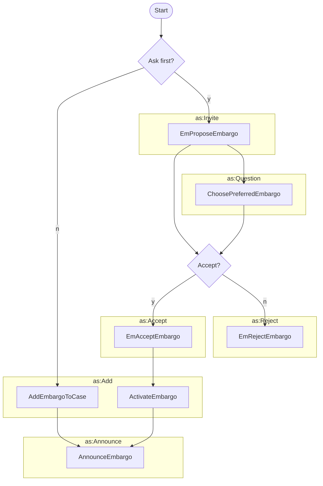

# Establishing an Embargo



The process to establish an embargo for a case can start in
one of two ways:

- Any participant can propose an embargo for a case. This is the most common
  way to establish an embargo.
- The case owner can add an embargo to a case without proposing it first. In some circumstances, this might be an
  appropriate way to establish an embargo.

<!-- for vertical spacing -->
<br/>



Add an embargo without proposing it first when the terms are already settled —
when no other participants have joined the case yet, or when your published
default embargo applies and nobody has proposed anything to the contrary. Actors
invited later decide for themselves whether to accept it. For why a newly created
case can already carry an active embargo with no visible proposal exchange, see
[Default Embargoes](../../../topics/process_models/em/defaults.md).


```mermaid
flowchart TB
    subgraph as:Invite
        EmProposeEmbargo
    end
    subgraph as:Question
        ChoosePreferredEmbargo
    end
    subgraph as:Accept
        EmAcceptEmbargo
    end
    subgraph as:Reject
        EmRejectEmbargo
    end
    subgraph as:Announce
        AnnounceEmbargo
    end
    subgraph as:Add
        ActivateEmbargo
        AddEmbargoToCase
    end
    start([Start]) --> f{Ask first?}
    f -->|n| AddEmbargoToCase
    f -->|y| EmProposeEmbargo
    EmProposeEmbargo --> a{Accept?}
    a -->|y| EmAcceptEmbargo
    a -->|n| EmRejectEmbargo
    EmProposeEmbargo --> ChoosePreferredEmbargo
    ChoosePreferredEmbargo --> a
    EmAcceptEmbargo --> ActivateEmbargo
    AddEmbargoToCase --> AnnounceEmbargo
    ActivateEmbargo --> AnnounceEmbargo
```









## Demo

!!! example "Try it: `vultron-demo establish-embargo`"

    Run this workflow end-to-end with the unified demo CLI:

    ```bash
    vultron-demo establish-embargo
    ```

    Or with Docker Compose:

    ```bash
    DEMO=establish-embargo docker compose -f docker/docker-compose.yml run --rm demo
    ```
