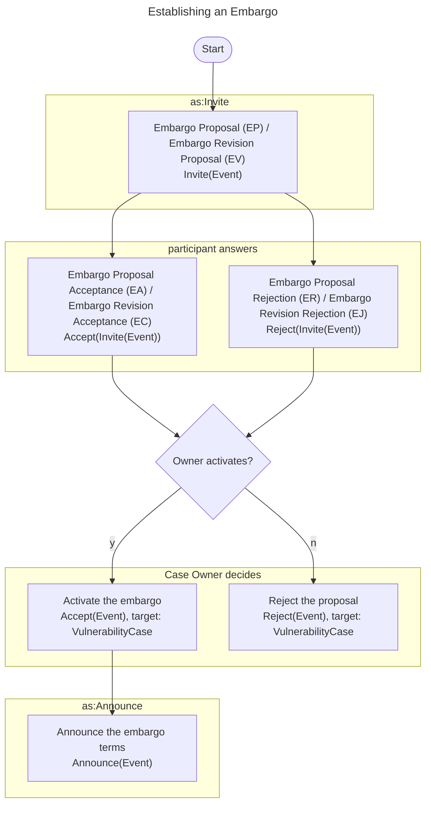

# How to Establish an Embargo

Use this guide to put a case under embargo.
An embargo starts as a proposal, and the Case Owner activates it, either after collecting the other participants' answers or at once when the terms are already settled.
You finish with the case at Embargo Management (EM) state `EM.ACTIVE` and the terms announced to every participant.

---

## Prerequisites



- An existing case with no active embargo.
  A case carries at most one.
- The Case Owner role, for activating an embargo.
  Any participant can propose one.
- The embargo terms you intend to propose — at minimum, an end date and time.

!!! note "Embargo Management is a model of its own"

    The Vultron protocol carries considerable detail about [Embargo Management](../../../topics/process_models/em/index.md) and how participants are expected to interact with embargoes.
    Read that section before designing embargo behavior.

---

## The exchange

The flowchart below shows the route to `EM.ACTIVE`.
Each participant's answer to the Invite records its own consent; the Case Owner's decision is a separate activity on the embargo itself.


```mermaid
---
title: Establishing an Embargo
---
flowchart TB
    subgraph as:Invite
        EmProposeEmbargo["Embargo Proposal (EP) / Embargo Revision Proposal (EV)<br/>Invite(Event)"]
    end
    subgraph participant answers
        EmAcceptEmbargo["Embargo Proposal Acceptance (EA) / Embargo Revision Acceptance (EC)<br/>Accept(Invite(Event))"]
        EmRejectEmbargo["Embargo Proposal Rejection (ER) / Embargo Revision Rejection (EJ)<br/>Reject(Invite(Event))"]
    end
    subgraph Case Owner decides
        ActivateEmbargo["Activate the embargo<br/>Accept(Event), target: VulnerabilityCase"]
        RejectEmbargoProposal["Reject the proposal<br/>Reject(Event), target: VulnerabilityCase"]
    end
    subgraph as:Announce
        AnnounceEmbargo["Announce the embargo terms<br/>Announce(Event)"]
    end
    start([Start]) --> EmProposeEmbargo
    EmProposeEmbargo --> EmAcceptEmbargo
    EmProposeEmbargo --> EmRejectEmbargo
    EmAcceptEmbargo --> d{Owner activates?}
    EmRejectEmbargo --> d
    d -->|y| ActivateEmbargo
    d -->|n| RejectEmbargoProposal
    ActivateEmbargo --> AnnounceEmbargo
```

---

## Negotiate the terms

Embargo Proposal (EP) is implemented in ActivityStreams as `Invite(Event)`.
The same activity carries a revision, Embargo Revision Proposal (EV); a receiver tells the two apart from the case's EM state rather than from the activity (MSM-02).

1. Send `Invite(Event)` with the proposed `EmbargoEvent` as its `object` and the case as its `context`.
   The case moves to `EM.PROPOSED`.
2. Each participant answers with Embargo Proposal Acceptance (EA), `Accept(Invite(Event))`, or Embargo Proposal Rejection (ER), `Reject(Invite(Event))`.
   Either answer records only that participant's own consent, the Case Owner's included; the case stays at `EM.PROPOSED`.
3. As Case Owner, send `Accept(Event)` with the proposed `EmbargoEvent` as its `object` and the case as its `target`, once you judge the proposal has carried.
   The case moves to `EM.ACTIVE`, and your own consent to the terms is recorded with it.
4. Send `Announce(Event)` so every participant has the terms in hand.

To turn the proposal down, send `Reject(Event)` with the same `object` and `target` as Case Owner instead.
The case returns to `EM.NONE` and the negotiation is open again.
Propose revised terms with another `Invite(Event)`.

Propose one set of terms at a time.
That is how the protocol resolves competing terms, not a workaround: there is no poll across candidate embargoes ([ADR-0100](../../../adr/0100-no-multi-candidate-embargo-poll.md)).
You may put several sets of terms on the table by sending a separate `Invite(Event)` for each, and each is then accepted or rejected on its own.
When more than one proposal is open, Participants take the one with the earliest end date first and treat the rest as revisions (EP-08).
See [Default Embargoes](../../../topics/process_models/em/defaults.md).

---

## Activate settled terms without waiting

There is no way to put an embargo on a case except by proposing it: adding an embargo to the case is what proposing does.
When the terms need no negotiation, propose them as Case Owner and activate them at once, without waiting for any answer.

1. Send `Invite(Event)` as above.
   Proposing the terms records your consent to them.
2. Send `Accept(Event)` with the case as its `target`.
3. Send `Announce(Event)`.

Use this route when the terms need no negotiation:

- no other participant has joined the case yet, or
- your published `EmbargoPolicy` applies and nobody has proposed anything to the contrary.

The other participants still receive the Invite and answer it, and only those that agree are bound, so activating at once binds nobody who did not agree.

!!! note "A new case may already be embargoed"

    An embargo-eligible case begins with an active embargo even when no proposal exchange is visible, because a Protocol Default applies when no proposal and no actor default does.
    A Reporter who wants other terms states them on the report Offer rather than by a proposal exchange; see [How to Report a Vulnerability](report_vulnerability.md#submit-a-report) and the `report-with-embargo` demo there.
    See [Default Embargoes](../../../topics/process_models/em/defaults.md).

---

## Verify

| What you sent | What to confirm |
|---|---|
| `Invite(Event)` | The case `em_state` is `PROPOSED`. |
| `Accept(Invite(Event))` | Your [embargo consent](../../../topics/behavior_logic/use-cases/embargo-lifecycle.md#which-messages-move-consent) row for the embargo is `ACCEPTED` (you are a signatory), as [§9 Participant Embargo Consent (PEC) State Machine in the specification](../../../reference/vultron-spec/tracking-models.md#9-participant-embargo-consent-pec-state-machine-n) defines it. |
| `Accept(Event)` with the case as `target`, as Case Owner | The case `em_state` is `ACTIVE`, the case names one active embargo, and your consent row for it is `ACCEPTED`. |
| `Reject(Event)` with the case as `target`, as Case Owner | The case `em_state` is `NONE` and no participant's consent row changed. |
| `Announce(Event)` | Every participant's replica carries the same active embargo ID. |

---

## See it end to end

!!! example "Try it: `vultron-demo establish-embargo`"

    ```bash
    vultron-demo establish-embargo
    ```

    Or with Docker Compose:

    ```bash
    DEMO=establish-embargo docker compose -f docker/docker-compose.yml run --rm demo
    ```

    The scenario runs both the accepted and the rejected proposal.

---

## Further reading

- [Embargo Management (EM) Messages](../../../reference/messages/em.md) — the wire format and a rendered example for each activity above
- [Embargo Management](../../../topics/process_models/em/index.md) — the state machine these activities drive
- [Negotiating Embargoes](../../../topics/process_models/em/negotiating.md) — how to choose terms other parties will accept
- [§9 Participant Embargo Consent (PEC) State Machine in the specification](../../../reference/vultron-spec/tracking-models.md#9-participant-embargo-consent-pec-state-machine-n) — the Participant Embargo Consent (PEC) state machine that records each participant's own answer to a proposal
- [How to Revise or Terminate an Embargo](manage_embargo.md) — what to do once the embargo is active
- [Trigger API Reference](../../../reference/trigger-api.md#embargo-management) — request schema and endpoint details for `propose-embargo`, `accept-embargo`, and `reject-embargo`
