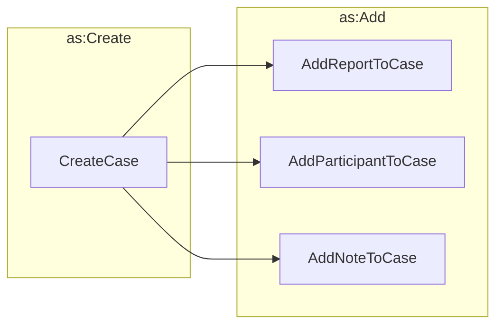

# Initializing a Case



The process of initializing a case involves creating the case and then adding at least one
report, at least one participant, and any notes to the case.

!!! tip "Combining steps"

    It is not always necessary for these steps to be performed individually.
    It would be reasonable to create a case with the report and appropriate
    participants and notes all in the initial case object. We have broken
    these steps out individually to make it easier to understand the
    process.





