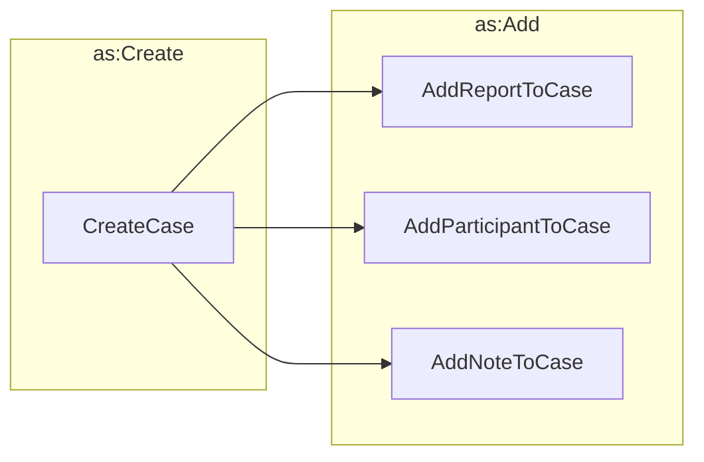

# How to Initialize a Case

Use this guide to open a `VulnerabilityCase` after validating a report.
Initialization seats the case, attaches at least one report, seats at least one
participant, and attaches any opening notes.
You finish with a case whose roster and report are in place and whose ledger has
its genesis entry.

---

## Prerequisites



- A report at Report Management (RM) state `RM.VALID`. See
  [How to Report a Vulnerability](report_vulnerability.md).
- The actor URIs of any participants you already know about, such as the
  Reporter.

---

## The exchange

The flowchart below shows the four activities case initialization can use.
The three `as:Add` activities branch from `CreateCase` because each attaches a
different kind of object to the new case.


```mermaid
flowchart LR
    subgraph as:Create
        CreateCase
    end
    subgraph as:Add
        AddReportToCase
        AddParticipantToCase
        AddNoteToCase
    end
    CreateCase --> AddReportToCase
    CreateCase --> AddParticipantToCase
    CreateCase --> AddNoteToCase
```

---

## Seat the case

1. Send `CreateCase`, carrying the new `VulnerabilityCase` as its `object`.
   Set yourself as Case Owner.
2. Attach the report with `AddReportToCase`, targeting the case.
3. Seat each participant you already know with `AddParticipantToCase`, targeting
   the case.
4. If the case needs opening context, attach it with `AddNoteToCase`. See
   [How to Publish a Status Update or a Note](status_updates.md).

If every report, participant, and note is known when you create the case, carry
them inline on the `CreateCase` activity and skip steps 2 through 4.
The steps are separated here because they are easier to follow one at a time, not
because a conformant implementation must emit them individually.

If a participant becomes known later, seat it with its own activity pair — see
[How to Seat a Participant on an Existing Case](initialize_participant.md).
If the actor has not agreed to join, invite it instead:
[How to Invite an Actor to a Case](invite_actor.md).

!!! warning "A second report needs its own `Add`"

    A case can accumulate reports.
    When a second report arrives for a case that already has one, attach it with
    `AddReportToCase` rather than creating a new case.

---

## Verify

| What you sent | What to confirm |
|---|---|
| `CreateCase` | The case exists and names you as Case Owner. |
| `AddReportToCase` | The case lists the report. |
| `AddParticipantToCase` | The case roster holds the participant with its roles. |
| `AddNoteToCase` | The note appears on the case. |

Every one of these is committed to the case ledger by the CASE_MANAGER and fanned
out to each participant, so each participant's replica should show the same
roster.

---

## See it end to end

!!! example "Try it: `vultron-demo initialize-case`"

    ```bash
    vultron-demo initialize-case
    ```

    Or with Docker Compose:

    ```bash
    DEMO=initialize-case docker compose -f docker/docker-compose.yml run --rm demo
    ```

---

## Further reading

- [Case Management Messages](../../../reference/messages/case_management.md) —
  the wire format and a rendered example for each activity above
- [Activity Vocabulary Design](../../../topics/activity_vocabulary_design.md) —
  why creation and attachment are separate verbs, and when inlining an object is
  worth having
- [Case Ledger Synchronization](../../../topics/case_lifecycle/case_ledger_sync.md)
  — how the activities above reach every participant's replica
