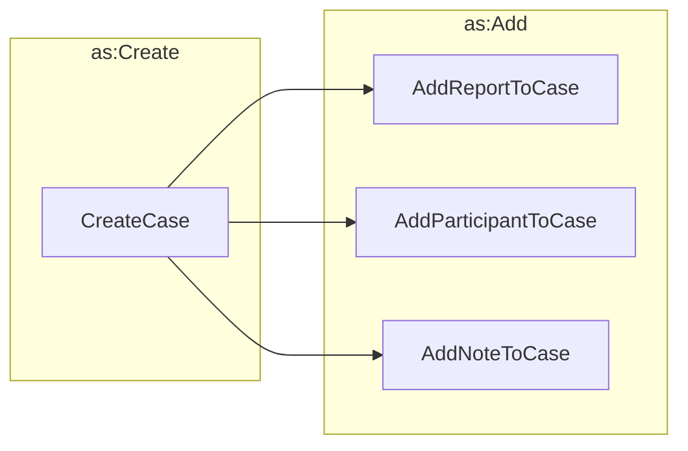

# Initializing a Case



The process of initializing a case involves creating the case and then adding at least one
report, at least one participant, and any notes to the case.


```mermaid
flowchart LR
    subgraph as:Create
        CreateCase
    end
    subgraph as:Add
        AddReportToCase
        AddParticipantToCase
        AddNoteToCase
    end
    CreateCase --> AddReportToCase
    CreateCase --> AddParticipantToCase
    CreateCase --> AddNoteToCase
```

These steps do not have to be performed individually. A case may be created with
its report, participants, and notes already inline in the initial case object;
the steps are broken out here because the individual steps are easier to follow.
See
[Activity Vocabulary Design](../../../topics/activity_vocabulary_design.md)
for the reasoning.






## Demo

!!! example "Try it: `vultron-demo initialize-case`"

    Run this workflow end-to-end with the unified demo CLI:

    ```bash
    vultron-demo initialize-case
    ```

    Or with Docker Compose:

    ```bash
    DEMO=initialize-case docker compose -f docker/docker-compose.yml run --rm demo
    ```
