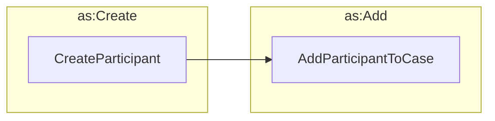

# Initializing a CaseParticipant



It may not always be necessary to generate a new `CreateParticipant` activity when creating a new `VulnerabilityCase`
object. It is possible to create a new `VulnerabilityCase` object and add a new `CaseParticipant` object to it in a
single `Create` activity.

However, there times when all the case participants are not known at the time the case is created. For example, a
finder might report a vulnerability to a coordinator, who then creates a new case. The relevant vendors might not be
known at the time the case is created, but they might be added later. In this scenario, the coordinator would create the
case with just the coordinator and the finder/reporter to start, and then add the vendors as participants in separate
steps as they are identified.

!!! question "What's the difference between a Case Participant and an Actor?"

    ActivityStreams actor objects are used to represent long-lived identities of people, organizations, groups, or 
    software agents.
    The `CaseParticipant` object is a wrapper around an `as:Actor` object that associates the actor with a specific
    `VulnerabilityCase` object. 
    This is done so that an actor can be associated with multiple cases, each with 
    different roles and statuses contextual to the individual cases.



