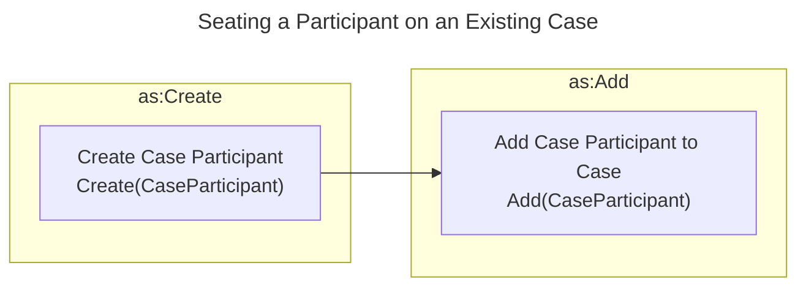

# How to Seat a Participant on an Existing Case

Use this guide when an actor has already agreed to join a case and you need to seat it.
Seating is two activities: mint a `CaseParticipant` record, then attach it to the case.
You finish with the actor on the case roster, holding the roles you assigned.

---

## Prerequisites



- An existing case, and the Case Owner role on it.
- The actor's Uniform Resource Identifier (URI), and its agreement to join. An actor
  that has not agreed is invited, not seated — see
  [How to Invite an Actor to a Case](invite_actor.md).
- The set of roles the actor will hold on this case.

---

## The exchange

The flowchart below shows the two activities in order. The `Create` mints the per-case
binding; the `Add` attaches it to the case.


```mermaid
---
title: Seating a Participant on an Existing Case
---
flowchart LR
    subgraph as:Create
        CreateParticipant["Create Case Participant<br/>Create(CaseParticipant)"]
    end
    subgraph as:Add
        AddParticipantToCase["Add Case Participant to Case<br/>Add(CaseParticipant)"]
    end
    CreateParticipant --> AddParticipantToCase
```

---

## Seat the participant

1. Send `Create(CaseParticipant)`, carrying a `CaseParticipant` that wraps the actor and
   names its roles on this case. Name the case in `context` — dispatch discriminates on
   it, so a `Create` without it matches no pattern.
2. Send `Add(CaseParticipant)`, naming the case in `target`.

If the participant's opening status is already known, carry it inline on the
`CaseParticipant` object rather than sending a separate status pair. A fully expanded
seating is four activities; an inline one is a single `Add`, and both express the same
outcome.

If all participants are known when the case is created, seat them inline on the
`Create(VulnerabilityCase)` activity instead — see
[How to Initialize a Case](initialize_case.md).

!!! note "The binding is per case"

    A `CaseParticipant` binds one `as:Actor` to one `VulnerabilityCase`, so the same
    long-lived actor identity can hold different roles and statuses in each case it
    works. Seat the actor again, with its own `CaseParticipant`, for each case.

---

## Verify

The case roster holds the new `CaseParticipant` with the roles you assigned, and the
seating appears as a ledger entry on every participant's replica.

---

## See it end to end

!!! example "Try it: `vultron-demo initialize-participant`"

    ```bash
    vultron-demo initialize-participant
    ```

    Or with Docker Compose:

    ```bash
    DEMO=initialize-participant docker compose -f docker/docker-compose.yml run --rm demo
    ```

---

## Further reading

- [Case Management Messages](../../../reference/messages/case_management.md) —
  the wire format and a rendered example for both activities above
- [Vultron AS Objects](../../../reference/activitypub/objects.md#caseparticipant)
  — the ActivityStreams (AS) `CaseParticipant` object these activities carry
- [Activity Vocabulary Design](../../../topics/activity_vocabulary_design.md) —
  why the binding is per case, and when to collapse the two activities into one
