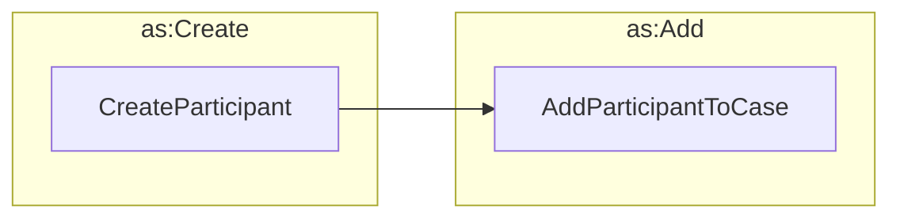

# Initializing a CaseParticipant



Use a separate `CreateParticipant` activity when the case participants are not
all known at the time the case is created. When they are known, a single
`Create` activity can carry the `VulnerabilityCase` and its `CaseParticipant`
objects together.

A [`CaseParticipant`](../../../reference/activitypub/objects.md#caseparticipant)
wraps an `as:Actor` and binds it to one `VulnerabilityCase`. For why the binding
is per-case, and for when to collapse these two activities into one, see
[Activity Vocabulary Design](../../../topics/activity_vocabulary_design.md).


```mermaid
flowchart LR
    subgraph as:Create
        CreateParticipant
    end
    subgraph as:Add
        AddParticipantToCase
    end
    CreateParticipant --> AddParticipantToCase
```




## Demo

!!! example "Try it: `vultron-demo initialize-participant`"

    Run this workflow end-to-end with the unified demo CLI:

    ```bash
    vultron-demo initialize-participant
    ```

    Or with Docker Compose:

    ```bash
    DEMO=initialize-participant docker compose -f docker/docker-compose.yml run --rm demo
    ```
