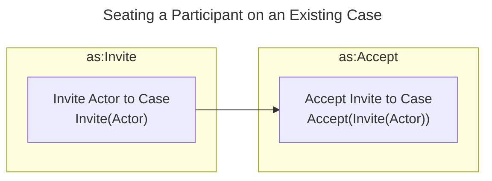

# How to Seat a Participant on an Existing Case

Use this guide when an actor must join a case that already exists.
An actor joins only by accepting the stub Invite the CASE_MANAGER sends it; no other message seats a member.
You finish with the actor on the case roster, holding the roles you assigned, and on every participant's replica.

---

## Prerequisites



- An existing case, and the Case Owner role on it.
- The actor's Uniform Resource Identifier (URI).
- The set of roles the actor will hold on this case.

---

## The exchange

The flowchart below shows the two activities that seat the actor.
The CASE_MANAGER sends the `Invite` at your request; the actor's `Accept` seats it.


```mermaid
---
title: Seating a Participant on an Existing Case
---
flowchart LR
    subgraph as:Invite
        RmInviteToCase["Invite Actor to Case<br/>Invite(Actor)"]
    end
    subgraph as:Accept
        RmAcceptInviteToCase["Accept Invite to Case<br/>Accept(Invite(Actor))"]
    end
    RmInviteToCase --> RmAcceptInviteToCase
```

---

## Seat the participant

1. Ask the CASE_MANAGER to invite the actor, naming the roles it will hold — see [How to Invite an Actor to a Case](invite_actor.md).
   The CASE_MANAGER sends the stub `Invite(Actor)` and records an inert `CaseParticipant` for the actor, with the roles the Invite names.
2. The actor answers `Accept(Invite(Actor))` to the CASE_MANAGER.
   The CASE_MANAGER commits the `Accept` as a ledger entry and seats the actor.
3. The CASE_MANAGER sends the new participant the case and the ledger it missed, then the full-case Invite that asks it to judge the case.
   The ledger holds the messages exchanged: the CASE_MANAGER's entry for creating the inert record, then the invitee's `Accept(Invite(Actor))` itself, which every other replica applies, and the CASE_MANAGER's entry for a vendor's VF status.

If all participants are known when the case is created, seat them inline on the `Create(VulnerabilityCase)` activity instead — see [How to Initialize a Case](initialize_case.md).

!!! warning "`Add(CaseParticipant)` does not seat a member"

    `Add(CaseParticipant)` is the Case Owner's request to reinstate a participant it removed earlier.
    The CASE_MANAGER refuses an `Add` that names an actor that never joined, so an `Add` cannot take the place of the Invite.
    See [How to Manage a Case Roster](manage_participants.md#reinstate-a-participant).

!!! note "The binding is per case"

    A `CaseParticipant` binds one `as:Actor` to one `VulnerabilityCase`, so the same long-lived actor identity can hold different roles and statuses in each case it works.
    Invite the actor again, and it receives its own `CaseParticipant`, for each case.

---

## Verify

The case roster holds the new `CaseParticipant` with the roles you assigned.
The `Accept(Invite(Actor))` appears as a ledger entry, and each participant's replica lists the new member.

---

## See it end to end

!!! example "Try it: `vultron-demo initialize-participant`"

    ```bash
    vultron-demo initialize-participant
    ```

    Or with Docker Compose:

    ```bash
    DEMO=initialize-participant docker compose -f docker/docker-compose.yml run --rm demo
    ```

---

## Further reading

- [Case Management Messages](../../../reference/messages/case_management.md) — the wire format and a rendered example for both activities above
- [Vultron AS Objects](../../../reference/activitypub/objects.md#caseparticipant) — the ActivityStreams (AS) `CaseParticipant` object the CASE_MANAGER records
- [Activity Vocabulary Design](../../../topics/activity_vocabulary_design.md) — why `as:Invite` asks where `as:Add` asserts
