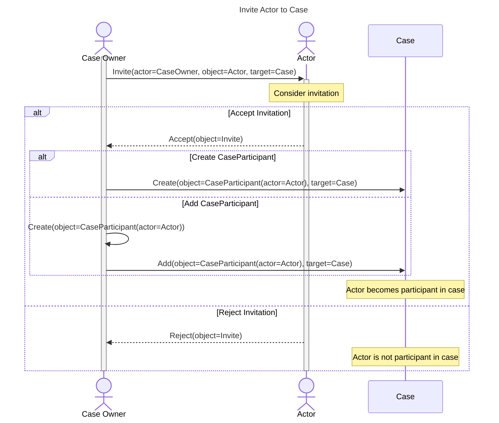

# Inviting an Actor to a Case



Inviting an actor to a case is a way to add them as a participant in the case.
The invitation is sent to the actor as an `as:Invite` activity.
Depending on the actor's response, they may become a participant in the case.

<!-- for vertical spacing -->
<br/>
<br/>
<br/>



!!! question "Invite vs Add?"

    When a case is first created, the Case Owner and any known participants (e.g., the Reporter)
    should be automatically added to the case. It's not even necessary for these to be emitted as
    separate `as:Add` activities. The `as:Create` activity for the case can include the Case Owner
    and any known participants as `CaseParticipant` objects.
    See [Initializing a Case](initialize_case.md) for more.

    However, over the lifespan of a case, there may be other actors that were
    not already involved at the time the case was created, but who should be invited to participate
    in the case. This is where the `as:Invite` activity comes in.

!!! tip "Avoid bogging down in details"

    Adding a participant to a case involves creating the participant object and a participant status object.
    As we discuss elsewhere, it's probably overkill to emit separate `as:Create` and `as:Add` events for each
    of these events.

    ```mermaid
    flowchart LR
    
    a[create participant] --> b[create participant status]
    b --> c[add participant status to participant]
    c --> d[add participant to case]
    ```
   
    Instead, we could emit a single `as:Create` event for the participant, already containing a status object, and
    have the `target` of the `as:Create` event be the case object.

    ```mermaid
    flowchart LR
    a[create particpant with status] -->|target| b[case]
    ```





