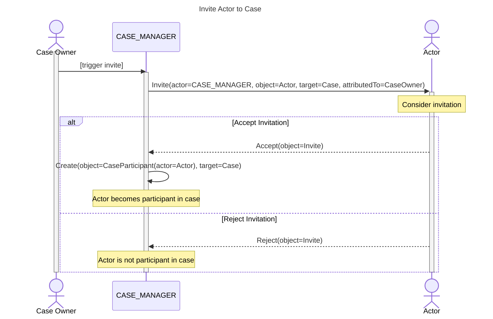

# How to Invite an Actor to a Case

Use this guide to bring an actor into a case it was not present for.
An invitation asks rather than asserts, so the actor joins only if it accepts.
You finish with the actor either seated as a participant or recorded as having
declined.

---

## Prerequisites



- An existing case, and the Case Owner role on it.
- The actor's URI.
- The CASE_MANAGER's actor URI. It sends the invitation and receives the reply.

---

## The exchange

The sequence diagram below shows both outcomes.
The Case Owner triggers the invitation, but every message on the wire is between
the CASE_MANAGER and the invited actor.


```mermaid
---
title: Invite Actor to Case
---
sequenceDiagram
    actor O as Case Owner
    participant CA as CASE_MANAGER
    actor A as Actor
    activate O
    O ->> CA: [trigger invite]
    activate CA
    CA ->>+ A: Invite(actor=CASE_MANAGER, object=Actor, target=Case, attributedTo=CaseOwner)
    note over A: Consider invitation
    alt Accept Invitation
        A -->> CA: Accept(object=Invite)
        CA ->> CA: Create(object=CaseParticipant(actor=Actor), target=Case)
        note over CA: Actor becomes participant in case
    else Reject Invitation
        A -->> CA: Reject(object=Invite)
        note over CA: Actor is not participant in case
    end
    deactivate A
    deactivate CA
    deactivate O
```

---

## Send the invitation

1. Trigger the invitation as Case Owner.
2. The CASE_MANAGER sends `RmInviteToCase` to the actor's inbox, with itself as
   the ActivityStreams `actor` and your identity in `attributedTo`
   (PCR-08-007, PCR-08-008).
3. Set the reply deadline on the activity's `end_time`.
   When it is present that value settles precedence over the invitee's local
   policy window; when it is absent the policy window applies instead
   (CM-28-002, ADR-0065).
   Either way the effective deadline is clamped down to the embargo's own
   `end_time`, so an `end_time` that outlives the embargo does not buy the invitee
   extra time (EP-07-006).

!!! warning "The CASE_MANAGER is the sender, not the Case Owner"

    Putting the Case Owner in the `actor` field makes the invitation
    unrecognizable to a conformant peer, which expects case-management handshakes
    to come from the CASE_MANAGER.
    Record who asked for the invitation in `attributedTo` instead.

---

## Answer an invitation

Send your reply to the CASE_MANAGER, never to the Case Owner.

- If you are joining the case, send `RmAcceptInviteToCase` with the `Invite`
  activity as its `object`.
- If you are not joining, send `RmRejectInviteToCase` with the `Invite` as its
  `object`.

On acceptance, the CASE_MANAGER commits the reply to the ledger, seats you at
Report Management (RM) state `RM.RECEIVED`, signs your embargo consent if an
embargo is active, sends `AnnounceVulnerabilityCase` to seed your replica, and
backfills the earlier ledger entries (CM-17-004).

Expect `RM.RECEIVED`, not `RM.ACCEPTED`.
Accepting an invitation says you are willing to join the case; it does not say
you have validated the report, which you have not yet seen in full
(CM-11-001).
Rule on the report afterwards — see
[How to Advance a Case Through Report Management](manage_case.md).

---

## Choose invitation over seating

Use `as:Invite` for an actor that was absent when the case was created.
Seat the Case Owner and any already-known participants, such as the Reporter,
inline on the `as:Create` for the case instead — see
[How to Initialize a Case](initialize_case.md).

If you are not the Case Owner but you know an actor belongs on the case, suggest
it rather than inviting it: see
[How to Suggest an Actor for a Case](suggest_actor.md).

---

## Verify

| What you sent | What to confirm |
|---|---|
| `RmInviteToCase` | The invitee holds an `Invite` whose `actor` is the CASE_MANAGER. |
| `RmAcceptInviteToCase` | The case roster holds you, and you have a local case replica. |
| `RmRejectInviteToCase` | The roster does not list you, and the refusal is on the ledger. |

---

## See it end to end

!!! example "Try it: `vultron-demo invite-actor`"

    ```bash
    vultron-demo invite-actor
    ```

    Or with Docker Compose:

    ```bash
    DEMO=invite-actor docker compose -f docker/docker-compose.yml run --rm demo
    ```

    The scenario invites one coordinator that accepts and a second that rejects.

---

## Further reading

- [Case Management Messages](../../../reference/messages/case_management.md) —
  the wire format and a rendered example for each activity above
- [Activity Vocabulary Design](../../../topics/activity_vocabulary_design.md) —
  why late arrivals are invited rather than added
- [Case Initialization](../../../topics/case_lifecycle/case_initialization.md) —
  the case lifecycle these invitations sit inside
