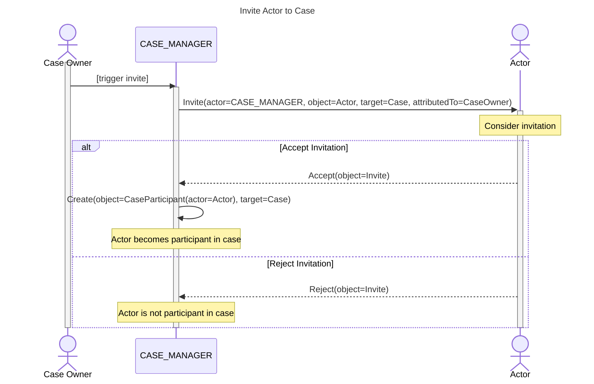

# Inviting an Actor to a Case



Inviting an actor to a case is a way to add them as a participant in the case.
The invitation is sent to the actor as an `as:Invite` activity.
Depending on the actor's response, they may become a participant in the case.

<!-- for vertical spacing -->
<br/>
<br/>
<br/>


```mermaid
---
title: Invite Actor to Case
---
sequenceDiagram
    actor O as Case Owner
    participant CA as CASE_MANAGER
    actor A as Actor
    activate O
    O ->> CA: [trigger invite]
    activate CA
    CA ->>+ A: Invite(actor=CASE_MANAGER, object=Actor, target=Case, attributedTo=CaseOwner)
    note over A: Consider invitation
    alt Accept Invitation
        A -->> CA: Accept(object=Invite)
        CA ->> CA: Create(object=CaseParticipant(actor=Actor), target=Case)
        note over CA: Actor becomes participant in case
    else Reject Invitation
        A -->> CA: Reject(object=Invite)
        note over CA: Actor is not participant in case
    end
    deactivate A
    deactivate CA
    deactivate O
```

!!! info "CASE_MANAGER routing (PCR-08-007, PCR-08-008)"

    The `Invite` activity is sent by the **CASE_MANAGER**, not the Case Owner.
    The Case Owner triggers the invite, but the CASE_MANAGER MUST be the
    ActivityStreams `actor` on the outbound `Invite`. The `attributedTo` field
    on the activity MAY carry the Case Owner's ID to record who initiated it.

    The invitee MUST address their `Accept` or `Reject` reply to the **CASE_MANAGER**,
    not directly back to the Case Owner. The CASE_MANAGER is the authoritative
    recipient of all case-management handshake messages after case creation.

Use `as:Invite` for actors that were not involved when the case was created.
The Case Owner and any already-known participants, such as the Reporter, are
seated inline on the `as:Create` activity for the case instead — see
[Initializing a Case](initialize_case.md).

For why late arrivals are invited rather than added, and for how many activities
one participant addition needs, see
[Activity Vocabulary Design](../../../topics/activity_vocabulary_design.md).






## Demo

!!! example "Try it: `vultron-demo invite-actor`"

    Run this workflow end-to-end with the unified demo CLI:

    ```bash
    vultron-demo invite-actor
    ```

    Or with Docker Compose:

    ```bash
    DEMO=invite-actor docker compose -f docker/docker-compose.yml run --rm demo
    ```
