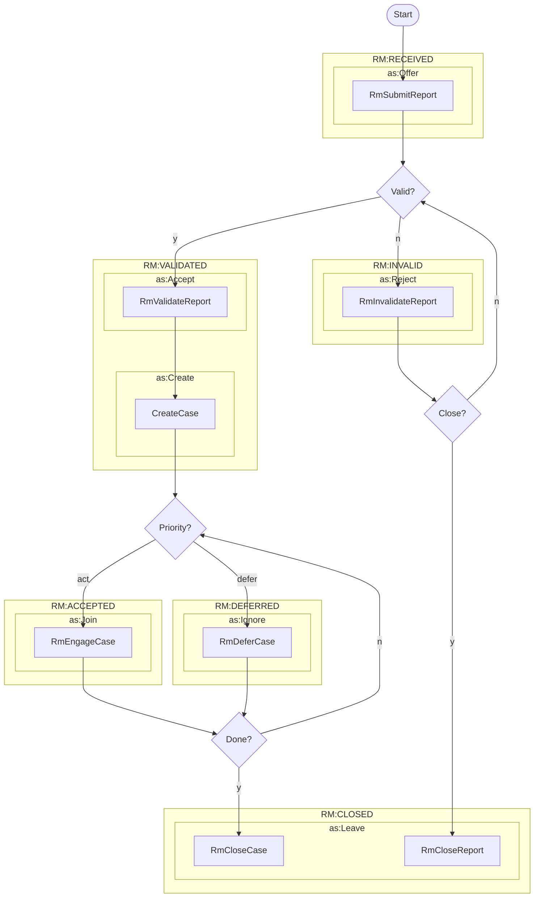

# Managing a Case



Case management activities reflect the
[Report Management](../../../topics/process_models/rm/index.md) process model.










!!! tip "Re-Engaging a Case"

    The `RmReEngageCase` activity is used to re-engage a case that has been
    deferred. Deferring a case is modeled as an `as:Ignore`
    activity, since it is indicating that a participant has not entirely left
    the case, but has instead deferred their participation for a period of
    time. Re-engaging a case is modeled as an `as:Undo` activity, since it is
    undoing the `as:Ignore` activity that was used to defer the case.
    Alternatively, we could have just used the same `RmEngageCase` (`as:Join`) 
    activity. That might still be a better option, but we'll leave it as an
    implementation choice for now.




!!! tip "Close Case vs Close Report"

    Closing a report is only relevant when the report is not valid, because 
    valid reports should be converted to cases. Hence, we define the 
    `RmCloseReport` activity as a an option for when a report is invalidated
    before a case is created. Both `RmCloseReport` and `RmCloseCase` are
    defined as subclasses of `as:Leave` to indicate that they are both
    activities that indicate that the actor's participation in the case or
    report has ended.
