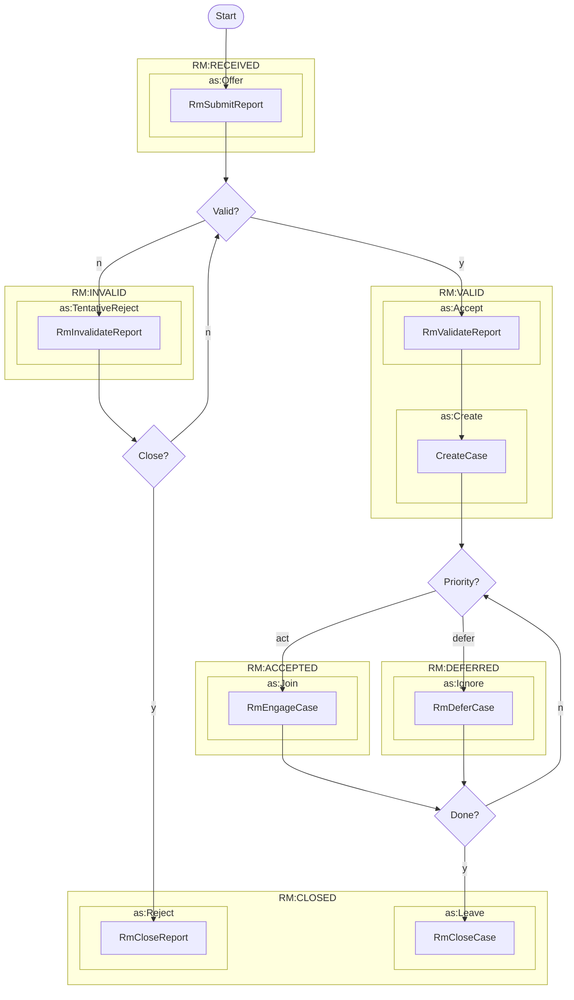

# How to Advance a Case Through Report Management

Use this guide to move your own Report Management (RM) state through the case
lifecycle: engage a case, defer it, re-engage it, and close it.
RM state is per participant, so every step here reports your own position and
never anyone else's.
You finish at `RM.CLOSED`, with each transition recorded on the case ledger.

---

## Prerequisites



- A report you have received, or a case you are seated on.
- Your own participant record on the case. Engaging and deferring are decisions
  about your participation, not judgments about the report.

---

## The state ladder

The flowchart below places each activity in the RM state it produces.
Read it as the set of moves available from wherever you are now.


```mermaid
flowchart TB
    subgraph RM:RECEIVED
        subgraph as:Offer
            RmSubmitReport
        end
    end
    subgraph RM:VALID
        subgraph as:Accept
            RmValidateReport
        end
        subgraph as:Create
            CreateCase
        end
    end
    subgraph RM:INVALID
        subgraph as:TentativeReject
            RmInvalidateReport
        end
    end
    subgraph RM:ACCEPTED
        subgraph as:Join
            RmEngageCase
        end
    end
    subgraph RM:DEFERRED
        subgraph as:Ignore
            RmDeferCase
        end
    end
    subgraph RM:CLOSED
        subgraph as:Leave
            RmCloseCase
        end
        subgraph as:Reject
            RmCloseReport
        end
    end

    d{Done?}
    c{Close?}
    p{Priority?}
    v{Valid?}
    start([Start])
    start --> RmSubmitReport
    RmSubmitReport --> v
    v -->|y| RmValidateReport
    v -->|n| RmInvalidateReport
    RmInvalidateReport --> c
    c -->|y| RmCloseReport
    RmValidateReport --> CreateCase
    CreateCase --> p
    p -->|act| RmEngageCase
    d -->|n| p
    p -->|defer| RmDeferCase
    RmEngageCase --> d
    RmDeferCase --> d
    c -->|n| v
    d -->|y| RmCloseCase
```

---

## Engage or defer a valid report

Once the report is at `RM.VALID` and a case exists, prioritize it and take one of
two moves.

- If you intend to work the case now, send `RmEngageCase`. Your RM state becomes
  `ACCEPTED`.
- If you intend to work it later, send `RmDeferCase`. Your RM state becomes
  `DEFERRED`.

Deferring is reversible.
To re-engage a deferred case, send the same `RmEngageCase` activity you would
have sent the first time — there is no separate re-engagement activity, and the
earlier deferral remains part of the case history.

---

## Close your participation

Pick the closure activity that matches what exists.

- If a case exists, send `RmCloseCase`.
- If the report was invalidated before any case was created, send
  `RmCloseReport`.

`RM.CLOSED` is terminal (ADR-0085).
There is no rejoin, so send the closure only when you are finished with the case.

What your closure does to the case depends on whether you are the Case Owner.

- If you are **not** the Case Owner, only your own RM state advances to
  `RM.CLOSED`. The case stays open for everyone else (CM-23-003).
- If you **are** the Case Owner, your `RmCloseCase` closes the case. The
  CASE_MANAGER advances you and itself to `RM.CLOSED` and commits a final
  `case_fully_closed` ledger entry (CM-23-002). Every other participant keeps the
  RM state it already held — closure does not advance bystanders (CM-23-012).

!!! warning "An owner closure is refused while an embargo is active"

    If you are the Case Owner and the case still holds an active embargo — the EM
    state is `ACTIVE` or `REVISE` — the CASE_MANAGER declines your `RmCloseCase`
    with an `as:Reject` and runs no part of the closure sequence (CM-23-011).
    Terminate the embargo first: see
    [How to Revise or Terminate an Embargo](manage_embargo.md).

---

## Verify

| What you sent | What to confirm |
|---|---|
| `RmEngageCase` | Your participant record shows `rm_state` = `ACCEPTED`. |
| `RmDeferCase` | Your participant record shows `rm_state` = `DEFERRED`. |
| `RmCloseCase` | Your participant record shows `rm_state` = `CLOSED`. As Case Owner, also confirm a final `case_fully_closed` ledger entry. |
| `RmCloseReport` | Your RM state is `CLOSED` and no case was created. |

Each transition is committed to the case ledger, so the same `rm_state` should be
visible on every participant's replica, not only your own.

---

## See it end to end

!!! example "Try it: `vultron-demo manage-case`"

    ```bash
    vultron-demo manage-case
    ```

    Or with Docker Compose:

    ```bash
    DEMO=manage-case docker compose -f docker/docker-compose.yml run --rm demo
    ```

    The scenario runs the engage path, the defer-and-re-engage path, and the
    invalidate path.

---

## Further reading

- [Report Management (RM) Messages](../../../reference/messages/rm.md) — the wire
  format and a rendered example for each activity above
- [Case Management Messages](../../../reference/messages/case_management.md) —
  the wire format for `RmCloseCase`
- [Activity Vocabulary Design](../../../topics/activity_vocabulary_design.md) —
  why re-engagement is not an `as:Undo`, and why the two closures use different
  verbs
- [Report Management](../../../topics/process_models/rm/index.md) — the state
  machine these activities drive
