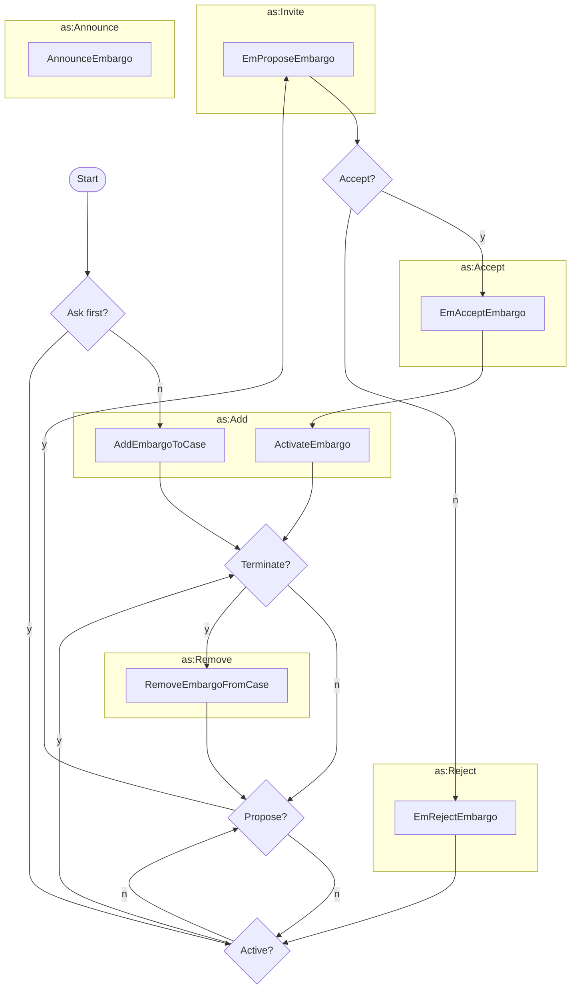

# Managing an Embargo



This diagram is similar to the one shown in [Establishing an Embargo](./establish_embargo.md), but it also shows the
decisions and activities that are used to manage an embargo once it has been established.
Once established, an embargo can be modified via a propose/accept/reject cycle.
It can also be terminated or removed from a case.

<!-- for vertical spacing -->
<br/>
<br/>














## Demo

!!! example "Try it: `vultron-demo manage-embargo`"

    Run this workflow end-to-end with the unified demo CLI:

    ```bash
    vultron-demo manage-embargo
    ```

    Or with Docker Compose:

    ```bash
    DEMO=manage-embargo docker compose -f docker/docker-compose.yml run --rm demo
    ```
