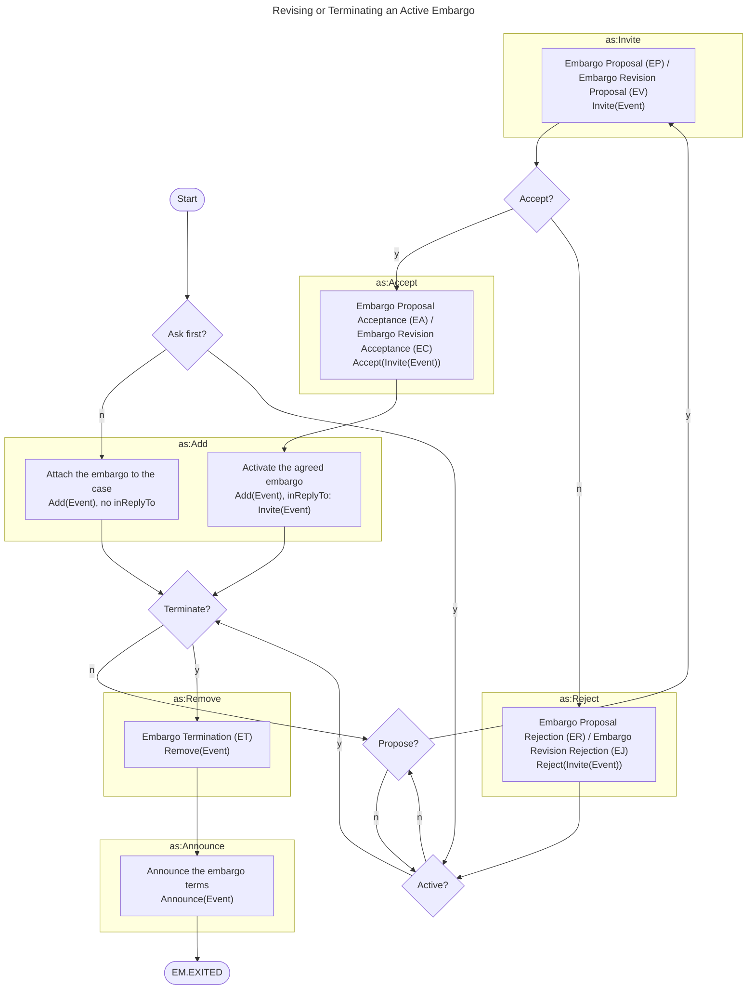

# How to Revise or Terminate an Embargo

Use this guide once a case already has an active embargo.
A revision runs the same propose, accept, or reject cycle that established the embargo; a termination removes it outright.
You finish with the case at Embargo Management (EM) state `EM.ACTIVE` under new terms, or at `EM.EXITED`.

---

## Prerequisites



- A case at `EM.ACTIVE`.
  See [How to Establish an Embargo](establish_embargo.md).
- The Case Owner role, for activating a revision or terminating the embargo.
  Any participant can propose a revision.

!!! note "Embargo Management is a model of its own"

    The Vultron protocol carries considerable detail about [Embargo Management](../../../topics/process_models/em/index.md) and how participants are expected to interact with embargoes.
    Read that section before designing embargo behavior.

---

## The exchange

The flowchart below extends the establishment flow with the moves available once an embargo is active.
The `Terminate?` branch is where an active embargo ends; the `Propose?` branch is where it changes.


```mermaid
---
title: Revising or Terminating an Active Embargo
---
flowchart TB
    subgraph as:Invite
        EmProposeEmbargo["Embargo Proposal (EP) / Embargo Revision Proposal (EV)<br/>Invite(Event)"]
    end
    subgraph as:Accept
        EmAcceptEmbargo["Embargo Proposal Acceptance (EA) / Embargo Revision Acceptance (EC)<br/>Accept(Invite(Event))"]
    end
    subgraph as:Reject
        EmRejectEmbargo["Embargo Proposal Rejection (ER) / Embargo Revision Rejection (EJ)<br/>Reject(Invite(Event))"]
    end
    subgraph as:Add
        ActivateEmbargo["Activate the agreed embargo<br/>Add(Event), inReplyTo: Invite(Event)"]
        AddEmbargoToCase["Attach the embargo to the case<br/>Add(Event), no inReplyTo"]
    end
    subgraph as:Remove
        RemoveEmbargoFromCase["Embargo Termination (ET)<br/>Remove(Event)"]
    end
    subgraph as:Announce
        AnnounceEmbargo["Announce the embargo terms<br/>Announce(Event)"]
    end
    start([Start])
    start --> f{Ask first?}
    f -->|n| AddEmbargoToCase
    f -->|y| v{Active?}
    v -->|y| t{Terminate?}
    v -->|n| p{Propose?}
    p -->|y| EmProposeEmbargo
    p -->|n| v
    EmProposeEmbargo --> a{Accept?}
    a -->|y| EmAcceptEmbargo
    a -->|n| EmRejectEmbargo
    EmAcceptEmbargo --> ActivateEmbargo
    EmRejectEmbargo --> v
    ActivateEmbargo --> t
    AddEmbargoToCase --> t
    t -->|n| p
    t -->|y| RemoveEmbargoFromCase
    RemoveEmbargoFromCase --> AnnounceEmbargo
    AnnounceEmbargo --> exited([EM.EXITED])
```

---

## Revise the terms

Embargo Revision Proposal (EV) is implemented in ActivityStreams as `Invite(Event)` — the same activity as an initial proposal, Embargo Proposal (EP).

1. Send `Invite(Event)` with the revised `EmbargoEvent`.
   The case moves to `EM.REVISE`.
2. Each participant answers with Embargo Revision Acceptance (EC), `Accept(Invite(Event))`, or Embargo Revision Rejection (EJ), `Reject(Invite(Event))`.
3. As Case Owner, send `Add(Event)` with `inReplyTo` naming the `Invite(Event)` it answers, once the revision has carried, then `Announce(Event)`.

A revision uses the same activities as an initial proposal.
The receiver tells the two apart from the case's EM state: a proposal that arrives while the embargo is active is a revision (MSM-02).

If the revision is rejected, the case returns to `EM.ACTIVE` under the original terms.
The embargo does not lapse because a revision failed.

---

## Terminate the embargo

Embargo Termination (ET) is implemented in ActivityStreams as `Remove(Event)`.

Send `Remove(Event)`, then `Announce(Event)` so participants see that the embargo is gone.
The case moves to `EM.EXITED`, with immediate effect.

!!! warning "Termination is not a revision"

    `Remove(Event)` ends the embargo now, rather than proposing a shorter one.
    If you want the embargo to end sooner but still exist, propose a revision with an earlier end time.

An embargo also terminates on its own when the case reaches public awareness.
See [Early Termination](../../../topics/process_models/em/early_termination.md).

---

## Verify

| What you sent | What to confirm |
|---|---|
| `Invite(Event)` on an active embargo | The case `em_state` is `REVISE`. |
| `Add(Event)` after a revision | The case `em_state` is `ACTIVE` and the active embargo carries the new terms. |
| `Reject(Invite(Event))` on a revision | The case `em_state` is `ACTIVE` and the terms are unchanged. |
| `Remove(Event)` | The case `em_state` is `EXITED` and no embargo is active. |

---

## See it end to end

!!! example "Try it: `vultron-demo manage-embargo`"

    ```bash
    vultron-demo manage-embargo
    ```

    Or with Docker Compose:

    ```bash
    DEMO=manage-embargo docker compose -f docker/docker-compose.yml run --rm demo
    ```

    The scenario runs an activate-then-terminate path and a reject-then-repropose path.

---

## Further reading

- [Embargo Management (EM) Messages](../../../reference/messages/em.md) — the wire format and a rendered example for each activity above, and the state-context rule that distinguishes a revision from a proposal
- [Embargo Management](../../../topics/process_models/em/index.md) — the state machine these activities drive
- [Participant Embargo Consent (§9)](../../../reference/vultron-spec/index.md#9-participant-embargo-consent-pec-state-machine-n) — how each participant's own commitment is tracked alongside the case EM state
- [Trigger API Reference](../../../reference/trigger-api.md#embargo-management) — request schema and endpoint details for `propose-embargo-revision` and `terminate-embargo`
