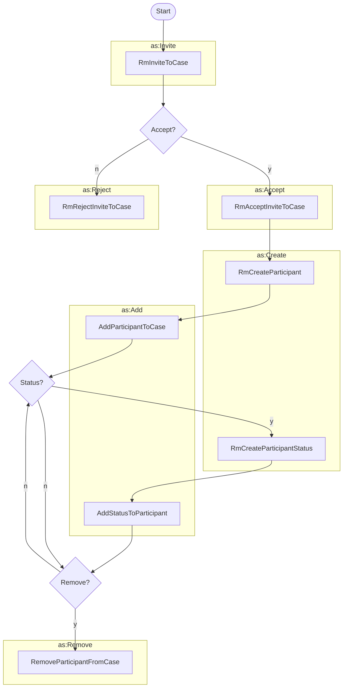

# Managing Case Participants



Typically most cases involve multiple participants, having various roles
within the case. While the most common activities are inviting and adding
participants, we've also included activities for removing participants.



!!! question "Create or Add?"

    There appears to be some logical interchangeability of `as:Create` 
    with `as:Add` since both include a `target` property that can be used to
    specify the object to which the new object is being added. We chose to 
    represent them separately here to acknowledge the difference between
    creating a new object and adding an existing object to another object, but
    in an actual implementation it may be acceptable to use either activity for
    both cases.
    It seems likely that the general idea should be to use `as:Create` when creating a new object to 
    add to another object (as the `target` of the activity), and `as:Add` when adding an existing object to another object. 
    
    That said, our intent is that Vultron be consistent with however ActivityPub does this.
    If what we're describing here is inconsistent with ActivityPub, please let us know in the form of an issue or 
    pull request.







## Create Participant Status

The vendor actor is creating a participant status representing the vendor's status in the context of a specific case.

```python exec="true" idprefix=""
from vultron.scripts.vocab_examples import create_participant_status, json2md

print(json2md(create_participant_status()))
```

## Add Status to Participant

The vendor is adding a status to their participant object in the context of the specific case.

```python exec="true" idprefix=""
from vultron.scripts.vocab_examples import add_status_to_participant, json2md

print(json2md(add_status_to_participant()))
```

## Remove Participant from Case

A coordinator is removing a vendor from a case.

```python exec="true" idprefix=""
from vultron.scripts.vocab_examples import remove_participant_from_case, json2md

print(json2md(remove_participant_from_case()))
```
