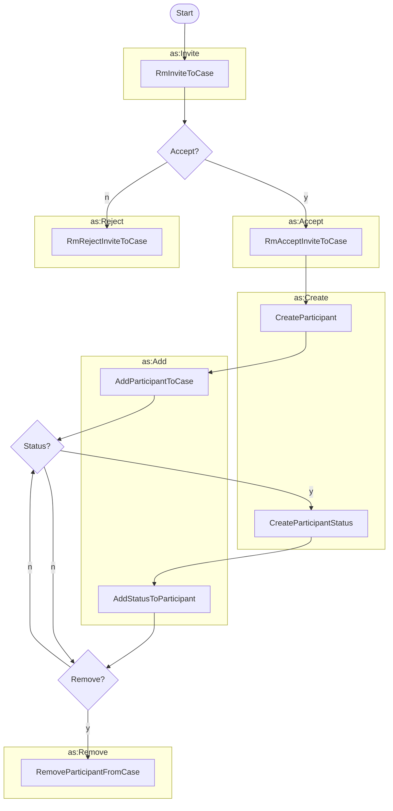

# How to Manage a Case Roster

Use this guide to run the full participant lifecycle on a case: invite an actor,
seat it when it accepts, record its status, and remove it when its involvement
ends.
Every step routes through the CASE_MANAGER, which is the authoritative recipient
of case-management handshake messages once a case exists.
You finish with a roster that reflects who is actually working the case.

---

## Prerequisites



- An existing case.
- The Case Owner role for invitations and removals. Any participant can record
  its own status.
- The CASE_MANAGER's actor URI, which is where handshake replies go.

---

## The lifecycle

The flowchart below shows the roster path from invitation to removal.
The two decision diamonds are the loop a long-running case sits in: status
updates accumulate, and a participant leaves only when `Remove?` is answered yes.


```mermaid
flowchart TB
    subgraph as:Invite 
        RmInviteToCase
    end
    subgraph as:Accept
        RmAcceptInviteToCase
    end
    subgraph as:Reject
        RmRejectInviteToCase
    end
    subgraph as:Create
        CreateParticipant
        CreateParticipantStatus
    end
    subgraph as:Add
        AddParticipantToCase
        AddStatusToParticipant
    end
    subgraph as:Remove
        RemoveParticipantFromCase
    end
    start([Start])
    start --> RmInviteToCase
    RmInviteToCase --> a{Accept?}
    a -->|y| RmAcceptInviteToCase
    a -->|n| RmRejectInviteToCase
    RmAcceptInviteToCase --> CreateParticipant
    
    CreateParticipantStatus --> AddStatusToParticipant
    CreateParticipant --> AddParticipantToCase
    AddParticipantToCase --> s{Status?}
    s -->|y| CreateParticipantStatus
    s -->|n| r{Remove?}
    AddStatusToParticipant --> r
    r -->|y| RemoveParticipantFromCase
    r -->|n| s
```

---

## Admit an actor

1. Trigger the invitation. The CASE_MANAGER sends `RmInviteToCase` with itself as
   the ActivityStreams `actor` and your Case Owner identity in `attributedTo`
   (PCR-08-007, PCR-08-008).
2. Wait for the invitee's reply, addressed to the CASE_MANAGER.
3. If the reply is `RmAcceptInviteToCase`, seat the actor — see
   [How to Seat a Participant on an Existing Case](initialize_participant.md).
4. If the reply is `RmRejectInviteToCase`, stop. The actor is not on the case,
   and nothing further is owed.

For the full invitation sequence, including the routing rule and its rationale,
see [How to Invite an Actor to a Case](invite_actor.md).

!!! warning "Do not address the handshake to the Case Owner"

    An invitee that replies directly to the Case Owner bypasses the
    CASE_MANAGER, so the reply is never committed to the ledger and no replica
    learns of it.
    Address `RmAcceptInviteToCase` and `RmRejectInviteToCase` to the
    CASE_MANAGER.

---

## Record a participant's status

1. Send `CreateParticipantStatus`, carrying the participant's `rm_state` and, for
   a Vendor or Deployer, its `vf_state` and `d_state`.
2. Send `AddStatusToParticipant`, targeting the participant record.

If the status is known when you seat the participant, carry it inline on the
`CaseParticipant` object instead of sending this pair.
Status is self-declaratory: send your own, and expect each participant to send
its own (ADR-0084).

---

## Remove a participant

Send `RemoveParticipantFromCase` with the participant as its `object` and the case
as its `target`.

!!! warning "Name the case in `target`, not `origin`"

    `origin` reads like the right field for a removal, and it is not one the
    receiver looks at: dispatch discriminates on `target`, so a `Remove` that
    names the case only in `origin` matches no pattern and the participant is
    never removed (#3438).

Removal takes a participant off the roster.
It is not a closure — a participant that has finished its own work closes with
`RmCloseCase` instead.
See [How to Advance a Case Through Report Management](manage_case.md).

---

## Verify

| What you sent | What to confirm |
|---|---|
| `RmInviteToCase` | The invitee holds an `Invite` whose `actor` is the CASE_MANAGER. |
| `AddParticipantToCase` | The roster holds the participant with its roles. |
| `AddStatusToParticipant` | The participant record carries the new status. |
| `RemoveParticipantFromCase` | The roster no longer lists the participant. |

---

## See it end to end

!!! example "Try it: `vultron-demo manage-participants`"

    ```bash
    vultron-demo manage-participants
    ```

    Or with Docker Compose:

    ```bash
    DEMO=manage-participants docker compose -f docker/docker-compose.yml run --rm demo
    ```

    The scenario runs invite, accept, seat, status update, and removal, then the
    rejection path.

---

## Further reading

- [Case Management Messages](../../../reference/messages/case_management.md) —
  the wire format and a rendered example for each activity above
- [Case State (CS) Messages](../../../reference/messages/cs.md) — the status
  fields `AddStatusToParticipant` carries
- [Activity Vocabulary Design](../../../topics/activity_vocabulary_design.md) —
  why `as:Invite` asks where `as:Add` asserts, and how many activities one
  participant addition needs
