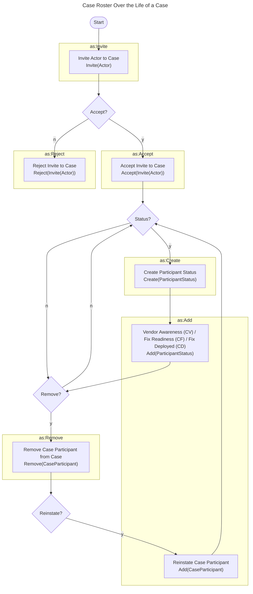

# How to Manage a Case Roster

Use this guide to run the full participant lifecycle on a case: invite an actor, seat it when it accepts, record its status, remove it from active participation, and reinstate it.
Every step routes through the CASE_MANAGER, which is the authoritative recipient of case-management handshake messages once a case exists.
You finish with a case whose active participants are the ones actually working it.

---

## Prerequisites



- An existing case.
- The Case Owner role for invitations, removals and reinstatements.
  Any participant can record its own status.
- The CASE_MANAGER's actor Uniform Resource Identifier (URI), which is where handshake replies go.

---

## The lifecycle

The flowchart below shows the roster path from invitation to removal and back.
The decision diamonds are the loop a long-running case sits in: status updates accumulate, a participant leaves active participation only when `Remove?` is answered yes, and it returns only when `Reinstate?` is answered yes.


```mermaid
---
title: Case Roster Over the Life of a Case
---
flowchart TB
    subgraph as:Invite
        RmInviteToCase["Invite Actor to Case<br/>Invite(Actor)"]
    end
    subgraph as:Accept
        RmAcceptInviteToCase["Accept Invite to Case<br/>Accept(Invite(Actor))"]
    end
    subgraph as:Reject
        RmRejectInviteToCase["Reject Invite to Case<br/>Reject(Invite(Actor))"]
    end
    subgraph as:Create
        CreateParticipantStatus["Create Participant Status<br/>Create(ParticipantStatus)"]
    end
    subgraph as:Add
        AddStatusToParticipant["Vendor Awareness (CV) / Fix Readiness (CF) / Fix Deployed (CD)<br/>Add(ParticipantStatus)"]
        AddParticipantToCase["Reinstate Case Participant<br/>Add(CaseParticipant)"]
    end
    subgraph as:Remove
        RemoveParticipantFromCase["Remove Case Participant from Case<br/>Remove(CaseParticipant)"]
    end
    start([Start])
    start --> RmInviteToCase
    RmInviteToCase --> a{Accept?}
    a -->|y| RmAcceptInviteToCase
    a -->|n| RmRejectInviteToCase
    RmAcceptInviteToCase --> s{Status?}

    CreateParticipantStatus --> AddStatusToParticipant
    s -->|y| CreateParticipantStatus
    s -->|n| r{Remove?}
    AddStatusToParticipant --> r
    r -->|y| RemoveParticipantFromCase
    r -->|n| s
    RemoveParticipantFromCase --> b{Reinstate?}
    b -->|y| AddParticipantToCase
    AddParticipantToCase --> s
```

---

## Admit an actor

1. Trigger the invitation.
   The CASE_MANAGER sends `Invite(Actor)` with itself as the ActivityStreams `actor` and your Case Owner identity in `attributedTo` (PCR-08-007, PCR-08-008).
2. Wait for the invitee's reply, addressed to the CASE_MANAGER.
3. If the reply is `Accept(Invite(Actor))`, the CASE_MANAGER makes the actor an active participant — see [How to Seat a Participant on an Existing Case](initialize_participant.md).
   The CASE_MANAGER ledgers the record's creation when it sends the Invite and each change the accept makes as its own entry; a replica stores what those entries carry, and nothing else is sent to seat it.
4. If the reply is `Reject(Invite(Actor))`, stop.
   The actor never becomes active, and nothing further is owed.
   The CASE_MANAGER keeps its inert participant record at RM `CLOSED`.

For the full invitation sequence, including the routing rule and its rationale, see [How to Invite an Actor to a Case](invite_actor.md).

!!! warning "Do not address the handshake to the Case Owner"

    An invitee that replies directly to the Case Owner bypasses the CASE_MANAGER, so the reply is never committed to the ledger and no replica learns of it.
    Address `Accept(Invite(Actor))` and `Reject(Invite(Actor))` to the CASE_MANAGER.

---

## Judge the case after joining

Once a participant is seated, the CASE_MANAGER sends it a second invitation, `Invite(Actor)` with the case as its `target`, after the case announcement and the ledger replay.
This full-case Invite carries the CASE_MANAGER's ledger position in the standard ActivityStreams `content` field, as the JSON of the `LedgerPosition` model (`log_index` and `entry_hash`).
The `target` stays the plain case URI.
That position is the floor: the participant's reply must reach it.

1. Wait until your copy of the ledger has caught up to the Invite's position.
   The trigger fails closed with `409` until it has, so retry once replication catches up.
2. Trigger one reply, naming the Invite in `invite_id`:
    - `POST /actors/{actor_id}/trigger/accept-full-case-invite` sends `Accept`, and the CASE_MANAGER records Report Valid (`RECEIVED` to `VALID`).
    - `POST /actors/{actor_id}/trigger/tentative-reject-full-case-invite` sends `TentativeReject`, and the CASE_MANAGER records Report Invalid (`RECEIVED` to `INVALID`).
    - `POST /actors/{actor_id}/trigger/reject-full-case-invite` sends `Reject`, and the CASE_MANAGER records Report Closed (`RECEIVED` to `CLOSED`).
3. The reply carries your own ledger position in `content`.
   The CASE_MANAGER refuses, and writes nothing for, a reply that is behind the Invite's position or names a ledger entry it does not hold.

A later `Join` or `Ignore` moves the participant to `ACCEPTED` or `DEFERRED` as it does for any participant.

---

## Record a participant's status

Vendor Awareness (CV), Fix Readiness (CF) and Fix Deployed (CD) are all implemented in ActivityStreams as `Add(ParticipantStatus)`.
Which one you are sending is determined by the field you set, not by a different activity.
See [How to Post a Status Update or a Case Note](status_updates.md) for the field that selects each.

1. Send `Create(ParticipantStatus)`, carrying the participant's `rm_state` and, for a Vendor or Deployer, its `vf_state` and `d_state`.
2. Send `Add(ParticipantStatus)`, targeting the participant record.

If the status is known when you seat the participant, carry it inline on the `CaseParticipant` object instead of sending this pair.
Status is self-declaratory: send your own, and expect each participant to send its own (PRM-06-001, ADR-0121).

---

## Remove a participant

Only the Case Owner removes a participant.
Send `Remove(CaseParticipant)` to the CASE_MANAGER, with the participant as its `object` and the case as its `target`.
If you are both the Case Owner and the CASE_MANAGER, send it to your own inbox.

!!! warning "Name the case in `target`, not `origin`"

    `origin` reads like the right field for a removal, and it is not one the receiver looks at: dispatch discriminates on `target`, so a `Remove` that names the case only in `origin` matches no pattern and the participant is never removed (#3438).

Removal withdraws the participant's entitlement to case content.
It does not take the participant off the roster: its record, its status history and its [embargo consent](../../../topics/behavior_logic/use-cases/embargo-lifecycle.md) stay, and the record carries a removal fact.
The CASE_MANAGER refuses a removal of the CASE_MANAGER or of the Case Owner, and a removal from anyone other than the Case Owner.
A second removal of the same participant changes nothing.

The CASE_MANAGER records your `Remove` as one ledger entry and sends that entry to every active participant, the removed one included.
It then sends the removed participant a direct `Remove(CaseParticipant)` naming it, with `attributedTo` set to you.
The removed participant receives no later ledger entries, and no Invite of any kind.
The CASE_MANAGER also refuses a recommendation that names the removed participant, and your acceptance of an earlier one; reinstate the participant instead.
A removed signatory stays bound by the embargo it accepted.
When that embargo is terminated, or replaced by a revision that ends no later, the CASE_MANAGER sends the removed participant the change directly, outside the ledger (see [ET — Embargo Termination](../../../reference/messages/em.md#et-embargo-termination)).
See [Participant Removal](../../../reference/vultron-spec/interactions.md#114-participant-removal-n).

Removal is not a closure — a participant that has finished its own work closes with `Leave(VulnerabilityCase)` instead.
See [How to Advance a Case Through Report Management](manage_case.md).

---

## Reinstate a participant

Only the Case Owner reinstates a removed participant.
Send `Add(CaseParticipant)` to the CASE_MANAGER, with the removed participant as its `object` and the case as its `target`.
If you are both the Case Owner and the CASE_MANAGER, send it to your own inbox.

Reinstatement clears the removal fact.
The participant does not accept again: it never withdrew, so it keeps its roles, its status history and its embargo consent.
The CASE_MANAGER refuses an `Add` from anyone other than the Case Owner, and an `Add` that names a participant that is not removed or that never joined.
`Add(CaseParticipant)` does not seat a new member; an actor joins only by accepting its stub Invite.

The CASE_MANAGER records your `Add` as one ledger entry.
When the participant is active again, the CASE_MANAGER sends it every ledger entry committed after its removal entry, in log order, then a direct `Add(CaseParticipant)` naming it, with `attributedTo` set to you.
A participant that has not accepted the active embargo stays inert: the CASE_MANAGER sends it that embargo's Invite instead, and its catch-up waits until it accepts.

---

## Verify

| What you sent | What to confirm |
|---|---|
| `Invite(Actor)` | The invitee holds an `Invite` whose `actor` is the CASE_MANAGER. |
| `Accept(Invite(Actor))` | The roster holds the participant with its roles. |
| `Add(ParticipantStatus)` | The participant record carries the new status. |
| `Remove(CaseParticipant)` | The roster still lists the participant, and its record names your `Remove` as its `removalActivity`. |
| `Add(CaseParticipant)` | The participant's record has no `removalActivity`, and the participant holds the ledger entries it missed. |
| `Accept`, `TentativeReject` or `Reject` of the full-case Invite | The CASE_MANAGER's record of the participant shows RM `VALID`, `INVALID` or `CLOSED`. |

---

## See it end to end

!!! example "Try it: `vultron-demo manage-participants`"

    ```bash
    vultron-demo manage-participants
    ```

    Or with Docker Compose:

    ```bash
    DEMO=manage-participants docker compose -f docker/docker-compose.yml run --rm demo
    ```

    The scenario runs invite, accept, status update, removal, and reinstatement, then the rejection path.

---

## Further reading

- [Case Management Messages](../../../reference/messages/case_management.md) — the wire format and a rendered example for each activity above
- [Case State (CS) Messages](../../../reference/messages/cs.md) — the status fields `Add(ParticipantStatus)` carries
- [Activity Vocabulary Design](../../../topics/activity_vocabulary_design.md) — why `as:Invite` asks where `as:Add` asserts
- [Trigger API Reference](../../../reference/trigger-api.md#actor-participation) — request schema and endpoint details for `suggest-actor-to-case`, `invite-actor-to-case`, `accept-case-invite`, and `reject-case-invite`
