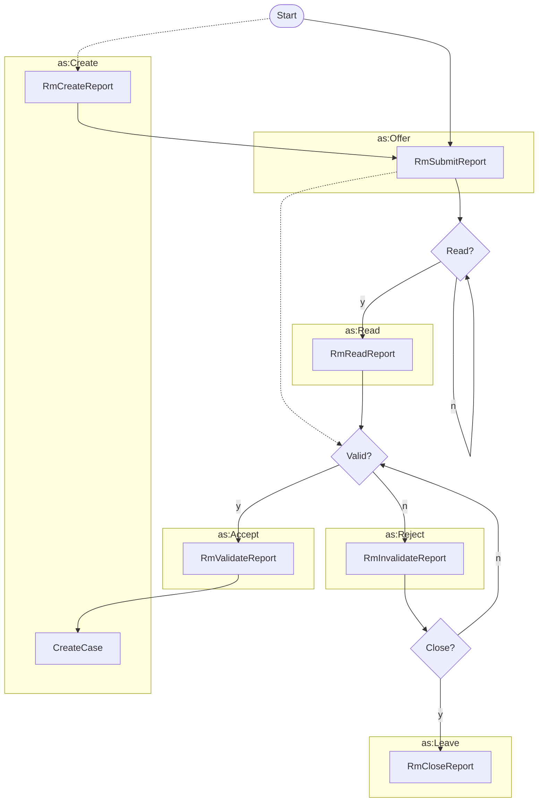

# Reporting a Vulnerability



The following task flow diagram addresses the opening portion of the Report Management process in which a finder
creates a vulnerability report and submits it to a vendor. The vendor then reads the report and either accepts or
rejects it. If the vendor accepts the report, they create a case for it. If the vendor rejects the report, they
eventually close it unless there's a reason to reconsider and validate it.



!!! question "`Create to...` vs `Create + Offer to...` ?"

    It's not always necessary for the `Create` activity to be distinct from the `Offer`.
    Creating a report `to` a vendor or coordinator could be equivalent to offering the report to the vendor.
    However, it's also possible that a report has already been created as part of a different
    process (perhaps involving other actors), and the `Offer` activity is used to offer the
    existing report to the vendor or coordinator. Therefore we show both options here.



Report submission might be followed by either a `Read` or `Accept` activity.
The `Read` activity is optional and should be used when the vendor wants to
acknowledge that they have received the report without accepting or rejecting
it. The `Accept` activity is used when the vendor wants to accept the report
and create a case for it.






