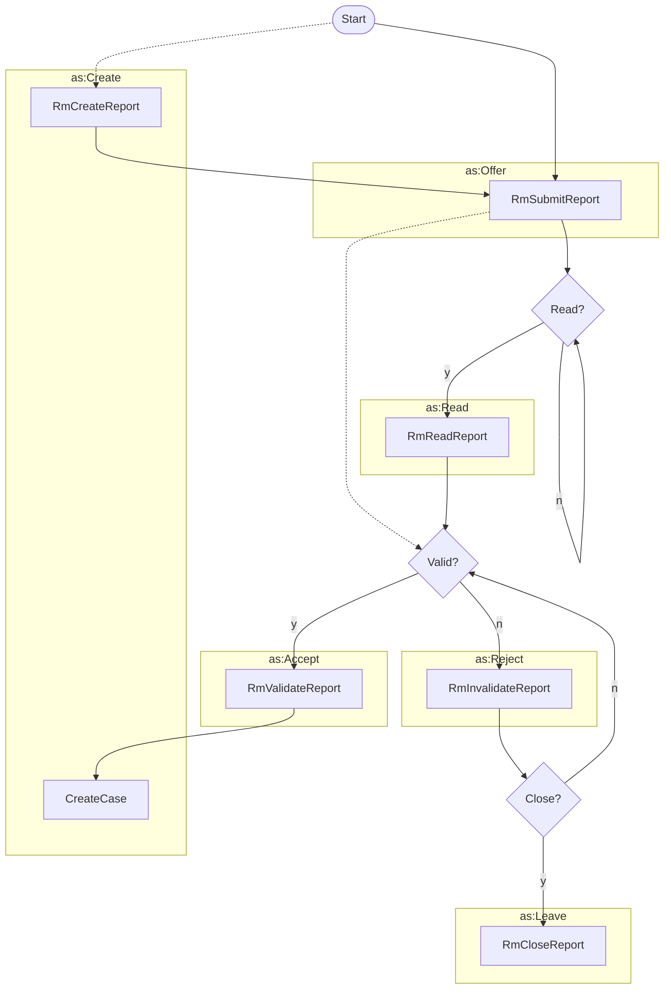
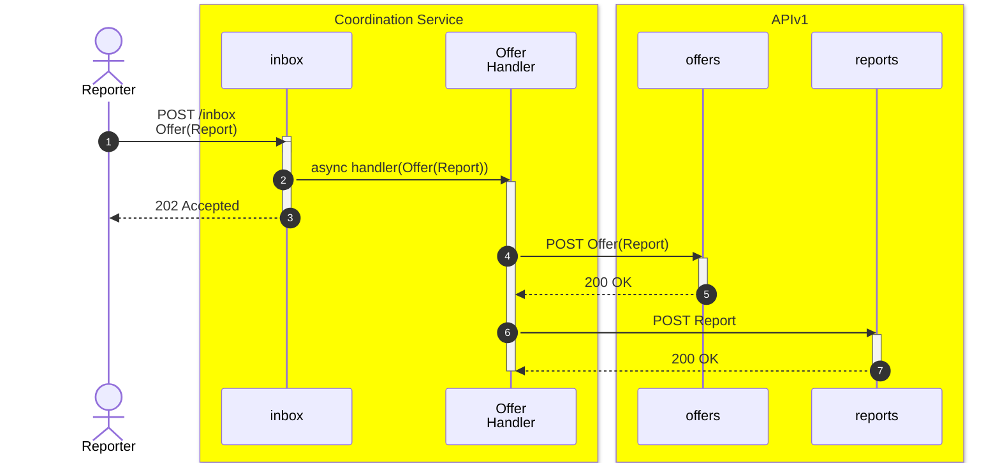
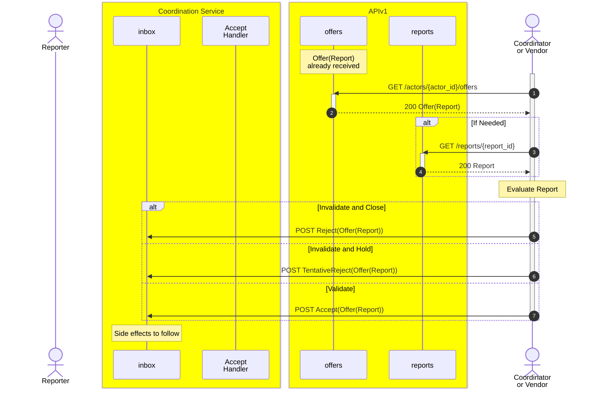
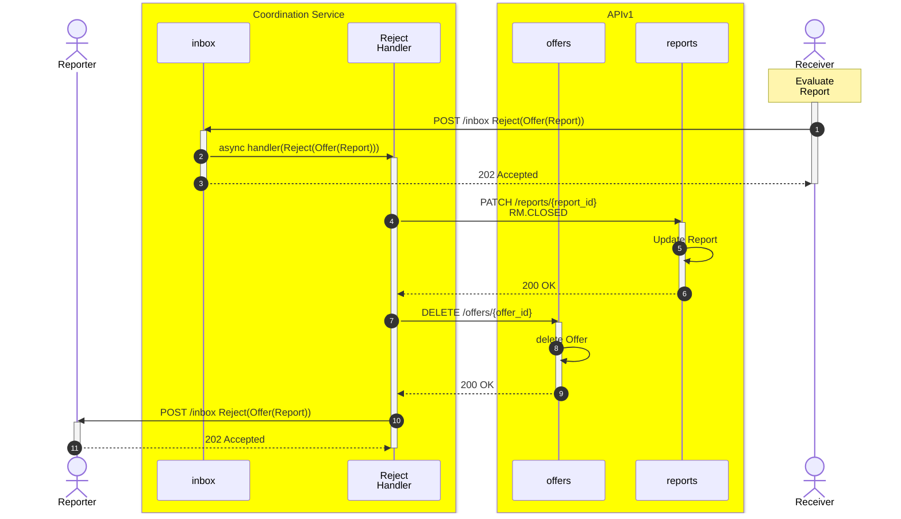
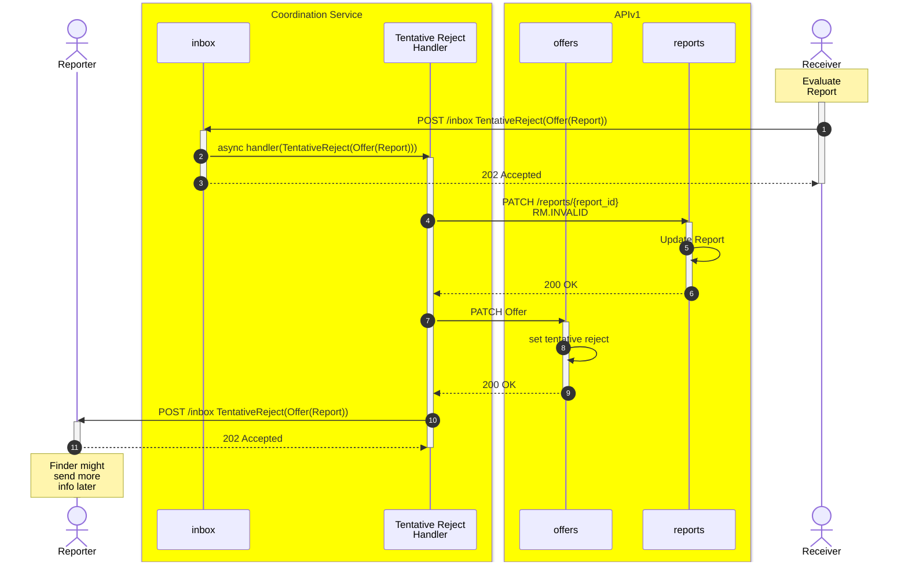
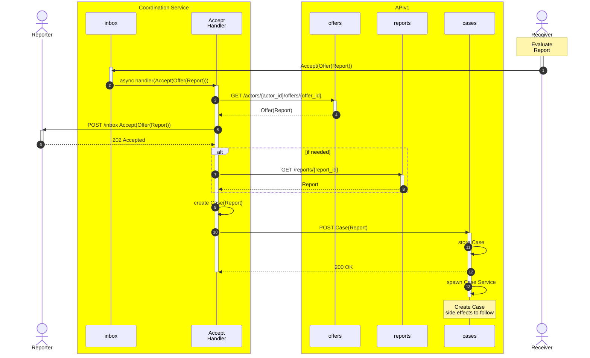
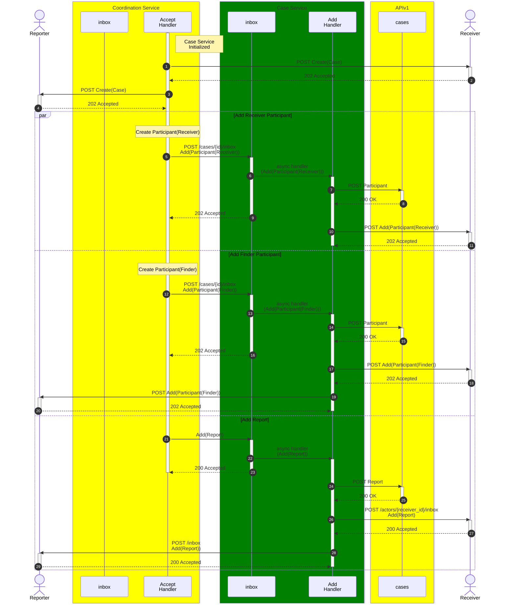

# Reporting a Vulnerability



The following task flow diagram addresses the opening portion of the Report
Management process in which a finder
creates a vulnerability report and submits it to a vendor. The vendor then reads
the report and either accepts or
rejects it. If the vendor accepts the report, they create a case for it. If the
vendor rejects the report, they
eventually close it unless there's a reason to reconsider and validate it.



!!! question "`Create(Report) + Offer(Report)` vs `Offer(Report)`"

    Reports are delivered to recipients using the `Offer` activity. An `Offer`
    can include a `Report` object that the sender created immediately before
    sending. While a `Create(Report)` technically precedes an `Offer(Report)`, in
    practice the receiver usually only observes the `Offer` because the report
    was created entirely on the sender's side.

    In other cases the `Report` may have been created earlier or by a different
    actor (for example, a platform or intermediary). When that happens the
    `Create(Report)` and `Offer(Report)` are distinct activities. We show both
    patterns here to cover both workflows.

!!! example "When would `Create(Report)` be separate from `Offer(Report)`?"

    A security researcher files a report with a bug-bounty platform that
    implements Vultron. The `Create(Report)` activity happens between the
    researcher and the platform. Later, the platform submits the `Report` to a
    vendor by sending an `Offer(Report)`. The vendor receives the `Offer`
    (which contains the `Report` object) and may not be aware of the earlier
    `Create(Report)` activity.



Report submission might be followed by either a `Read` or `Accept` activity.

The `Read` activity is optional and should be used when the vendor wants to
acknowledge that they have received the report without accepting or rejecting
it.



The `Accept` activity is used when the vendor wants to accept the report
and create a case for it.






## Sequence Diagrams

The following sequence diagrams illustrate the interactions between actors
during the report submission process.

### Reporter Submits Report

### Receiver Evaluates Report

### Receiver Invalidates and Closes Offered Report

### Receiver Invalidates and Holds Offered Report

### Receiver Accepts Offered Report

### Spawn Case Actor from Report

