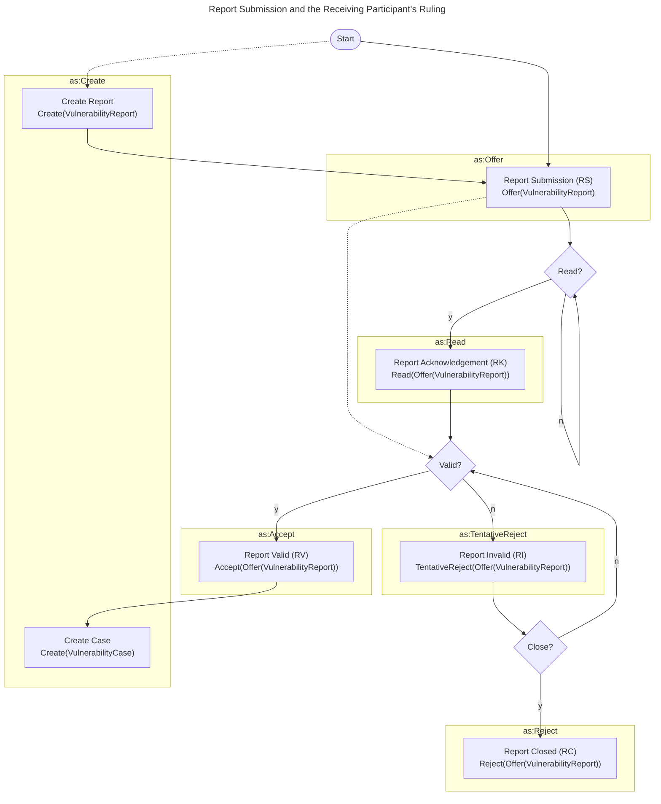

# How to Report a Vulnerability

This guide covers the opening exchange of Report Management (RM): a Reporter delivers a vulnerability report, and the recipient rules on it.
Follow the Reporter steps to submit a report, or the recipient steps to accept one and open a case.
You finish with the report at `RM.VALID` and a case created, or at `RM.INVALID` and closed.

---

## Prerequisites



- The recipient's actor Uniform Resource Identifier (URI).
  A Reporter needs somewhere to send the report.
- Nothing else.
  Report submission is the one exchange that does not require an existing case.

---

## The exchange

The flowchart below shows every path from an unsent report to a closed report or a created case.
Solid arrows are the common path; the dotted arrow is the shortcut taken when a recipient rules on a report without acknowledging it first.


```mermaid
---
title: Report Submission and the Receiving Participant's Ruling
---
flowchart TB
    subgraph as:Create
        RmCreateReport["Create Report<br/>Create(VulnerabilityReport)"]
        CreateCase["Create Case<br/>Create(VulnerabilityCase)"]
    end
    subgraph as:Read
        RmReadReport["Report Acknowledgement (RK)<br/>Read(Offer(VulnerabilityReport))"]
    end
    subgraph as:Offer
        RmSubmitReport["Report Submission (RS)<br/>Offer(VulnerabilityReport)"]
    end
    subgraph as:Accept
        RmValidateReport["Report Valid (RV)<br/>Accept(Offer(VulnerabilityReport))"]
    end
    subgraph as:TentativeReject
        RmInvalidateReport["Report Invalid (RI)<br/>TentativeReject(Offer(VulnerabilityReport))"]
    end
    subgraph as:Reject
        RmCloseReport["Report Closed (RC)<br/>Reject(Offer(VulnerabilityReport))"]
    end
    start([Start])
    start -.-> RmCreateReport
    start --> RmSubmitReport
    RmCreateReport --> RmSubmitReport
    RmSubmitReport -.-> v{Valid?}
    RmSubmitReport --> r{Read?}
    r -->|y| RmReadReport
    r -->|n| r
    v -->|y| RmValidateReport
    RmReadReport --> v
    v -->|n| RmInvalidateReport
    RmInvalidateReport --> c{Close?}
    c -->|y| RmCloseReport
    c -->|n| v
    RmValidateReport --> CreateCase
```

---

## Submit a report

1. Mint the report object with `Create(VulnerabilityReport)`.
   If the report is being created and sent in the same breath, skip this step and carry the report object inline on the `Offer` instead.
2. Send Report Submission (RS), implemented in ActivityStreams as `Offer(VulnerabilityReport)`, to the recipient's inbox, carrying the report as its `object`.

The recipient's report reaches `RM.RECEIVED` on delivery.
`Offer(VulnerabilityReport)` is the only RM message whose receipt moves the receiver's own RM state; every other RM message reports the sender's state.

!!! tip "One report, several recipients"

    Send a separate `Offer(VulnerabilityReport)` to each recipient.
    Each recipient runs its own RM state machine, so there is no broadcast form of report submission.

---

## Rule on a received report

Choose one of three answers.

- If you have read the report but are not ready to rule on it, send Report Acknowledgement (RK), `Read(Offer(VulnerabilityReport))`.
  See [How to Acknowledge a Report](acknowledge.md).
- If the report is in scope and actionable, send Report Valid (RV), `Accept(Offer(VulnerabilityReport))`, then create the case.
  See [How to Initialize a Case](initialize_case.md).
- If the report is not actionable, send Report Invalid (RI), `TentativeReject(Offer(VulnerabilityReport))`.
  This holds the report open, so the Reporter can supply information that changes your decision.

If you invalidated the report and have decided not to reconsider, send Report Closed (RC), `Reject(Offer(VulnerabilityReport))`, to close it.
If the Reporter supplies new information that changes your decision, send `Accept(Offer(VulnerabilityReport))` instead — `RM.INVALID` is not terminal.

!!! warning "Closing a report is not closing a case"

    `Reject(Offer(VulnerabilityReport))` applies only while the report has no case.
    Once `Accept(Offer(VulnerabilityReport))` has produced one, closure is `Leave(VulnerabilityCase)`.
    See [How to Advance a Case Through Report Management](manage_case.md).

---

## Verify

| What you sent | What to confirm |
|---|---|
| `Offer(VulnerabilityReport)` | The recipient holds the report and their RM state is `RECEIVED`. |
| `Accept(Offer(VulnerabilityReport))` | Your RM state is `VALID` and a `VulnerabilityCase` exists. |
| `TentativeReject(Offer(VulnerabilityReport))` | Your RM state is `INVALID` and the report is still open. |
| `Reject(Offer(VulnerabilityReport))` | Your RM state is `CLOSED`. |

---

## See it end to end

!!! example "Try it: `vultron-demo receive-report`"

    ```bash
    vultron-demo receive-report
    ```

    Or with Docker Compose:

    ```bash
    DEMO=receive-report docker compose -f docker/docker-compose.yml run --rm demo
    ```

    For a narrated walkthrough of the same run, see [Tutorial: Run the Receive-Report Demo](../../../tutorials/receive_report_demo.md).

---

## Further reading

- [Report Management (RM) Messages](../../../reference/messages/rm.md) — the wire format and a rendered example for each activity above
- [Activity Vocabulary Design](../../../topics/activity_vocabulary_design.md) — why `Create(VulnerabilityReport)` and `Offer(VulnerabilityReport)` are separate activities, and why report closure and case closure use different verbs
- [Report Management](../../../topics/process_models/rm/index.md) — the state machine these activities drive
- [Trigger API Reference](../../../reference/trigger-api.md#report-management) — request schema and endpoint details for `submit-report`, `validate-report`, `invalidate-report`, `reject-report`, and `close-report`
