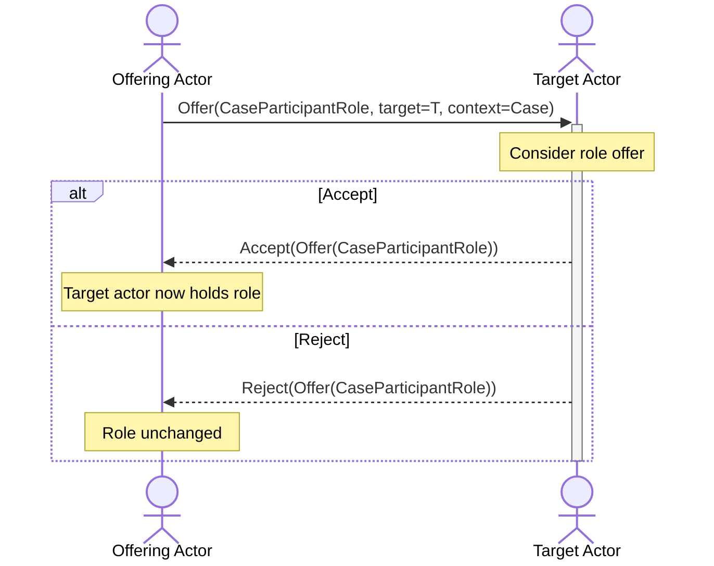

# Role Delegation



Role delegation is the protocol flow by which the Case Owner (or another
authorized participant) offers a specific `CVDRole` to another actor in the case.
The recipient may accept or reject the offer.

The canonical wire format uses a dedicated `as_CaseParticipantRole` object
(introduced in ADR-0039) to unambiguously distinguish a role offer from a case
ownership-transfer offer. Both previously serialized as `Offer(VulnerabilityCase)`,
creating an ambiguity resolved only by registry ordering. The new format is
self-describing: the object type alone identifies the activity as a role offer.

See also: [ADR-0039 — Resolve Wire Ambiguity Between OFFER\_CASE\_MANAGER\_ROLE
and OFFER\_CASE\_OWNERSHIP\_TRANSFER via Dedicated Object
Type](../../../adr/0039-offer-case-participant-role-wire-type.md)

## Protocol Flow



## Offer CaseParticipantRole

The offering actor (typically the Case Owner or Case Manager) sends an
`Offer(as_CaseParticipantRole)` to the target actor's inbox. The
`as_CaseParticipantRole` object carries the specific `CVDRole` being offered.
The `target` field is the Actor receiving the role; the case is identified via
the `context` field.

**Pattern**: `OfferCaseParticipantRolePattern` in
`vultron/wire/as2/extractor/_instances.py`

**Factory**: `offer_case_participant_role_activity` in
`vultron/wire/as2/factories/__init__.py` (re-exported from
`vultron/wire/as2/factories/case.py`)

```python
from vultron.wire.as2.factories import offer_case_participant_role_activity
from vultron.enums.roles import CVDRole

activity = offer_case_participant_role_activity(
    role=CVDRole.CASE_MANAGER,
    target_actor=target_actor,  # as_Actor
    case=vulnerability_case,    # as_VulnerabilityCase
    actor=offering_actor_id,
    to=[target_actor_id],
)
```

## Accept CaseParticipantRole

The target actor accepts the role offer by sending
`Accept(Offer(CaseParticipantRole))` back to the offering actor.

**Pattern**: `AcceptCaseParticipantRolePattern` in
`vultron/wire/as2/extractor/_instances.py`

**Factory**: `accept_case_participant_role_activity` in
`vultron/wire/as2/factories/__init__.py`

```python
from vultron.wire.as2.factories import accept_case_participant_role_activity

activity = accept_case_participant_role_activity(
    offer=original_offer,   # the Offer(CaseParticipantRole) activity
    actor=target_actor_id,
    to=[offering_actor_id],
)
```

## Reject CaseParticipantRole

The target actor declines the role offer by sending
`Reject(Offer(CaseParticipantRole))` back to the offering actor.

**Pattern**: `RejectCaseParticipantRolePattern` in
`vultron/wire/as2/extractor/_instances.py`

**Factory**: `reject_case_participant_role_activity` in
`vultron/wire/as2/factories/__init__.py`

```python
from vultron.wire.as2.factories import reject_case_participant_role_activity

activity = reject_case_participant_role_activity(
    offer=original_offer,   # the Offer(CaseParticipantRole) activity
    actor=target_actor_id,
    to=[offering_actor_id],
)
```

## Reference

- Patterns: `vultron/wire/as2/extractor/_instances.py` —
  `OfferCaseParticipantRolePattern`, `AcceptCaseParticipantRolePattern`,
  `RejectCaseParticipantRolePattern`
- Factories: `vultron/wire/as2/factories/case.py` —
  `offer_case_participant_role_activity`, `accept_case_participant_role_activity`,
  `reject_case_participant_role_activity`
- ADR: [ADR-0039](../../../adr/0039-offer-case-participant-role-wire-type.md)
- Spec: `specs/semantic-extraction.yaml` SE-08-001 through SE-08-005
