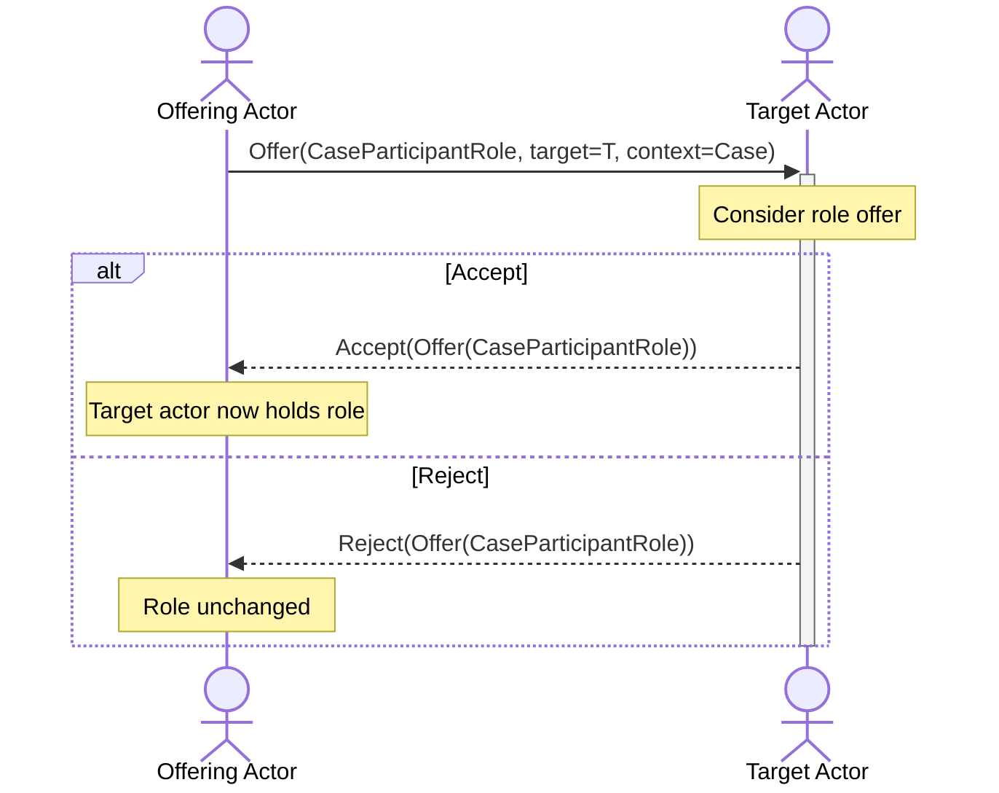

# How to Delegate a Role to Another Participant

Use this guide to offer a `CVDRole` on a case to another actor.
Delegation is an offer, so the recipient decides whether to take the role.
You finish with the recipient holding the role, or with the roster unchanged.

---

## Prerequisites



- An existing case, and the authority to delegate on it. This is normally the
  Case Owner or the Case Manager.
- The target actor's URI, and its seat on the case.
- The specific `CVDRole` you intend to offer.

---

## The exchange

The sequence diagram below shows both outcomes.
The offer names the role; the reply decides whether the role moves.

---

## Offer the role

1. Send `OfferCaseParticipantRole` to the target actor's inbox.
2. Carry the role in an `as_CaseParticipantRole` object, name the target actor in
   `target`, and name the case in `context`.
3. Wait for the reply. Nothing changes until the target answers.

In the reference implementation this is the `offer-case-participant-role` trigger
behavior.

!!! warning "Offer a role, not a case"

    A role offer and a case ownership transfer are both offers, and they used to
    serialize identically.
    Carrying an `as_CaseParticipantRole` object is what tells a peer which one you
    mean (ADR-0039), so do not offer the `VulnerabilityCase` when you mean to
    delegate a role.
    For the transfer, see
    [Ownership Transfer](../../../topics/case_lifecycle/ownership_transfer.md).

---

## Answer a role offer

Reply to the offering actor with the original `Offer` as your `object`.

- If you are taking the role, send `AcceptCaseParticipantRole`. You hold the role
  from that point.
- If you are not, send `RejectCaseParticipantRole`. The roster is unchanged.

Consider what the role obliges you to do before accepting.
`CVDRole.CASE_MANAGER` in particular makes you the single-writer authority for the
case ledger, so accepting it moves real work onto your actor.

---

## Verify

| What you sent | What to confirm |
|---|---|
| `OfferCaseParticipantRole` | The target holds an `Offer` carrying an `as_CaseParticipantRole`. |
| `AcceptCaseParticipantRole` | Your `CaseParticipant` record lists the new role. |
| `RejectCaseParticipantRole` | Your roles are unchanged and the refusal is recorded. |

---

## Further reading

- [Case Management Messages](../../../reference/messages/case_management.md) — the
  wire format, pattern, and factory for each activity above
- [Activity Vocabulary Design](../../../topics/activity_vocabulary_design.md) —
  why a new object type was minted here rather than a new verb
- [ADR-0039 — Resolve Wire Ambiguity Between OFFER\_CASE\_MANAGER\_ROLE
  and OFFER\_CASE\_OWNERSHIP\_TRANSFER via Dedicated Object
  Type](../../../adr/0039-offer-case-participant-role-wire-type.md)
