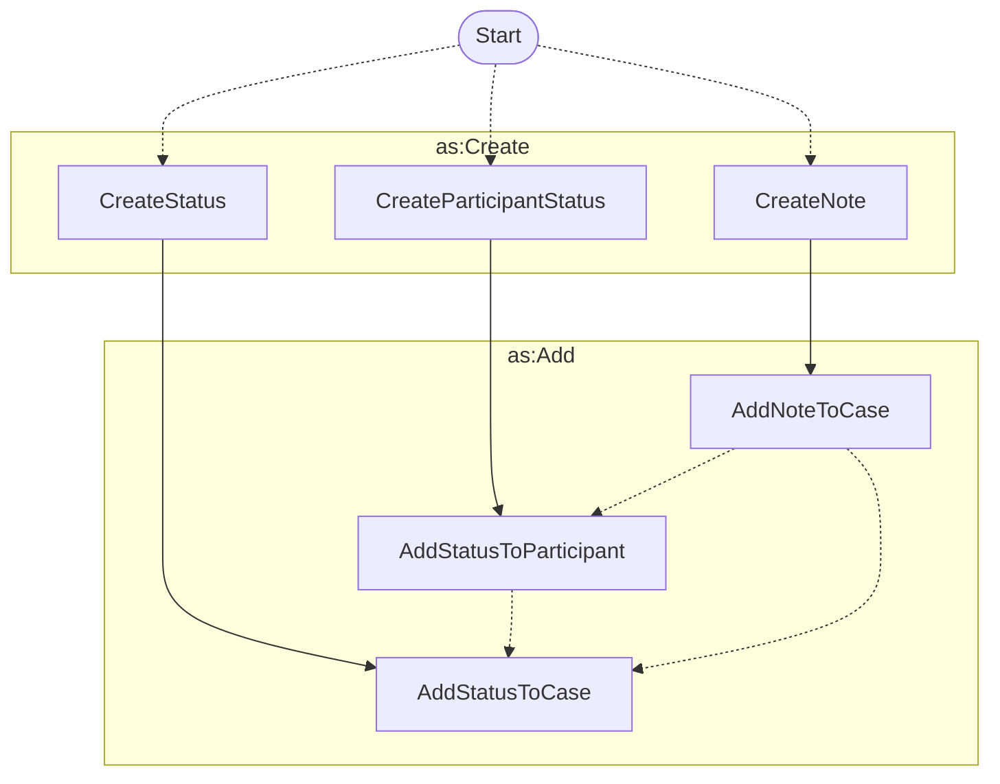

# Status Updates and Comments



Here we have a number of activities that are used to update the status of a
case, or to add a comment to a case.



!!! tip inline end "See also"

    Descriptions of the [`CaseStatus`](../objects.md#casestatus) and
    [`ParticipantStatus`](../objects.md#participantstatus), and [`CaseParticipant`](../objects.md#caseparticipant)
    objects can be found in the [Objects](../objects.md) section.

In addition to the Create/Add process for
each of these, there are sometimes additional activities that are triggered in
response to a status update or a comment:

- A status update to a participant can trigger a status update to the case.
- A note might trigger a status update to a case or a participant.

!!! tip "A Note on `as:Notes`"

    The ActivityStreams vocabulary includes an [`as:Note`](../objects.md) object, which is
    used to represent a comment or short post. We use this object to represent 
    comments on a case.

!!! tip "Create *then* Add vs Create with a Target"

    In this documentation, we use the `as:Create` activity to represent the 
    creation of a new object, such as a new note or a new status. We use the 
    `as:Add` activity to represent the addition of an existing object to another 
    object, such as adding a status to a case.

    However, it is likely acceptable within an ActivityPub implementation to
    use the `as:Create` activity for both cases, since the `as:Create` activity
    includes a `target` property that can be used to specify the object to
    which the new object is being added.

    Sinilarly, it may also be acceptable to use the `as:Add` activity to
    represent the creation of a new object, since the `as:Add` activity
    includes a `object` property that can be used to specify the object that
    is being created along with the `target` property that can be used to
    specify the object to which the new object is being added.

## Create Status

```python exec="true" idprefix=""
from vultron.scripts.vocab_examples import create_case_status, json2md

print(json2md(create_case_status()))
```

## Add Status to Case

```python exec="true" idprefix=""
from vultron.scripts.vocab_examples import add_status_to_case, json2md

print(json2md(add_status_to_case()))
```

## Create Participant Status

```python exec="true" idprefix=""
from vultron.scripts.vocab_examples import create_participant_status, json2md

print(json2md(create_participant_status()))
```

## Add Status to Participant

```python exec="true" idprefix=""
from vultron.scripts.vocab_examples import add_status_to_participant, json2md

print(json2md(add_status_to_participant()))
```

## Create Note

```python exec="true" idprefix=""
from vultron.scripts.vocab_examples import create_note, json2md

print(json2md(create_note()))
```

## Add Note to Case

```python exec="true" idprefix=""
from vultron.scripts.vocab_examples import add_note_to_case, json2md

print(json2md(add_note_to_case()))
```
