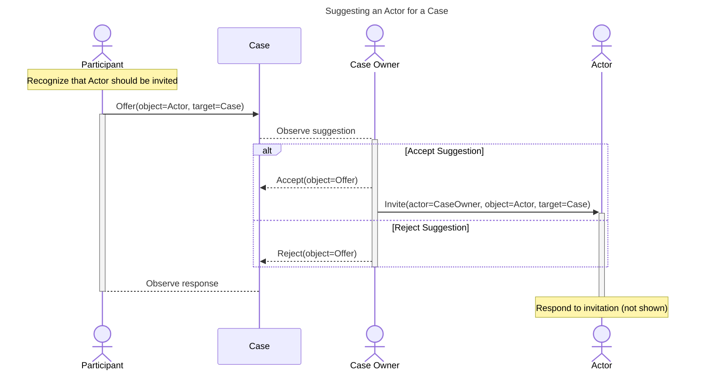

# Suggesting an Actor for a Case



During the course of coordinating a case, an existing case participant might recognize that another actor
should be invited to participate in the case. The following mechanisms provide a way for a case participant
to suggest that another actor be invited to participate in the case.

<!-- for vertical spacing -->
<br/>
<br/>
<br/>

!!! question "Why Suggest instead of just Invite?"

    The process described here makes an assumption that there is a case owner who is responsible for coordinating the 
    case. Participants having the case owner role can in principle just directly invite other actors to participate in 
    the case, and they might not need the suggestion mechanism described here. However, we include this mechanism
    to account for the possibilities that:
    
    - there could be multiple case owners, and they might not all agree on who should be invited to participate in the 
      case.
    - a non-case-owner participant might want to suggest that another actor be invited to participate in the case

    Of these, the latter is the more likely scenario, but the mechanism described here can be used in either case.    

!!! example "Reasons to Invite other Actors"

    There are many reasons why a case participant might want to suggest another actor to participate in a case.
    The following are some examples:

    - A finder, having reported to one vendor, might further discover that the vulnerability is actually in a 
      third-party library, and suggest inviting the library vendor to participate in the case.
    - A vendor might be a participant in (but not the owner of) a case, and wants to suggest that the case owner
      invite a sector-specific coordinator to participate in the case to address critical infrastructure concerns.
    - A reporter participant might suggest a technical expert (for example, a member of a protocol working group) to 
      include in the case.
    - A coordinator might suggest to the case owner that a large deployer be invited to participat in a case to 
      address concerns about the impact of deploying a fix for a vulnerability on infrastructure and operations.

Below is a sequence diagram showing the process of suggesting an actor for a case.
We used a sequence diagram instead of a flow chart since the process is relatively simple and the sequence diagram
is easier to read.



## Recommend Actor

An actor can recommend that another actor be invited to participate in a case by sending an `Offer` activity
with the `object` property set to the actor that is being recommended. The `target` property of the `Offer` activity
is set to the `case` object. Implementations should then prompt the case owner to accept or reject the
recommendation.

```python exec="true" idprefix=""
from vultron.scripts.vocab_examples import recommend_actor, json2md

print(json2md(recommend_actor()))
```

## Accept Actor Recommendation

The case owner can accept the recommendation by sending an `Accept` activity.
We show this as an actor accepting the actor `object` from the recommendation [above](#recommend-actor),
rather than accepting the `Offer` activity itself. Note the `target` property of the `Accept` activity is set to the
`case` object.

This should be followed by the case owner [inviting the actor to the case](#invite-to-case).

```python exec="true" idprefix=""
from vultron.scripts.vocab_examples import accept_actor_recommendation, json2md

print(json2md(accept_actor_recommendation()))
```

## Reject Actor Recommendation

The case owner can reject the recommendation by sending a `RejectActorRecommendation` activity.
The structure of this activity is similar to the `Accept` activity [above](#accept-actor-recommendation).

```python exec="true" idprefix=""
from vultron.scripts.vocab_examples import reject_actor_recommendation, json2md

print(json2md(reject_actor_recommendation()))
```


