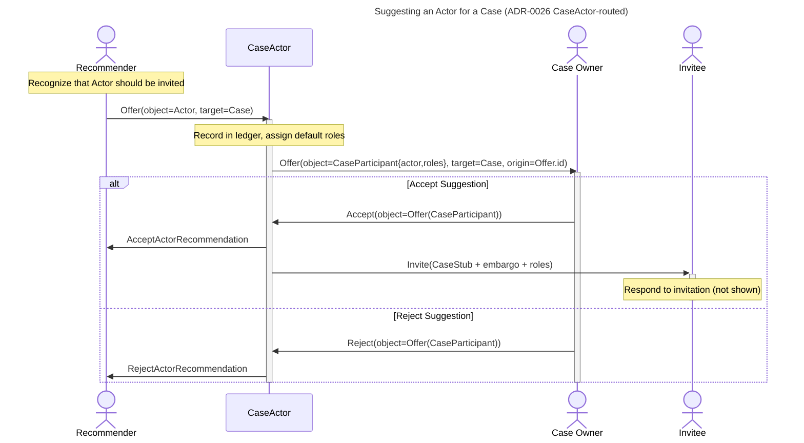

# Suggesting an Actor for a Case



During the course of coordinating a case, an existing case participant might recognize that another actor
should be invited to participate in the case. The following mechanisms provide a way for a case participant
to suggest that another actor be invited to participate in the case.

<!-- for vertical spacing -->
<br/>
<br/>
<br/>

!!! question "Why Suggest instead of just Invite?"

    The process described here makes an assumption that there is a case owner who is responsible for coordinating the 
    case. Participants having the case owner role can in principle just directly invite other actors to participate in 
    the case, and they might not need the suggestion mechanism described here. However, we include this mechanism
    to account for the possibilities that:
    
    - there could be multiple case owners, and they might not all agree on who should be invited to participate in the 
      case.
    - a non-case-owner participant might want to suggest that another actor be invited to participate in the case

    Of these, the latter is the more likely scenario, but the mechanism described here can be used in either case.    

!!! example "Reasons to Invite other Actors"

    There are many reasons why a case participant might want to suggest another actor to participate in a case.
    The following are some examples:

    - A finder, having reported to one vendor, might further discover that the vulnerability is actually in a 
      third-party library, and suggest inviting the library vendor to participate in the case.
    - A vendor might be a participant in (but not the owner of) a case, and wants to suggest that the case owner
      invite a sector-specific coordinator to participate in the case to address critical infrastructure concerns.
    - A reporter participant might suggest a technical expert (for example, a member of a protocol working group) to 
      include in the case.
    - A coordinator might suggest to the case owner that a large deployer be invited to participat in a case to 
      address concerns about the impact of deploying a fix for a vulnerability on infrastructure and operations.

Below is a sequence diagram showing the process of suggesting an actor for a case.
We used a sequence diagram instead of a flow chart since the process is relatively simple and the sequence diagram
is easier to read.


```mermaid
---
title: Suggesting an Actor for a Case (ADR-0026 CaseActor-routed)
---
sequenceDiagram
    actor A as Recommender
    participant CA as CaseActor
    actor B as Case Owner
    actor D as Invitee
    Note over A: Recognize that Actor should be invited
    A ->> CA: Offer(object=Actor, target=Case)
    activate CA
    Note over CA: Record in ledger, assign default roles
    CA ->> B: Offer(object=CaseParticipant{actor,roles}, target=Case, origin=Offer.id)
    activate B
    alt Accept Suggestion
        B ->> CA: Accept(object=Offer(CaseParticipant))
        CA ->> A: AcceptActorRecommendation
        CA ->>+ D: Invite(CaseStub + embargo + roles)
        note over D: Respond to invitation (not shown)
        deactivate D
    else Reject Suggestion
        B ->> CA: Reject(object=Offer(CaseParticipant))
        CA ->> A: RejectActorRecommendation
    end
    deactivate B
    deactivate CA
```

## Recommend Actor

A participant recommends another actor to the **CaseActor** by sending an `Offer` activity with the
`object` property set to the actor being recommended and the `target` set to the case.
The CaseActor records the recommendation in the canonical ledger, assigns default roles, and
forwards a transformed offer to the Case Owner.

```python exec="true" idprefix=""
from vultron.wire.as2.vocab.examples.vocab_examples import recommend_actor, json2md

print(json2md(recommend_actor()))
```

## CaseActor Forwards Offer to Case Owner

The CaseActor transforms the `Offer(Actor, Case)` into `Offer(CaseParticipant{actor, roles}, Case)`
and sends it to the Case Owner's inbox. The `origin` field carries the ID of the original recommendation
so the Case Owner can trace the causal chain.

```python exec="true" idprefix=""
from vultron.wire.as2.vocab.examples.vocab_examples import offer_case_participant, json2md

print(json2md(offer_case_participant()))
```

## Case Owner Accepts Recommendation

The Case Owner accepts the recommendation by sending `Accept(Offer(CaseParticipant))` to the
**CaseActor** (not directly to the recommender). The CaseActor records the decision, notifies the
original recommender, and sends an `Invite` to the proposed participant.

```python exec="true" idprefix=""
from vultron.wire.as2.vocab.examples.vocab_examples import accept_case_participant_offer, json2md

print(json2md(accept_case_participant_offer()))
```

## Case Owner Rejects Recommendation

The Case Owner rejects the recommendation by sending `Reject(Offer(CaseParticipant))` to the
**CaseActor**. The CaseActor records the decision and notifies the original recommender.

```python exec="true" idprefix=""
from vultron.wire.as2.vocab.examples.vocab_examples import reject_case_participant_offer, json2md

print(json2md(reject_case_participant_offer()))
```



## Demo

!!! example "Try it: `vultron-demo suggest-actor`"

    Run this workflow end-to-end with the unified demo CLI:

    ```bash
    vultron-demo suggest-actor
    ```

    Or with Docker Compose:

    ```bash
    DEMO=suggest-actor docker compose -f docker/docker-compose.yml run --rm demo
    ```
