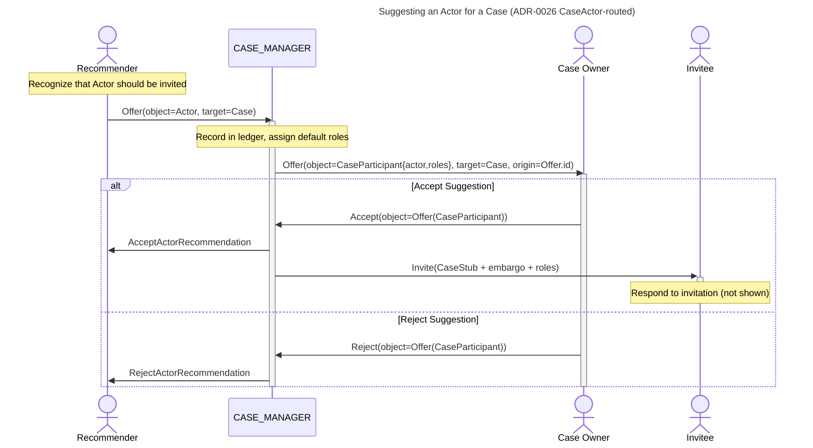

# How to Suggest an Actor for a Case

Use this guide when you believe an actor belongs on a case and you are not the one who
decides. A suggestion goes to the CASE_MANAGER, which presents it to the Case Owner for
a decision (ADR-0026, ADR-0029). You finish with the suggested actor either invited or
the recommendation declined, and with the outcome reported back to you.

---

## Prerequisites



- A case you participate in. Any participant can suggest an actor.
- The suggested actor's Uniform Resource Identifier (URI).
- The CASE_MANAGER's actor URI.

If you hold the Case Owner role and the decision is yours alone, invite the actor
directly instead — see
[How to Invite an Actor to a Case](invite_actor.md).

---

## The exchange

The sequence diagram below shows the full round trip, from recommendation to invitation
or refusal. The recommender never contacts the Case Owner or the invitee directly.


```mermaid
---
title: Suggesting an Actor for a Case (ADR-0026 CaseActor-routed)
---
sequenceDiagram
    actor A as Recommender
    participant CA as CASE_MANAGER
    actor B as Case Owner
    actor D as Invitee
    Note over A: Recognize that Actor should be invited
    A ->> CA: Offer(object=Actor, target=Case)
    activate CA
    Note over CA: Record in ledger, assign default roles
    CA ->> B: Offer(object=CaseParticipant{actor,roles}, target=Case, origin=Offer.id)
    activate B
    alt Accept Suggestion
        B ->> CA: Accept(object=Offer(CaseParticipant))
        CA ->> A: AcceptActorRecommendation
        CA ->>+ D: Invite(CaseStub + embargo + roles)
        note over D: Respond to invitation (not shown)
        deactivate D
    else Reject Suggestion
        B ->> CA: Reject(object=Offer(CaseParticipant))
        CA ->> A: RejectActorRecommendation
    end
    deactivate B
    deactivate CA
```

---

## Recommend the actor

The written protocol does not enumerate this exchange. It has a single message type,
General Inquiry (GI), for information no formal state machine tracks but that
participants need in order to coordinate, and GI was a placeholder for that whole
category. Building this prototype surfaced specific needs inside it, and where a need
turned out to be a recognisable communication pattern that existing ActivityStreams
vocabulary could already express, it was split off and given its own activity. The
suggestion handshake below is three of those. The list is open rather than complete.

1. Send `Offer(Actor)` to the CASE_MANAGER with the recommended actor as its `object`
   and the case as its `target`.
2. Wait. The CASE_MANAGER records the recommendation on the ledger, assigns default
   roles, and forwards a transformed offer to the Case Owner.
3. Read the outcome from the CASE_MANAGER's reply — `Accept(Offer(CaseParticipant))` or
   `Reject(Offer(CaseParticipant))`.

The forwarded offer carries the original recommendation's ID in its `origin` field, so
the Case Owner can trace the request back to you.

---

## Decide on a recommendation

As Case Owner, answer the forwarded offer, addressing the reply to the CASE_MANAGER and
not to the recommender.

- If the actor should join, send `Accept(Offer(CaseParticipant))`, with the forwarded
  `Offer(CaseParticipant)` as its `object`. The CASE_MANAGER then invites the actor.
- If it should not, send `Reject(Offer(CaseParticipant))` with the same `object`. No
  invitation is sent.

!!! warning "Replying to the recommender skips the record"

    The CASE_MANAGER is the single writer for the case ledger. A decision sent straight
    back to the recommender is never committed, so no replica learns of it and no
    invitation follows.

---

## Verify

| What you sent | What to confirm |
|---|---|
| `Offer(Actor, Case)` | The recommendation appears as a ledger entry. |
| `Accept(Offer(CaseParticipant))` | The recommender holds an `Accept(Offer(CaseParticipant))`, and the suggested actor holds an `Invite`. |
| `Reject(Offer(CaseParticipant))` | The recommender holds a `Reject(Offer(CaseParticipant))`, and no `Invite` was sent. |

---

## See it end to end

!!! example "Try it: `vultron-demo suggest-actor`"

    ```bash
    vultron-demo suggest-actor
    ```

    Or with Docker Compose:

    ```bash
    DEMO=suggest-actor docker compose -f docker/docker-compose.yml run --rm demo
    ```

    The scenario runs both outcomes: the Case Owner accepts one suggestion and rejects
    another.

---

## Further reading

- [General Inquiry (GI) Messages](../../../reference/messages/general.md) — the wire
  format and a rendered example for the recommendation activities
- [Case Management Messages](../../../reference/messages/case_management.md) —
  the wire format for the forwarded offer and its accept and reject replies
- [Activity Vocabulary Design](../../../topics/activity_vocabulary_design.md) —
  why the suggestion step exists alongside direct invitation, and the situations it
  covers
