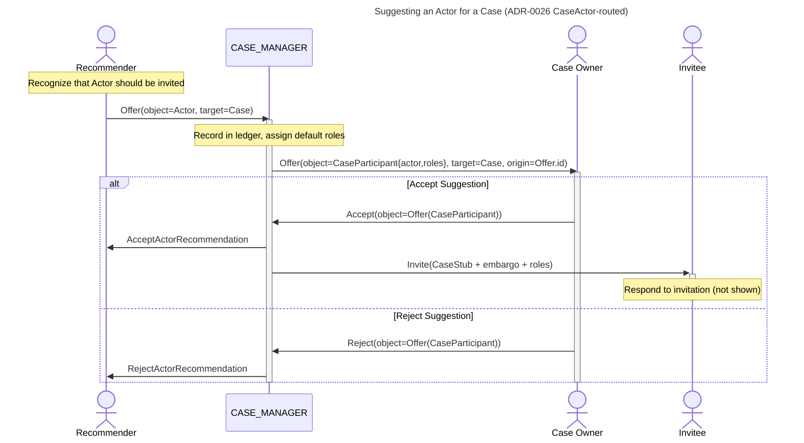

# Suggesting an Actor for a Case



During the course of coordinating a case, an existing case participant might recognize that another actor
should be invited to participate in the case. The following mechanisms provide a way for a case participant
to suggest that another actor be invited to participate in the case.

<!-- for vertical spacing -->
<br/>
<br/>
<br/>

Use this flow to get an actor invited when you are not the Case Owner, or when a
case has more than one Case Owner and the invitation needs a decision. A Case
Owner can also invite an actor directly — see
[Inviting an Actor to a Case](invite_actor.md). For why the suggestion step
exists alongside direct invitation, and for the situations it covers, see
[Activity Vocabulary Design](../../../topics/activity_vocabulary_design.md).

The sequence diagram below shows the process of suggesting an actor for a case.


```mermaid
---
title: Suggesting an Actor for a Case (ADR-0026 CaseActor-routed)
---
sequenceDiagram
    actor A as Recommender
    participant CA as CASE_MANAGER
    actor B as Case Owner
    actor D as Invitee
    Note over A: Recognize that Actor should be invited
    A ->> CA: Offer(object=Actor, target=Case)
    activate CA
    Note over CA: Record in ledger, assign default roles
    CA ->> B: Offer(object=CaseParticipant{actor,roles}, target=Case, origin=Offer.id)
    activate B
    alt Accept Suggestion
        B ->> CA: Accept(object=Offer(CaseParticipant))
        CA ->> A: AcceptActorRecommendation
        CA ->>+ D: Invite(CaseStub + embargo + roles)
        note over D: Respond to invitation (not shown)
        deactivate D
    else Reject Suggestion
        B ->> CA: Reject(object=Offer(CaseParticipant))
        CA ->> A: RejectActorRecommendation
    end
    deactivate B
    deactivate CA
```

## Recommend Actor

A participant recommends another actor to the **CASE_MANAGER** by sending an `Offer` activity with the
`object` property set to the actor being recommended and the `target` set to the case.
The CASE_MANAGER records the recommendation in the canonical ledger, assigns default roles, and
forwards a transformed offer to the Case Owner.

```python exec="true" idprefix=""
from vultron.wire.as2.vocab.examples.vocab_examples import recommend_actor, json2md

print(json2md(recommend_actor()))
```

## CASE_MANAGER Forwards Offer to Case Owner

The CASE_MANAGER transforms the `Offer(Actor, Case)` into `Offer(CaseParticipant{actor, roles}, Case)`
and sends it to the Case Owner's inbox. The `origin` field carries the ID of the original recommendation
so the Case Owner can trace the causal chain.

```python exec="true" idprefix=""
from vultron.wire.as2.vocab.examples.vocab_examples import offer_case_participant, json2md

print(json2md(offer_case_participant()))
```

## Case Owner Accepts Recommendation

The Case Owner accepts the recommendation by sending `Accept(Offer(CaseParticipant))` to the
**CASE_MANAGER** (not directly to the recommender). The CASE_MANAGER records the decision, notifies the
original recommender, and sends an `Invite` to the proposed participant.

```python exec="true" idprefix=""
from vultron.wire.as2.vocab.examples.vocab_examples import accept_case_participant_offer, json2md

print(json2md(accept_case_participant_offer()))
```

## Case Owner Rejects Recommendation

The Case Owner rejects the recommendation by sending `Reject(Offer(CaseParticipant))` to the
**CASE_MANAGER**. The CASE_MANAGER records the decision and notifies the original recommender.

```python exec="true" idprefix=""
from vultron.wire.as2.vocab.examples.vocab_examples import reject_case_participant_offer, json2md

print(json2md(reject_case_participant_offer()))
```



## Demo

!!! example "Try it: `vultron-demo suggest-actor`"

    Run this workflow end-to-end with the unified demo CLI:

    ```bash
    vultron-demo suggest-actor
    ```

    Or with Docker Compose:

    ```bash
    DEMO=suggest-actor docker compose -f docker/docker-compose.yml run --rm demo
    ```
