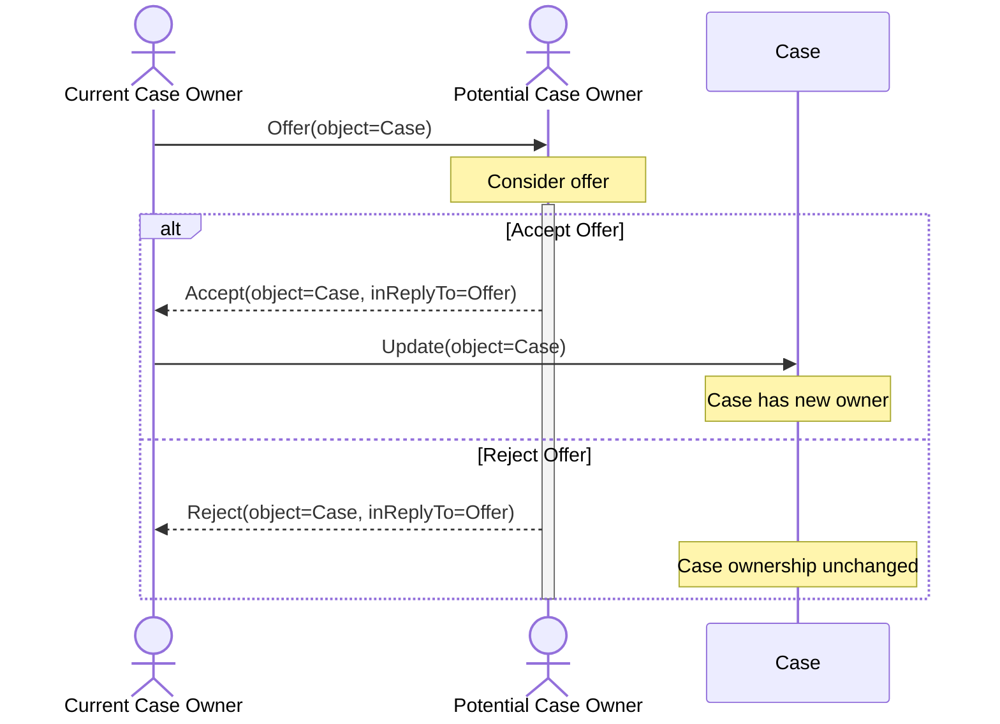

# Transferring Case Ownership



Transfer if case ownership was not part of the original Vultron protocol, but it seems like a
reasonable extension that could be useful in some cases, such as transferring a
case

- from a researcher to a vendor
- from a vendor to an upstream vendor
- from a vendor to a coordinator
- from a coordinator to a vendor
- between coordinators

The presumption here is that the initial creator of a case is its owner.
Subsequent to that, the existing owner can offer to transfer ownership to
another participant. The new owner can then accept or reject the offer.

We use a sequence diagram instead of a flow chart since the process is
relatively simple and the sequence diagram is easier to read.



## Offer Case Ownership Transfer

The current owner of a case can offer to transfer ownership of the case to
another participant.

```python exec="true" idprefix=""
from vultron.scripts.vocab_examples import offer_case_ownership_transfer, json2md

print(json2md(offer_case_ownership_transfer()))
```

## Accept Case Ownership Transfer

The new owner of a case can accept an offer to transfer ownership of the case
to them.

```python exec="true" idprefix=""
from vultron.scripts.vocab_examples import accept_case_ownership_transfer, json2md

print(json2md(accept_case_ownership_transfer()))
```

## Reject Case Ownership Transfer

The proposed new owner of a case can reject an offer to transfer ownership of
the case to them. In this case, the case ownership transfer is cancelled, and the
case ownership remains with the original owner.

```python exec="true" idprefix=""
from vultron.scripts.vocab_examples import reject_case_ownership_transfer, json2md

print(json2md(reject_case_ownership_transfer()))
```

## Update Case

The case object is updated to reflect the new owner of the case.

```python exec="true" idprefix=""
from vultron.scripts.vocab_examples import update_case, json2md

print(json2md(update_case()))
```
