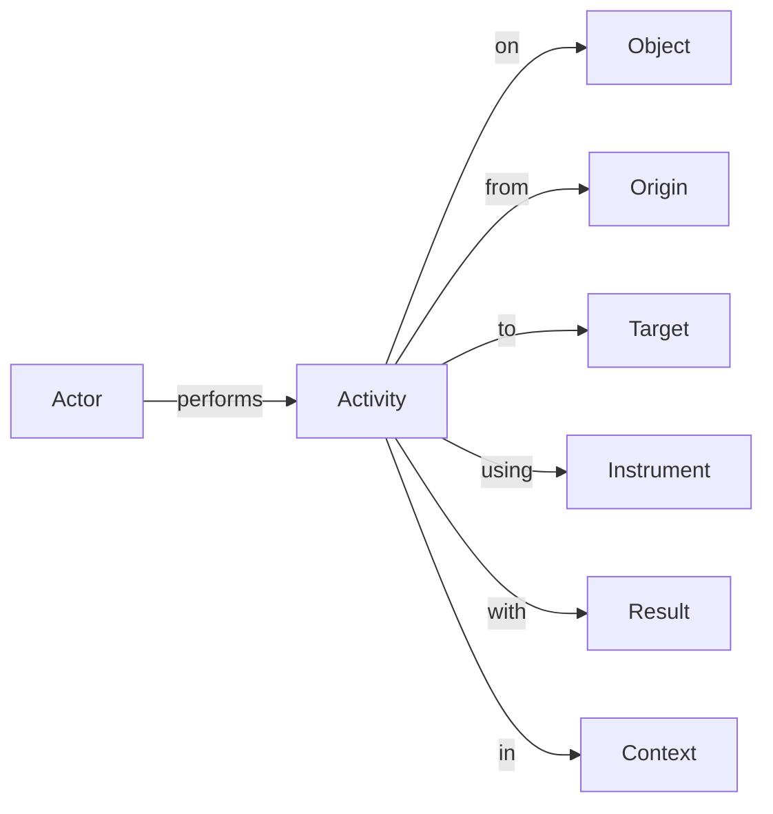

# Vultron and ActivityPub



The Vultron protocol can be mapped onto the [ActivityPub](https://www.w3.org/TR/activitypub/){:target="_blank"}
protocol. This mapping is described in the
[Vultron ActivityStreams Ontology](../../reference/ontology/vultron_as.md).

In this section, we'll provide some examples of how the Vultron protocol
message types can be represented as ActivityPub messages using the
[ActivityStreams vocabulary](https://www.w3.org/TR/activitystreams-vocabulary/){:target="_blank"}.

## ActivityStreams Vocabulary

The [ActivityStreams vocabulary](https://www.w3.org/TR/activitystreams-vocabulary/){:target="_blank"} can be thought of as defining a
grammar for describing activities that are performed by actors. The generic structure of a sentence that can be
described using the ActivityStreams vocabulary is:

## Vultron ActivityStreams

From this perspective, the ActivityStreams vocabulary can be used to compose activities like the following:

- A Reporter Submits a Report to a Vendor
- A Vendor Validates a Report
- A Vendor Creates a Case from a Report
- A Reporter Proposes an Embargo on a Case
- A Vendor Accepts an Embargo on a Case

Vultron ActivityStreams (Vultron AS) is an extension of the
[ActivityStreams vocabulary](https://www.w3.org/TR/activitystreams-vocabulary/){:target="_blank"}
to describe the mapping of Vultron to ActivityStreams.
Vultron AS defines a number of new objects and activities that are used in the
Vultron protocol. These are described in the following sections:

- :material-bolt: [**Objects**](objects.md) specific to the Vultron AS vocabulary
- :material-wrench: [**Activities**](activities/index.md) used in the Vultron AS vocabulary

