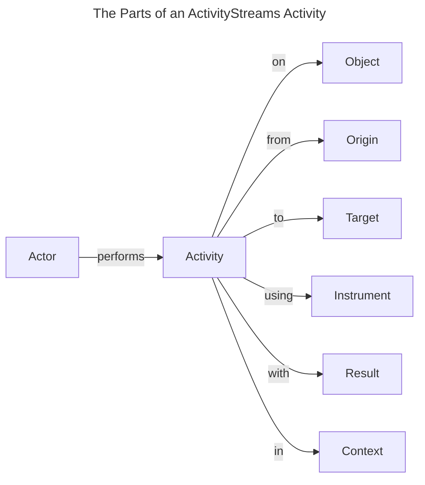

# Vultron and ActivityPub



Vultron messages are [ActivityStreams 2.0 (AS2)](https://www.w3.org/TR/activitystreams-core/){:target="_blank"} activities, delivered between actors over [ActivityPub](https://www.w3.org/TR/activitypub/){:target="_blank"}.
AS2 is the wire vocabulary, not an analogy for it: every protocol message a Vultron actor sends is an AS2 activity, and every object it carries is either an AS2 object or a Vultron extension of one.
This page gives you the shape of those activities so that the [activity guides](activities/index.md) can name each one by its verb and object without re-explaining the fields.

Two other pages carry what this one leaves out.
[Message Types](../../reference/messages/index.md) lists every activity the protocol uses, with its formal message name, its discriminating fields, and a rendered example.
[Activity Vocabulary Design](../../topics/activity_vocabulary_design.md) explains why each verb was chosen.

## The grammar of an activity

The [AS2 vocabulary](https://www.w3.org/TR/activitystreams-vocabulary/){:target="_blank"} describes an activity as a sentence: an actor performs a verb on an object, optionally from an origin, to a target, in a context.


```mermaid
---
title: The Parts of an ActivityStreams Activity
---
flowchart LR
    Actor -->|performs| Activity
    Activity -->|on| Object
    Activity -->|from| Origin
    Activity -->|to| Target
    Activity -->|using| Instrument
    Activity -->|with| Result
    Activity -->|in| Context
```

The diagram shows the seven relationships an AS2 activity can express.
Vultron uses four of them on nearly every message: `actor`, the verb (`type`), `object`, and either `target` or `context` to name the case.

The activity guides write an activity as `Verb(Object)`, with a nested form when the object is itself an activity.
`Offer(VulnerabilityReport)` is an `as:Offer` whose object is a `VulnerabilityReport`; `Accept(Offer(VulnerabilityReport))` is an `as:Accept` whose object is that `Offer`.

## What a Vultron activity looks like

The message below is Report Submission (RS), implemented in ActivityStreams as `Offer(VulnerabilityReport)`.
It was produced by the reference implementation; the identifiers and timestamps are placeholders.

```json
{
  "@context": "https://www.w3.org/ns/activitystreams",
  "type": "Offer",
  "id": "urn:uuid:70f657e8-8640-414f-9b1a-2512f9664e3a",
  "published": "2026-09-28T17:38:03+00:00",
  "to": ["https://vendor.example/actors/psirt"],
  "actor": "https://reporter.example/actors/finder",
  "object": {
    "@context": "https://certcc.github.io/Vultron/ns/context.jsonld",
    "type": "VulnerabilityReport",
    "id": "https://reporter.example/reports/CVE-2026-0001",
    "name": "Buffer overflow in example-server",
    "content": "Details of the finding.",
    "attributedTo": "https://reporter.example/actors/finder"
  }
}
```

Read it field by field.

| Field | What it carries | Where the guides rely on it |
|---|---|---|
| `type` | The AS2 verb | Every guide names its activities by verb and object |
| `actor` | The actor performing the activity | Case-management handshakes are sent by the CASE_MANAGER, with the requesting participant in `attributedTo` |
| `object` | The thing acted on: a Vultron object, or an earlier activity being answered | `Accept`, `Reject`, `TentativeReject`, and `Read` carry the activity they answer, not the object inside it |
| `target` | Where the object goes | `Add` names the case here, as do `Remove(Note)` and `Remove(CaseParticipant)`; `Offer(CaseParticipantRole)` names the actor being offered the role |
| `origin` | Where the object comes from | `Remove(Event)`, which terminates an embargo, names the case here rather than in `target` |
| `context` | The case an activity belongs to | `Create(CaseStatus)`, `Create(CaseParticipant)`, and `Invite(Event)` name the case here |
| `inReplyTo` | The earlier activity this one answers, when the verb alone does not say so | `Add(Event)` with `inReplyTo` activates an agreed embargo; without it, it imposes one |
| `to` | The recipient inboxes | A report is offered to each recipient separately; case traffic goes to the CASE_MANAGER |

Whether the case sits in `target` or `context` is not a matter of style.
A receiver tells activities apart by these fields, so a `Create(CaseStatus)` that names its case in `target` instead of `context` is not recognized as a status update.
Each guide states which field its activities use, and [Message Types](../../reference/messages/index.md) records the discriminator for every activity.

## The Vultron vocabulary

The verbs are all standard AS2: `Offer`, `Accept`, `Reject`, `TentativeReject`, `Read`, `Create`, `Add`, `Remove`, `Invite`, `Join`, `Ignore`, `Leave`, `Announce`, and `Update`.
Vultron adds no verbs.

The objects are where Vultron extends AS2.
`VulnerabilityReport`, `VulnerabilityCase`, `CaseParticipant`, `CaseParticipantRole`, `CaseStatus`, `ParticipantStatus`, `EmbargoEvent`, `CaseLedgerEntry`, and `ProcessingFault` are Vultron types, declared in the Vultron JSON-LD context that each object cites in its own `@context`.
Standard AS2 objects appear too: an embargo proposal is an `as:Event`, a case note is an `as:Note`, and the actor invited to a case is an `as:Actor`.

The same verb carries different protocol messages depending on its object.
`Accept(Offer(VulnerabilityReport))` is Report Valid (RV); `Accept(Invite(Event))` is Embargo Proposal Acceptance (EA); `Accept(Invite(Actor))` is an actor joining a case.
Read the object before the verb.

<div class="grid cards" markdown>

- :material-bolt: [**Objects**](../../reference/activitypub/objects.md) — each Vultron object type and its fields
- :material-wrench: [**Activity guides**](activities/index.md) — how to carry out each protocol task, activity by activity
- :material-table: [**Message Types**](../../reference/messages/index.md) — the full mapping from formal message names to wire activities

</div>
