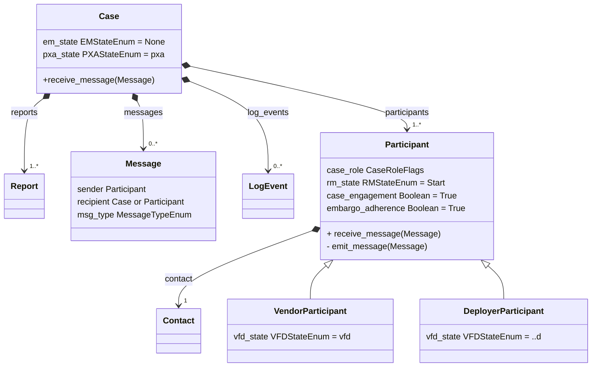
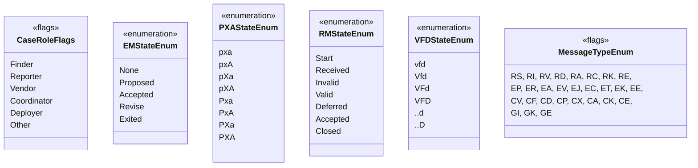

# A Vultron Protocol Case Object



Here we describe a notional MPCVD `Case` object that incorporates the [process models](../topics/process_models/index.md)
and [formalisms](../reference/formal_protocol/index.md) that define the Vultron Protocol.
The object model we describe is intended to provide the necessary core information for an implementation of the
[formal protocol](../reference/formal_protocol/index.md).
The diagram below depicts a UML Class Diagram of the `Case` model.
It is not the minimal possible model required by the Vultron Protocol; for example, strictly speaking, a 
Participant does not need to attempt to track the state of every other Participant, but it might help to do so. 
Rather, this model is intended to be compact yet sufficient for an implementation to effectively track the coordination
effort of an MPCVD case.

The remainder of this section provides details about the diagram below.

With the following supporting enumerations and flags:

## The `Case` Class

The `Case` class has attributes to track the [Embargo Management](../topics/process_models/em/index.md) (EM) state and the
[participant-agnostic](../topics/process_models/model_interactions/index.md) portion of the [Case State](../topics/process_models/cs/index.md) (CS) model (i.e., the `pxa`
substates), as outlined in [model interactions](../topics/process_models/model_interactions/index.md).
The `Case` class aggregates one or more  `Reports` and `Participants`, and 0 or more `Messages` and `LogEvents`.
We include a `receive_message()` method to allow `Participants` to send messages to the `Case`.
See [below](#the-message-class) for more details.

## The `Report` Class

The `Report` class represents the vulnerability report that serves as the impetus for the case.
Since it is possible for multiple reports to arrive that describe the same vulnerability, the cardinality of the 
composition relationship allows for a `Case` to have many `Reports`.
In most `Cases`, however, there will be only a single associated `Report`.

## The `Message` Class

The `Message` class represents a protocol message as outlined in [Message Types](../reference/formal_protocol/messages.md).
We expect that any implementation of this model will expand this data type to include numerous message-related attributes.
Here, we highlight the minimum requirements that the protocol demands: 

- Each `Message` has an identified sender (who is a `Participant` in the case) and one or more message
types as enumerated in [Message Types](../reference/formal_protocol/messages.md).
- Message types are represented as flags since a single actual message might represent multiple message types.
- For example, a report submission that includes an embargo proposal might have both the _RS_ and _EP_ message type flags set.

Conceptually, one might think of the `Case` as a shared object among engaged `Participants` and that `Messages` are sent
to the `Case` for all `Participants` to see.
In other words, the `Case` acts as a broadcast domain, a topic queue, or a blackboard pattern (depending on your 
preferences for networking or software engineering terminology). 
Because of this shared-channel assumption, we could have omitted the `recipient` attribute from the `Message` class, as the `Case` itself
can serve as the recipient of each message emitted by any `Participant`.
Implementations of this model could, of course, choose a more traditional messaging model with specified recipients, so
we leave that choice to implementers.

## The `LogEvent` Class

The `LogEvent` class is a placeholder to represent an event log or history for the `Case`.
Although not required for the protocol to operate, it is a good idea for `Case` tracking to include a timestamped
list of events (e.g., state changes or messages sent or received) so that new `Participants` can be brought up to speed
and so that cases can be analyzed for process improvement in the future.

## The `Participant` Class

The `Participant` class represents an individual or organization's involvement in the case.
The attributes of the `Participant` class are as follows:

!!! tip inline end
    Flags are used instead of an enumeration to convey that
    a `Participant` may have multiple roles in a single `Case`. Roles
    may differ for the same actor across different cases.

`case_role`

:   A set of flags indicating the Role(s) this `Participant` plays in
    the `Case`

For example, an organization might be the Vendor in one case and the Coordinator in another.

`rm_state`

:   An enumeration attribute that captures the RM state for this `Participant`
    consistent with [Report Management](../topics/process_models/rm/index.md).

!!! tip inline end

    The `case_engagement` attribute is provided to allow other `Participants` to recognize the
    status of other `Participants`.

`case_engagement`

:   A Boolean attribute that indicates whether the `Participant` should
    be included in future communications about the `Case`

For example, a Reporter who bows out of a case shortly after reporting it to a Coordinator might be listed as a 
`Participant` with `case_engagement=False` and could, therefore, be left out of further communication about the case.

!!! tip inline end
    
    As discussed in [Embargo Principles](../topics/process_models/em/principles.md#sec:embargo_engagement), 
    it is possible for a `Participant` to exit a case while still agreeing to abide by the terms of the extant embargo.

`embargo_adherence`

:   A Boolean attribute that indicates the expectation that a
    `Participant` is adhering to any existing embargo

    
Continuing our example of a Reporter leaving a case early, they might still be cooperative and indicate their 
`embargo_adherence=True`. 
A more hostile `Participant` exit could warrant setting `embargo_adherence=False`, likely triggering an embargo
teardown procedure as a consequence.

`Participants` can also emit (send) and receive messages. 

!!! tip 

    The `+` on `receive_message` indicates that this capability is accessible to others (i.e., you can send a `Participant` a message).
    On the contrary the `-` on `emit_message` conveys that this capability is only accessible to the `Participant` class 
    itself (i.e., each `Participant` gets to decide if, when, and what messages to send).

#### `Vendor` and `Deployer` `Participant` Classes.

The presence of the `VendorParticipant` and `DeployerParticipant`
classes---depicted as implementations of the `Participant` class---is
necessitated by the discussion in [States](../reference/formal_protocol/states.md),
where we described how Vendors and Deployers have a unique part to play in the creation, delivery, and
deployment of fixes within the CVD process. 
These two classes add the `vfd_state` attribute with different possible values.
Vendors can take on one of four possible values (`vfd`, `Vfd`, `VFd`, and `VFD`),
whereas Deployers only have two possible values (`..d` and `..D`).
Other than that, Vendors and Deployers have the same attributes as other `Participants`.

## The `Contact` Class

Since a `Participant` is a specific relationship between an individual or organization and the `Case` itself,
we can safely assume that those individuals or organizations exist and persist independently of the `Cases` they 
participate in.
Hence, each `Participant` class in a `Case` is associated with a long-lived `Contact` record that represents an
individual or organization.
Defining the `Contact` class is outside the scope of this document, so we will simply say that there is nothing
particularly special about it.
One might reasonably expect `Contacts` to have names, email addresses, phone numbers, etc.

!!! tip "Directory Services Are (Currently) Out of Scope"

    A separate contact management process and accompanying directory service is a likely candidate for [future integration work](../topics/future_work/cvd_directory.md).
    For now, we observe that similar directories already exist, although there is room for improvement:

    - FIRST maintains a [directory of member teams](https://www.first.org/members/teams/) for incident response purposes

    - Disclose.io offers a searchable list of [bug bounty and vulnerability
    disclosure programs](https://disclose.io/programs/).
    Contributions are solicited as [pull requests](https://github.com/disclose/diodb) on GitHub.
  
    - Many vulnerability disclosure platform service providers host directories of the programs hosted on their platforms.

## The Enumeration Classes

The remainder of the class diagram above consists of classes representing the Role and Message Type flags and various enumerations.

- The `Role` flags are consistent with the roles we defined in [Terms and Definitions](../topics/background/terms.md), as taken from the [CVD Guide](https://vuls.cert.org/confluence/display/CVD).
- `Message Type` flags are consistent with [Message Types](../reference/formal_protocol/messages.md).
- The other enumeration classes are consistent with the [Report Management](../topics/process_models/rm/index.md), [Embargo Management](../topics/process_models/em/index.md), 
and [Case State](../topics/process_models/cs/index.md) process models and their respective state machines. 
Note that we split the [CS model](../topics/process_models/cs/cs_model.md) states into two separate enumerations to reflect the participant-agnostic and participant-specific portions of the model
described in [Model Interactions](../topics/process_models/model_interactions/index.md).

