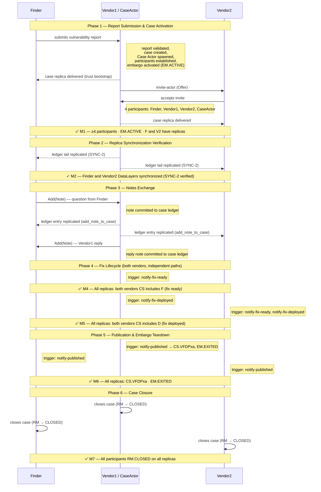

# How to Run the FVV Demo

The **FVV demo** exercises the three-actor CVD workflow:
**Finder → Vendor1 → Vendor2** with no coordinator.

Vendor1 creates the case, invites the Finder and Vendor2, and each vendor
advances through an independent fix path (`CS_vfd`).
Both Finder and Vendor2 DataLayers are verified as SYNC-2 replicas of the
authoritative Vendor1 state.

---

## Prerequisites

- [Docker](https://docs.docker.com/get-docker/){:target="_blank"} (version 20.10 or later)
- [Docker Compose](https://docs.docker.com/compose/install/){:target="_blank"} (version 2.x)
- A local clone of the Vultron repository

---

## Step 1 — Clone the repository

```bash
git clone https://github.com/CERTCC/Vultron.git
cd Vultron
```

---

## Step 2 — Create the environment file

```bash
cp docker/.env.example docker/.env
```

---

## Step 3 — Run the FVV demo

```bash
DEMO=fvv \
docker compose -f docker/docker-compose-multi-actor.yml \
    up --abort-on-container-exit --exit-code-from demo-runner
```

The `DEMO=fvv` environment variable selects the FVV scenario.
Docker builds the images on the first run (a few minutes); subsequent runs
use the cache.

!!! success "Success indicator"

    Look for this line at the end of the output:

    ```text
    FVV DEMO COMPLETE ✓  (VFDPxa full lifecycle)
    ```

---

## What happens: the seven phases

The FVV demo progresses through **seven phases**, verified by milestones M1–M7.

### Sequence diagram



### Phase 1 — Report submission and case activation (M1)

The Finder submits a vulnerability report to Vendor1.
Vendor1 validates the report, creates a `VulnerabilityCase`, spawns a
Case Actor, and activates the default embargo (EM → ACTIVE).
Vendor1 then invites Vendor2; Vendor2 accepts and receives a case replica.
All four participants (Finder, Vendor1, Vendor2, CaseActor) are present with
EM.ACTIVE.

**M1 verified when:**
Each replica holds ≥ 4 participants and an active embargo, and both Finder
and Vendor2 have a local case record.

### Phase 2 — Replica synchronization verification (M2)

The demo runner waits for both Finder and Vendor2 to receive the Vendor1
ledger tail entry (SYNC-2 replication), then calls `verify_replica_state`
for each — asserting that the `actor_participant_index`, active embargo ID,
and log tail hash all match the authoritative Vendor1 state.

**M2 verified when:**
Both Finder and Vendor2 DataLayers are synchronized with Vendor1.

### Phase 3 — Notes exchange

The Finder adds a question note to the case; Vendor1 replies.
Each note generates an `add_note_to_case` event committed to the case ledger
and fanned out to all participants (Finder, Vendor2) via
`Announce(CaseLedgerEntry)`.

### Phase 4 — Fix lifecycle (M4–M5)

Vendor1 reports fix-ready and fix-deployed.
Vendor2 independently reports fix-ready and fix-deployed on its own
participant record.
Both transitions are replicated to Finder and Vendor2 and verified.

**M4 verified when:** All replicas show both vendors' CS includes `F` (fix ready).

**M5 verified when:** All replicas show both vendors' CS includes `D` (fix deployed).

### Phase 5 — Publication and embargo teardown (M6)

All three actors (Vendor1, Finder, Vendor2) trigger `notify-published`,
setting CS to `VFDPxa`.
The Case Actor detects the publication event from the Case Owner and
auto-terminates the embargo (EM → EXITED).

**M6 verified when:** All replicas show `CS.VFDPxa` and `EM.EXITED`.

### Phase 6 — Case closure (M7)

Each actor closes its own case record (RM → CLOSED).
The Case Actor auto-closes when all participants are closed.

**M7 verified when:** All participants on all replicas are `RM.CLOSED`.

---

## Reading the log output

| Marker | What it means |
|:-------|:--------------|
| `✅ M1:` | ≥4 participants, EM.ACTIVE, Finder and Vendor2 have replicas |
| `✓ M2:` | Finder and Vendor2 DataLayers synchronized (SYNC-2 verified) |
| `✓ Phase 3:` | Notes exchange complete (question + reply committed to case ledger) |
| `✅ M4:` | All replicas: both vendors CS includes F (fix ready) |
| `✅ M5:` | All replicas: both vendors CS includes D (fix deployed) |
| `✅ M6:` | All replicas: CS.VFDPxa and EM.EXITED |
| `✅ M7:` | All participants RM.CLOSED on all replicas |

Between milestones, look for these prefixes:

| Prefix | Meaning |
|:-------|:--------|
| `🚥 <description>` | A demo step is starting |
| `🟢 <description>` | A demo step completed successfully |
| `🔴 <description>` | A demo step failed |
| `📋 <description>` | A demo check is starting |
| `✅ <description>` | A demo check passed |
| `❌ <description>` | A demo check failed |

A successful run ends with:

```text
================================================================================
FVV DEMO COMPLETE ✓  (VFDPxa full lifecycle)
================================================================================
```

---

## Troubleshooting

### The demo-runner exits immediately with an error

Actor containers may not have finished starting. Verify all services are healthy:

```bash
docker compose -f docker/docker-compose-multi-actor.yml \
    ps finder vendor vendor2 case-actor
```

All four should show `healthy` status.

### A milestone check fails with `❌`

Read the failure message and check the logs:

```bash
docker compose -f docker/docker-compose-multi-actor.yml logs demo-runner
docker compose -f docker/docker-compose-multi-actor.yml logs vendor
docker compose -f docker/docker-compose-multi-actor.yml logs finder
docker compose -f docker/docker-compose-multi-actor.yml logs vendor2
```

Look for `ERROR` or `500` status lines corresponding to the failing step.

### Docker images are stale after a code change

Force a rebuild:

```bash
docker compose -f docker/docker-compose-multi-actor.yml \
    build --no-cache demo-runner
```

### The demo fails partway through and leaves volumes dirty

Clean up volumes before retrying:

```bash
docker compose -f docker/docker-compose-multi-actor.yml down -v
```

---

## Step 4 — Clean up

```bash
docker compose -f docker/docker-compose-multi-actor.yml down -v
```

---

## Next steps

- **Run the two-actor demo first** — see
  [Tutorial: Run the Two-Actor Demo](../../tutorials/two-actor-demo.md) for
  a simpler scenario that introduces the core patterns.
- **Read the scenario source** — the FVV demo script is at
  `vultron/demo/scenario/fvv_demo.py`; shared helpers are in
  `vultron/demo/helpers/`.
