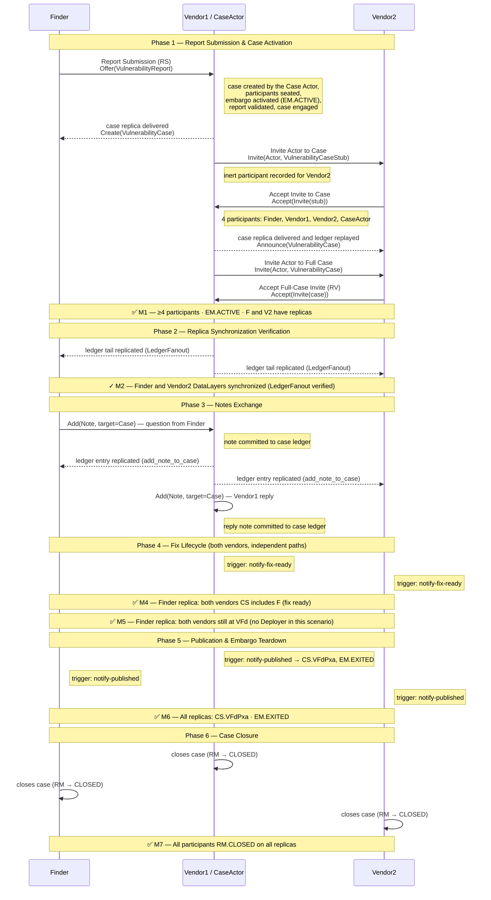

# How to Run the FVV Demo

The **FVV demo** exercises the three-actor CVD workflow:
**Finder → Vendor1 → Vendor2** with no coordinator.

The Finder reports to Vendor1, whose Case Actor creates the case and seats the Finder.
Vendor1 invites Vendor2, and each vendor advances its own fix path to fix ready.
The Finder's and Vendor2's copies of the case are verified as [Ledger Fanout](../../topics/case_lifecycle/case_manager_and_ledger.md) replicas of the authoritative state held by the Case Actor, which the Vendor1 container hosts.

---

## Prerequisites

- [Docker](https://docs.docker.com/get-docker/){:target="_blank"} (version 20.10 or later)
- [Docker Compose](https://docs.docker.com/compose/install/){:target="_blank"} (version 2.x)
- A local clone of the Vultron repository

---

## Step 1 — Clone the repository

```bash
git clone https://github.com/CERTCC/Vultron.git
cd Vultron
```

---

## Step 2 — Create the environment file

```bash
cp docker/.env.example docker/.env
```

---

## Step 3 — Run the FVV demo

```bash
DEMO=fvv \
docker compose -f docker/docker-compose-multi-actor.yml \
    up --abort-on-container-exit --exit-code-from demo-runner
```

The `DEMO=fvv` environment variable selects the FVV scenario.
Docker builds the images on the first run (a few minutes); subsequent runs
use the cache.

!!! success "Success indicator"

    Look for this line at the end of the output:

    ```text
    FVV DEMO COMPLETE ✓  (VFDPxa full lifecycle)
    ```

    The banner names the lifecycle the scenario walks; the case state the checks verify ends at `VFdPxa`, because no participant deploys a fix (see Phase 4).

---

## What happens: six phases, six milestones

The FVV demo progresses through **six phases**.
Milestones M1, M2, and M4 through M7 verify them; the notes exchange (Phase 3) logs a completion line instead of a numbered milestone, so no `M3` appears in the output.

### Sequence diagram


```mermaid
sequenceDiagram
    participant F as Finder
    participant V1 as Vendor1 / CaseActor
    participant V2 as Vendor2

    note over F,V2: Phase 1 — Report Submission & Case Activation

    F->>V1: Report Submission (RS)<br/>Offer(VulnerabilityReport)
    note right of V1: case created by the Case Actor,<br/>participants seated,<br/>embargo activated (EM.ACTIVE),<br/>report validated, case engaged
    V1-->>F: case replica delivered<br/>Create(VulnerabilityCase)
    V1->>V2: Invite Actor to Case<br/>Invite(Actor, VulnerabilityCaseStub)
    note right of V1: inert participant recorded for Vendor2
    V2->>V1: Accept Invite to Case<br/>Accept(Invite(stub))
    note right of V1: 4 participants: Finder, Vendor1, Vendor2, CaseActor
    V1-->>V2: case replica delivered and ledger replayed<br/>Announce(VulnerabilityCase)
    V1->>V2: Invite Actor to Full Case<br/>Invite(Actor, VulnerabilityCase)
    V2->>V1: Accept Full-Case Invite (RV)<br/>Accept(Invite(case))

    note over F,V2: ✅ M1 — ≥4 participants · EM.ACTIVE · F and V2 have replicas

    note over F,V2: Phase 2 — Replica Synchronization Verification

    V1-->>F: ledger tail replicated (LedgerFanout)
    V1-->>V2: ledger tail replicated (LedgerFanout)
    note over F,V2: ✓ M2 — Finder and Vendor2 DataLayers synchronized (LedgerFanout verified)

    note over F,V2: Phase 3 — Notes Exchange

    F->>V1: Add(Note, target=Case) — question from Finder
    note right of V1: note committed to case ledger
    V1-->>F: ledger entry replicated (add_note_to_case)
    V1-->>V2: ledger entry replicated (add_note_to_case)
    V1->>V1: Add(Note, target=Case) — Vendor1 reply
    note right of V1: reply note committed to case ledger

    note over F,V2: Phase 4 — Fix Lifecycle (both vendors, independent paths)

    note right of V1: trigger: notify-fix-ready
    note right of V2: trigger: notify-fix-ready
    note over F,V2: ✅ M4 — Finder replica: both vendors CS includes F (fix ready)
    note over F,V2: ✅ M5 — Finder replica: both vendors still at VFd (no Deployer in this scenario)

    note over F,V2: Phase 5 — Publication & Embargo Teardown

    note right of V1: trigger: notify-published → CS.VFdPxa, EM.EXITED
    note right of F: trigger: notify-published
    note right of V2: trigger: notify-published
    note over F,V2: ✅ M6 — All replicas: CS.VFdPxa · EM.EXITED

    note over F,V2: Phase 6 — Case Closure

    V1->>V1: closes case (RM → CLOSED)
    F->>F: closes case (RM → CLOSED)
    V2->>V2: closes case (RM → CLOSED)
    note over F,V2: ✅ M7 — All participants RM.CLOSED on all replicas
```

### Phase 1 — Report submission and case activation (M1)

The Finder submits a vulnerability report to Vendor1.
Vendor1 proposes a case to its Case Actor, which creates the case, seats Vendor1 as Case Owner and the Finder as Reporter, and activates Vendor1's default embargo (EM → ACTIVE).
Vendor1 validates the report and engages the case.
Vendor1 then invites Vendor2; Vendor2 accepts and receives a case replica.
All four participants (Finder, Vendor1, Vendor2, Case Actor) are present with EM.ACTIVE.

**M1 verified when:**
Each replica holds ≥ 4 participants and an active embargo, and both Finder
and Vendor2 have a local case record.

### Phase 2 — Replica synchronization verification (M2)

The demo runner waits for both Finder and Vendor2 to hold every ledger entry the Vendor1 container holds, then compares each replica with it: the participant index, the active embargo id, and the ledger tail hash must all match.

**M2 verified when:**
Both Finder and Vendor2 DataLayers are synchronized with Vendor1.

### Phase 3 — Notes exchange

The Finder adds a question note to the case; Vendor1 replies.
Each note is sent to the Case Actor, which commits an `add_note_to_case` entry to the case ledger and fans it out to every participant via `Announce(CaseLedgerEntry)`.
This phase ends with a `✓ Notes exchange complete` line rather than a numbered milestone.

### Phase 4 — Fix lifecycle (M4–M5)

Vendor1 reports fix ready with a Fix Readiness (CF), `Add(ParticipantStatus)`, and Vendor2 does the same on its own participant record.
Neither vendor reports a deployed fix: deployment is a Deployer's step, and this scenario has none, so both vendors stop at `VFd`.
Both transitions are replicated to the Finder and verified.

**M4 verified when:** the Finder's replica shows both vendors' CS includes `F` (fix ready).

**M5 verified when:** the Finder's replica still shows both vendors at `VFd`, their final vendor-path state.

### Phase 5 — Publication and embargo teardown (M6)

All three actors (Vendor1, Finder, Vendor2) trigger `notify-published`, each reporting Public Awareness (CP) with `Add(ParticipantStatus)`.
The Case Actor sees the publication report from the Case Owner and terminates the embargo (EM → EXITED).

**M6 verified when:** all replicas show `CS.VFdPxa` and `EM.EXITED`, and every participant is public-aware.

### Phase 6 — Case closure (M7)

Each actor closes its participation with `Leave(VulnerabilityCase)` (RM → CLOSED).
Vendor1 is the Case Owner, so its closure also closes the case: the Case Actor advances itself to `RM.CLOSED` and records that the case is fully closed.

**M7 verified when:** All participants on all replicas are `RM.CLOSED`.

---

## Reading the log output

| Marker | What it means |
|:-------|:--------------|
| `✅ M1:` | ≥4 participants, EM.ACTIVE, Finder and Vendor2 have replicas |
| `✓ M2:` | Finder and Vendor2 DataLayers synchronized (Ledger Fanout verified) |
| `✓ Notes exchange complete` | Question and replies committed to the case ledger (no numbered milestone) |
| `✅ M4:` | Finder replica: both vendors CS includes F (fix ready) |
| `✅ M5:` | Finder replica: both vendors still at VFd |
| `✅ M6:` | All replicas: CS.VFdPxa and EM.EXITED; all participants public-aware |
| `✅ M7:` | All participants RM.CLOSED on all replicas |

Between milestones, look for these prefixes:

| Prefix | Meaning |
|:-------|:--------|
| `🚥 <description>` | A demo step is starting |
| `🟢 <description>` | A demo step completed successfully |
| `🔴 <description>` | A demo step failed |
| `📋 <description>` | A demo check is starting |
| `✅ <description>` | A demo check passed |
| `❌ <description>` | A demo check failed |

A successful run ends with:

```text
================================================================================
FVV DEMO COMPLETE ✓  (VFDPxa full lifecycle)
================================================================================
```

---

## Troubleshooting

### The demo-runner exits immediately with an error

Actor containers may not have finished starting. Verify all services are healthy:

```bash
docker compose -f docker/docker-compose-multi-actor.yml \
    ps finder vendor actor5 case-actor
```

All of them should show `healthy` status.
The `actor5` service plays Vendor2 in this scenario.

### A milestone check fails with `❌`

Read the failure message and check the logs:

```bash
docker compose -f docker/docker-compose-multi-actor.yml logs demo-runner
docker compose -f docker/docker-compose-multi-actor.yml logs vendor
docker compose -f docker/docker-compose-multi-actor.yml logs finder
docker compose -f docker/docker-compose-multi-actor.yml logs actor5
```

Look for `ERROR` or `500` status lines corresponding to the failing step.

### Docker images are stale after a code change

Force a rebuild:

```bash
docker compose -f docker/docker-compose-multi-actor.yml \
    build --no-cache demo-runner
```

### The demo fails partway through and leaves volumes dirty

Clean up volumes before retrying:

```bash
docker compose -f docker/docker-compose-multi-actor.yml down -v
```

---

## Step 4 — Clean up

```bash
docker compose -f docker/docker-compose-multi-actor.yml down -v
```

---

## Next steps

- **Run the FV demo first** — see
  [Tutorial: Run the FV Demo](../../tutorials/fv-demo.md) for
  a simpler scenario that introduces the core patterns.
- **Read the scenario narrative** — the
  [FVV scenario narrative](../../topics/scenarios/fvv.md) explains each step
  in CVD terms and names the ledger entry it produces.
- **Read the scenario source** — the FVV demo script is at
  `vultron/demo/scenario/fvv_demo.py`; shared helpers are in
  `vultron/demo/helpers/`.
