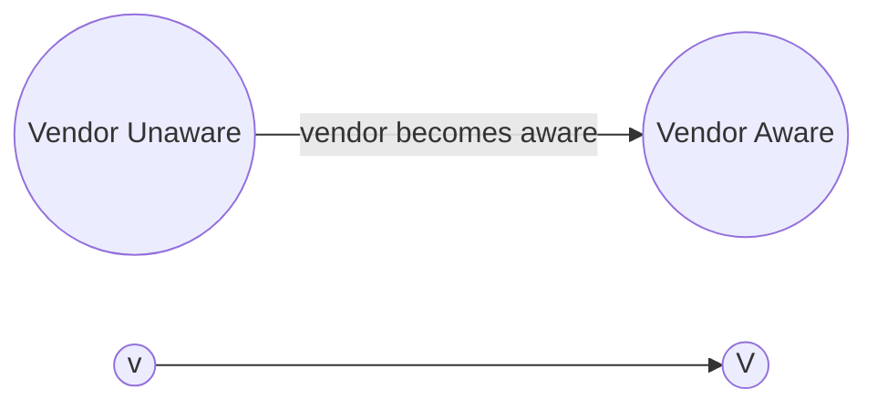
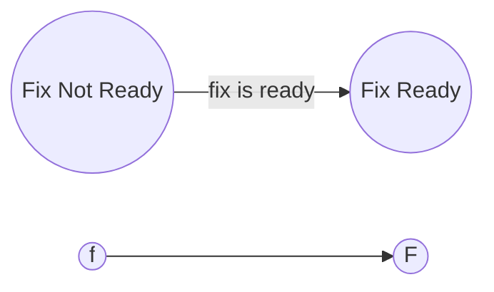
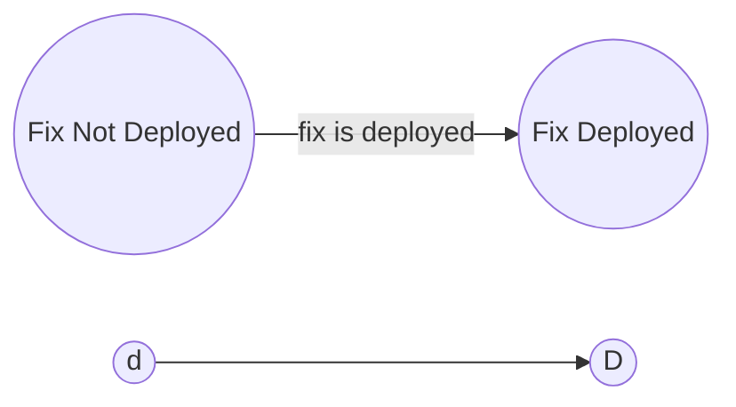
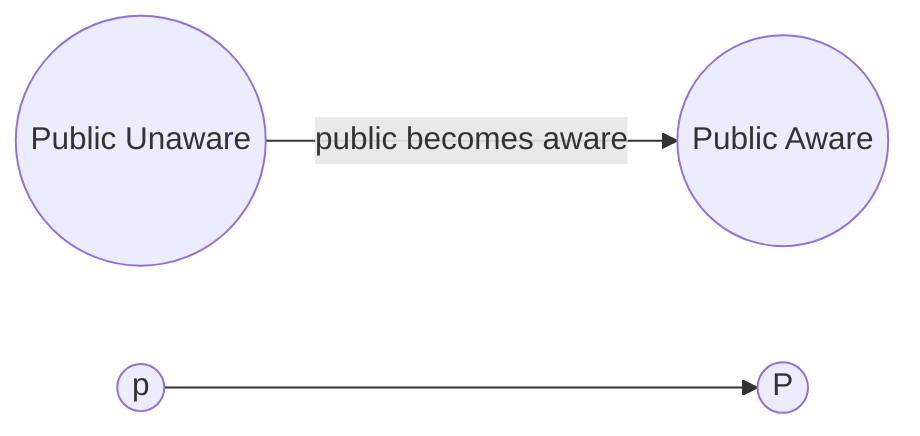
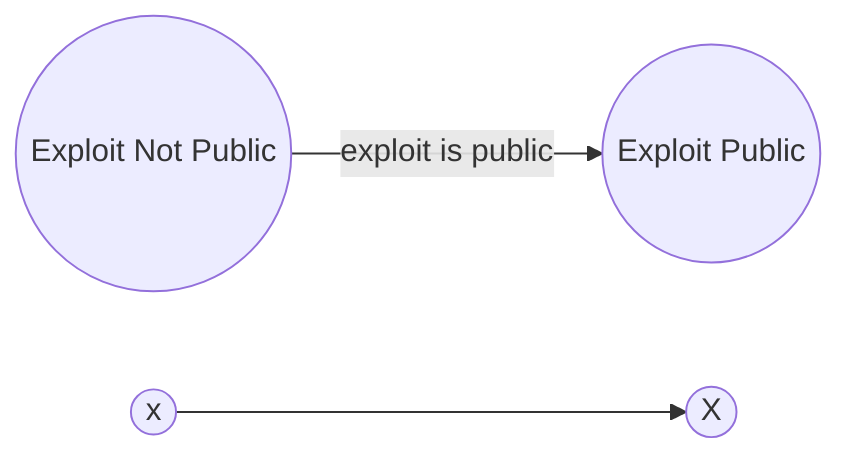
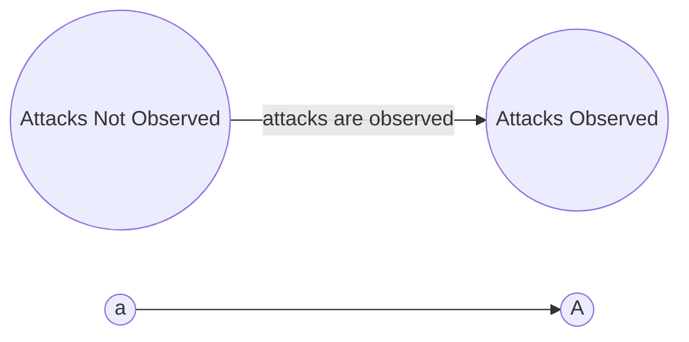
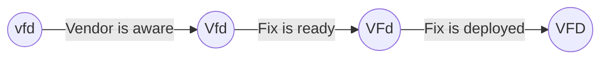
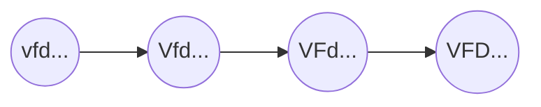
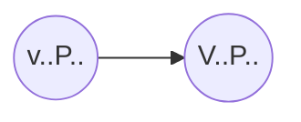
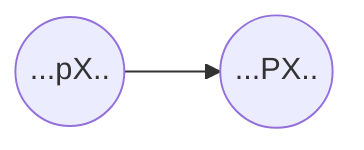

# CVD Case State Model {#sec:model}

In this chapter, we revisit the [CS]{acronym-label="CS"
acronym-form="singular+full"} model from the Householder and Spring 2021
report [@householder2021state]. A complete derivation of the
[CS]{acronym-label="CS" acronym-form="singular+short"} model can be
found in that report. Here, we are primarily interested in the final
model, which comprises 32 states and their transitions.

As in the previous two chapters, we wish to define 5-tuple
$(\mathcal{Q},\Sigma,\delta,q_0,F)$ [@kandar2013automata], this time for
the [CS]{acronym-label="CS" acronym-form="singular+short"} model.
However, due to the size of the final [CS]{acronym-label="CS"
acronym-form="singular+short"} model, we begin with some necessary
background on the substates of the model in
§[1.1](#sec:cvd_case_states){reference-type="ref"
reference="sec:cvd_case_states"} prior to defining the Case States in
§[1.2](#sec:cs_substates_to_states){reference-type="ref"
reference="sec:cs_substates_to_states"}.

## CVD Case Substates {#sec:cvd_case_states}

In our model, the state of the world is a specification of the current
status of all the events in the vulnerability lifecycle model described
in the Householder and Spring 2021 report [@householder2021state]. We
describe the relevant factors as substates below. For notational
purposes, each substate status is represented by a letter for that part
of the state of the world. For example, $v$ means no Vendor awareness
and $V$ means the Vendor is aware. The complete set of status labels is
shown in
Table [\[tab:event_status\]](#tab:event_status){reference-type="ref"
reference="tab:event_status"}.

### The $Vendor~Awareness$ Substate ($v,V$) {#sec:cs_v}

The *Vendor Awareness* substate corresponds to *Disclosure* in the
Arbaugh, Fithen, and McHugh article, "Windows of Vulnerability: A Case
Study analysis" [@arbaugh2000windows] and *vulnerability discovered by
Vendor* in Bilge and Dumitraş's article, "Before we knew it: an
empirical study of zero-day attacks in the real
world" [@bilge2012before]. In the interest of model simplicity, we are
not concerned with *how* the Vendor finds out about the vulnerability's
existence---whether it was found via internal testing, reported within a
[CVD]{acronym-label="CVD" acronym-form="singular+short"} process, or
noticed as the result of incident or malware analysis.

### The $Fix~Readiness$ Substate ($f,F$) {#sec:cs_f}

The *Fix Readiness* substate refers to the Vendor's creation and
possession of a fix that *could* be deployed to a vulnerable system *if*
the system owner knew of its existence. Here we differ somewhat from
previous
models [@arbaugh2000windows; @frei2010modeling; @bilge2012before]; their
models address the *release* of the fix rather than its *readiness* for
release. This distinction is necessary because we are interested in
modeling the activities and states leading up to disclosure. Fix
*release* is a goal of the [CVD]{acronym-label="CVD"
acronym-form="singular+short"} process, whereas fix *readiness* is a
significant process milestone along the way.

### The $Fix~Deployed$ Substate ($d,D$) {#sec:cs_d}

The *Fix Deployed* substate reflects the deployment status of an
existing fix. The model in the Householder and Spring 2021 report
[@householder2021state] was initially designed to treat this substate as
a singular binary state for a case, but we intend to relax that here to
reflect a more realistic perspective in which each Deployer maintains
their own instance of this state value. It remains a binary state for
each Deployer, which, however, is still a simplification.

### The $Public~Awareness$ Substate ($p,P$) {#sec:cs_p}

The *Public Awareness* substate corresponds to *Publication* in the
Arbaugh, Fithen, and McHugh article  [@arbaugh2000windows], *time of
public disclosure* in Frei et al.'s article Modeling the Security
Ecosystem---The Dynamics of (In)Security  [@frei2010modeling]; and
*vulnerability disclosed publicly* in Bilge and Dumitraş's article
 [@bilge2012before]. The public might find out about a vulnerability
through the Vendor's announcement of a fix, a news report about a
security breach, a conference presentation by a researcher, or a variety
of other means. As above, we are primarily concerned with the occurrence
of the event itself rather than the details of *how* the public
awareness event arises.

### The $Exploit~Public$ Substate ($x,X$) {#sec:cs_x}

The *Exploit Public* substate reflects whether the method of exploiting
a vulnerability has been made public in sufficient detail to be
reproduced by others. Posting [PoC]{acronym-label="PoC"
acronym-form="singular+short"} code to a widely available site or
including the exploit code in a commonly available exploit tool meets
this criteria; privately held exploits do not.

### The $Attacks~Observed$ Substate ($a,A$) {#sec:cs_a}

The *Attacks Observed* substate reflects whether attacks have been
observed in which the vulnerability was exploited. This substate
requires evidence that the vulnerability was exploited; we can then
presume the existence of exploit code regardless of its availability to
the public. Analysis of malware from an incident might meet
$Attacks~Observed$ but not $Exploit~Public$, depending on how closely
the attacker holds the malware. Use of a public exploit in an attack
meets both $Exploit~Public$ and $Attacks~Observed$.

### [CS]{acronym-label="CS" acronym-form="singular+short"} Model Design Choices

We chose to include the *Fix Ready*, *Fix Deployed*, and *Public
Awareness* events so that our model could better accommodate two common
modes of modern software deployment:

-   *shrinkwrap* is a traditional distribution mode where the Vendor and
    Deployer are distinct entities, and Deployers must be made aware of
    the fix before it can be deployed. In this case, both *Fix Ready*
    and *Public Awareness* are necessary for *Fix Deployment* to occur.

-   *[SAAS]{acronym-label="SAAS" acronym-form="singular+short"}* is a
    more recent delivery mode where the Vendor also plays the role of
    Deployer. In this distribution mode, *Fix Ready* can lead directly
    to *Fix Deployed* with no dependency on *Public Awareness*.

We note that so-called *silent fixes* by Vendors can sometimes result in
a fix being deployed without public awareness even if the Vendor is not
the Deployer. Thus, it is possible (but unlikely) for *Fix Deployed* to
occur before *Public Awareness* even in the shrinkwrap mode above. It is
also possible, and somewhat more likely, for *Public Awareness* to occur
before *Fix Deployed* in the [SAAS]{acronym-label="SAAS"
acronym-form="singular+short"} mode as well.

## CVD Case States {#sec:cs_substates_to_states}

In the [CS]{acronym-label="CS" acronym-form="singular+short"} model, a
state $q^{cs}$ represents the status of each of the six substates. State
labels inherit the substate notation from above: lowercase letters
designate events that have not occurred, and uppercase letters designate
events that have occurred in a particular state. For example, the state
$VFdpXa$ represents Vendor is aware, fix is ready, fix not deployed, no
public awareness, exploit is public, and no attacks. The order in which
the events occurred does not matter when defining the state. However, we
will observe a notation convention keeping the letter names in the same
case-insensitive order $(v,f,d,p,x,a)$.

[CS]{acronym-label="CS" acronym-form="singular+short"} states can be any
combination of statuses, provided that a number of caveats elaborated in
§[1.3](#sec:transitions){reference-type="ref"
reference="sec:transitions"} are met. One such caveat worth noting here
is that valid states must follow what we call the *Vendor fix path*.[^1]
The reason is causal: For a fix to be deployed ($D$), it must have been
ready ($F$) for deployment. And for it to be ready, the Vendor must have
already known ($V$) about the vulnerability---symbolically,
$D \implies F \implies V$. As a result, valid states must begin with one
of the following strings: $vfd$, $Vfd$, $VFd$, or $VFD$.

The [CS]{acronym-label="CS" acronym-form="singular+short"} model is thus
composed of 32 possible states, which we define as $\mathcal{Q}^{cs}$ in
[\[eq:all_states\]](#eq:all_states){reference-type="eqref"
reference="eq:all_states"}. $$\label{eq:all_states}
    \mathcal{Q}^{cs} = 
    \begin{Bmatrix}
        vfdpxa, & vfdPxa, & vfdpXa, & vfdPXa, \\
        vfdpxA, & vfdPxA, & vfdpXA, & vfdPXA, \\
        Vfdpxa, & VfdPxa, & VfdpXa, & VfdPXa, \\
        VfdpxA, & VfdPxA, & VfdpXA, & VfdPXA, \\
        VFdpxa, & VFdPxa, & VFdpXa, & VFdPXa, \\
        VFdpxA, & VFdPxA, & VFdpXA, & VFdPXA, \\
        VFDpxa, & VFDPxa, & VFDpXa, & VFDPXa, \\
        VFDpxA, & VFDPxA, & VFDpXA, & VFDPXA
    \end{Bmatrix}$$

### [CS]{acronym-label="CS" acronym-form="singular+short"} Start and End States

All vulnerabilities start in the base state $q^{cs}_0$ in which no
events have occurred. $$\label{eq:q_0}
    q^{cs}_0 = vfdpxa$$ The lone final state in which all events have
occurred is $VFDPXA$. $$\label{eq:F}
\mathcal{F}^{cs} = \{ VFDPXA \}$$ Note that this is a place where our
model of the vulnerability lifecycle diverges from what we expect to
observe in [CVD]{acronym-label="CVD" acronym-form="singular+short"}
cases in the real world. There is ample evidence that most
vulnerabilities never have exploits published or attacks observed
[@householder2020historical; @jacobs2021exploit]. Therefore, practically
speaking, we might expect vulnerabilities to wind up in one of
$$\mathcal{F}^\prime = \{ {VFDPxa}, {VFDPxA}, {VFDPXa}, {VFDPXA} \}$$ at
the time a report is closed (i.e., when $q^{rm} \xrightarrow{c} C$). In
fact, most count a [CVD]{acronym-label="CVD"
acronym-form="singular+short"} as successful when reports are closed in
$q^{cs} \in VFDPxa$ because it means that the defenders won the race
against adversaries. The distinction between the [RM]{acronym-label="RM"
acronym-form="singular+short"} and [CS]{acronym-label="CS"
acronym-form="singular+short"} processes is important; Participants can
close cases whenever their [RM]{acronym-label="RM"
acronym-form="singular+short"} process dictates, independent of the
[CS]{acronym-label="CS" acronym-form="singular+short"} state. In other
words, it remains possible for exploits to be published or attacks to be
observed long after the [RM]{acronym-label="RM"
acronym-form="singular+short"} process has closed a case.

### [CS]{acronym-label="CS" acronym-form="singular+short"} Model Wildcard Notation

We frequently need to refer to subsets of $\mathcal{Q}^{cs}$. To do so,
we will use a dot ($\cdot$) to represent a single character wildcard.
For example, $VFdP\cdot\cdot$ refers to the subset of $\mathcal{Q}^{cs}$ in
which the Vendor is aware, a fix is ready but not yet deployed, and the
public is aware of the vulnerability, yet we are indifferent to whether
exploit code has been made public or attacks have been observed.
Specifically,
$${VFdP\cdot\cdot} = \{{VFdPxa}, {VFdPxA}, {VFdPXa}, {VFdPXA}\} \subset{\mathcal{Q}}^{cs}$$

## [CS]{acronym-label="CS" acronym-form="singular+short"} Transitions {#sec:transitions}

In this section, we elaborate on the input symbols and transition
functions for our [CS]{acronym-label="CS" acronym-form="singular+short"}
[DFA]{acronym-label="DFA" acronym-form="singular+short"}. A row-wise
reading of Table
[\[tab:event_status\]](#tab:event_status){reference-type="ref"
reference="tab:event_status"} implies a set of events corresponding to
each specific substate change, which we correspond to the symbols in the
[CS]{acronym-label="CS" acronym-form="singular+short"}
[DFA]{acronym-label="DFA" acronym-form="singular+short"}.

-   $\mathbf{V}$ -- A Vendor becomes aware of a vulnerability
    $vfd\cdot\cdot\cdot \to Vfd\cdot\cdot\cdot$

-   $\mathbf{F}$ -- A Vendor readies a fix for a vulnerability
    $Vfd\cdot\cdot\cdot \to VFd\cdot\cdot\cdot$

-   $\mathbf{D}$ -- A Deployer deploys a fix for a vulnerability
    $VFd\cdot\cdot\cdot \to VFD\cdot\cdot\cdot$

-   $\mathbf{P}$ -- Information about a vulnerability becomes known to
    the public $\cdot\cdot\cdot p\cdot\cdot \to \cdot\cdot\cdot P\cdot\cdot$

-   $\mathbf{X}$ -- An exploit for a vulnerability is made public
    $\cdot\cdot\cdot\cdot x\cdot \to \cdot\cdot\cdot\cdot X\cdot$

-   $\mathbf{A}$ -- Attacks exploiting a vulnerability are observed
    $\cdot\cdot\cdot\cdot\cdot a \to \cdot\cdot\cdot\cdot\cdot A$

We define the set of symbols for our [CS]{acronym-label="CS"
acronym-form="singular+short"} [DFA]{acronym-label="DFA"
acronym-form="singular+short"} as $\Sigma^{cs}$:

$$\label{eq:events}
    \Sigma^{cs} = \{\mathbf{V},\mathbf{F},\mathbf{D},\mathbf{P},\mathbf{X},\mathbf{A}\}$$

Here we diverge somewhat from the notation used for the
[RM]{acronym-label="RM" acronym-form="singular+short"} and
[EM]{acronym-label="EM" acronym-form="singular+short"} models described
in previous chapters, which use lowercase letters for transitions and
uppercase letters for states. Because [CS]{acronym-label="CS"
acronym-form="singular+short"} state names already use both lowercase
and uppercase letters, here we use a bold font for the symbols of the
[CS]{acronym-label="CS" acronym-form="singular+short"}
[DFA]{acronym-label="DFA" acronym-form="singular+short"} to
differentiate the transition from the corresponding substate it leads
to: e.g., $vfd\cdot\cdot\cdot \xrightarrow{\mathbf{V}} Vfd\cdot\cdot\cdot$.

For the [CS]{acronym-label="CS" acronym-form="singular+short"} model, an
input symbol $\sigma^{cs} \in \Sigma^{cs}$ is "read" when a Participant
observes a change in status (a Vendor is notified and exploit code has
been published, etc.). For the sake of simplicity, we begin with the
assumption that observations are globally known---that is, a status
change observed by any [CVD]{acronym-label="CVD"
acronym-form="singular+short"} Participant is known to all. In the real
world, we believe the [MPCVD]{acronym-label="MPCVD"
acronym-form="singular+short"} protocol proposed in
§[\[sec:formal_protocol\]](#sec:formal_protocol){reference-type="ref"
reference="sec:formal_protocol"} is poised to ensure eventual
consistency with this assumption through the communication of perceived
case state across coordinating parties.

### [CS]{acronym-label="CS" acronym-form="singular+short"} Transitions Defined {#sec:transition_function}

Here we define the allowable transitions between states in the
[CS]{acronym-label="CS" acronym-form="singular+short"} model. A diagram
of the [CS]{acronym-label="CS" acronym-form="singular+short"} process,
including its states and transitions, is shown in Figure
[\[fig:vfdpxa_map\]](#fig:vfdpxa_map){reference-type="ref"
reference="fig:vfdpxa_map"}.

Transitions in the [CS]{acronym-label="CS"
acronym-form="singular+short"} model follow a few rules described in
detail in §2.4 of the Householder and Spring 2021
report [@householder2021state], which we summarize here:

-   Because states correspond to the status of events that have or have
    not occurred, and all state transitions are irreversible (i.e., we
    assume history is immutable), the result will be an acyclic directed
    graph of states beginning at $q^{cs}_0={vfdpxa}$ and ending at
    $\mathcal{F}^{cs}=\{VFDPXA\}$ with allowed transitions as the edges.
    In practical terms for the [CS]{acronym-label="CS"
    acronym-form="singular+short"} model, this means there is an arrow
    of time from $vfdpxa$ through $VFDPXA$ in which each individual
    state transition changes exactly one letter from lowercase to
    uppercase.

-   The *Vendor fix path*
    ($vfd \cdot\cdot\cdot \xrightarrow{\mathbf{V}} Vfd \cdot\cdot\cdot \xrightarrow{\mathbf{F}} VFd \cdot\cdot\cdot \xrightarrow{\mathbf{D}} VFD \cdot\cdot\cdot$)
    is a causal requirement as outlined in
    §[1.2](#sec:cs_substates_to_states){reference-type="ref"
    reference="sec:cs_substates_to_states"}.

-   Vendors are presumed to know at least as much as the public does;
    therefore, $v\cdot\cdot P\cdot\cdot$ can only lead to $V\cdot\cdot P\cdot\cdot$.

-   Exploit publication is tantamount to public awareness; therefore,
    $\cdot\cdot\cdot pX \cdot$ can only lead to $\cdot\cdot\cdot\cdot PX \cdot$.

In this model, attacks observed when a vulnerability is unknown to the
public ($\cdot\cdot\cdot p \cdot A$) need not immediately cause public awareness
($\cdot\cdot\cdot P \cdot A$), although, obviously, that can and does happen.
Our reasoning for allowing states in $\cdot\cdot\cdot p \cdot A$ to persist is
twofold:

-   First, the connection between attacks and exploited vulnerabilities
    is often made later during incident analysis. While the attack
    itself may have been observed much earlier, the knowledge of *which*
    vulnerability it targeted may be delayed until after other events
    have occurred.

-   Second, attackers are not a monolithic group. An attack from a niche
    set of threat actors does not automatically mean that the knowledge
    and capability of exploiting a particular vulnerability is widely
    available to all possible adversaries. Publication, in that case,
    might assist other adversaries more than it helps defenders.

In other words, although $\cdot\cdot\cdot p \cdot A$ does not require an
immediate transition to $\cdot\cdot\cdot P \cdot A$ the way
$\cdot\cdot\cdot pX \cdot \xrightarrow{\mathbf{P}} \cdot\cdot\cdot PX \cdot$ does, it
does seem plausible that the likelihood of $\mathbf{P}$ occurring
increases when attacks are occurring. Logically, this is a result of
there being more ways for the public to discover the vulnerability when
attacks are happening than when they are not. For states in
$\cdot\cdot\cdot p \cdot a$, the public depends on the normal vulnerability
discovery and reporting process. States in $\cdot\cdot\cdot p \cdot A$ include
that possibility and add the potential for discovery as a result of
security incident analysis. Hence,

-   Once attacks have been observed, fix development SHOULD accelerate,
    the embargo teardown process SHOULD begin, and publication and
    deployment SHOULD follow as soon as is practical.

### A Regular Grammar for the [CS]{acronym-label="CS" acronym-form="singular+short"} model

Following the complete state machine diagram in Figure
[\[fig:vfdpxa_map\]](#fig:vfdpxa_map){reference-type="ref"
reference="fig:vfdpxa_map"}, we can summarize the transition functions
of the [CS]{acronym-label="CS" acronym-form="singular+short"} model as a
right-linear grammar $\delta^{cs}$:

$$\label{eq:delta_cs}
    \delta^{cs} =
    \begin{cases}
        vfdpxa &\to \mathbf{V}~Vfdpxa~|~\mathbf{P}~vfdPxa~|~\mathbf{X}~vfdpXa~|~\mathbf{A}~vfdpxA \\
        vfdpxA &\to \mathbf{V}~VfdpxA~|~\mathbf{P}~vfdPxA~|~\mathbf{X}~vfdpXA \\
        vfdpXa &\to \mathbf{P}~vfdPXa \\
        vfdpXA &\to \mathbf{P}~vfdPXA \\
        vfdPxa &\to \mathbf{V}~VfdPxa \\
        vfdPxA &\to \mathbf{V}~VfdPxA \\ 
        vfdPXa &\to \mathbf{V}~VfdPXa \\
        vfdPXA &\to \mathbf{V}~VfdPXA \\
        
        Vfdpxa &\to \mathbf{F}~VFdpxa~|~\mathbf{P}~VfdPxa~|~\mathbf{X}~VfdpXa~|~\mathbf{A}~VfdpxA \\
        VfdpxA &\to \mathbf{F}~VFdpxA ~|~ \mathbf{P}~VfdPxA ~|~ \mathbf{X}~VfdpXA \\
        VfdpXa &\to \mathbf{P}~VfdPXa \\
        VfdpXA &\to \mathbf{P}~VfdPXA \\
        VfdPxa &\to \mathbf{F}~VFdPxa ~|~ \mathbf{X}~VfdPXa ~|~ \mathbf{A}~VfdPxA \\
        VfdPxA &\to \mathbf{F}~VFdPxA ~|~ \mathbf{X}~VfdPXA \\
        VfdPXa &\to \mathbf{F}~VFdPXa ~|~ \mathbf{A}~VfdPXA \\
        VfdPXA &\to \mathbf{F}~VFdPXA \\ 
        
        VFdpxa &\to \mathbf{D}~VFDpxa~|~\mathbf{P}~VFdPxa ~|~ \mathbf{X}~VFdpXa ~|~ \mathbf{A}~VFdpxA \\
        VFdpxA &\to \mathbf{D}~VFDpxA ~|~ \mathbf{P}~VFdPxA ~|~ \mathbf{X}~VFdpXA \\
        VFdpXa &\to \mathbf{P}~VFdPXa \\
        VFdpXA &\to \mathbf{P}~VFdPXA \\
        VFdPxa &\to \mathbf{D}~VFDPxa ~|~ \mathbf{X}~VFdPXa ~|~ \mathbf{A}~VFdPxA \\
        VFdPxA &\to \mathbf{D}~VFDPxA ~|~ \mathbf{X}~VFDPXA \\
        VFdPXa &\to \mathbf{D}~VFDPXa ~|~ \mathbf{A}~VFdPXA \\
        VFdPXA &\to \mathbf{D}~VFDPXA \\
        
        VFDpxa &\to \mathbf{P}~VFDPxa ~|~ \mathbf{X}~VFDpXa ~|~ \mathbf{A}~VFDpxA \\
        VFDpxA &\to \mathbf{P}~VFDPxA ~|~ \mathbf{X}~VFDpXA \\
        VFDpXa &\to \mathbf{P}~VFDPXa \\
        VFDpXA &\to \mathbf{P}~VFDPXA \\
        VFDPxa &\to \mathbf{X}~VFDPXa ~|~ \mathbf{A}~VFDPxA \\
        VFDPxA &\to \mathbf{X}~VFDPXA \\
        VFDPXa &\to \mathbf{A}~VFDPXA \\
        VFDPXA &\to \varepsilon \\
    \end{cases}$$

A more thorough examination of the strings generated by this grammar,
their interpretation as the possible histories of all
[CVD]{acronym-label="CVD" acronym-form="singular+short"} cases, and
implications for measuring the efficacy of the overall
[CVD]{acronym-label="CVD" acronym-form="singular+short"} process writ
large can be found in the Householder and Spring 2021
report [@householder2021state].

## CS Model Fully Defined

In combination, the full definition of the [CS]{acronym-label="CS"
acronym-form="singular+short"} DFA
$(\mathcal{Q},q_0,\mathcal{F},\Sigma,\delta)^{cs}$ is given by equations
[\[eq:all_states\]](#eq:all_states){reference-type="eqref"
reference="eq:all_states"}, [\[eq:q_0\]](#eq:q_0){reference-type="eqref"
reference="eq:q_0"}, [\[eq:F\]](#eq:F){reference-type="eqref"
reference="eq:F"}, [\[eq:events\]](#eq:events){reference-type="eqref"
reference="eq:events"}, and
[\[eq:delta_cs\]](#eq:delta_cs){reference-type="eqref"
reference="eq:delta_cs"}. For convenience, we have assembled them into
[\[eq:vfdpxa_dfa\]](#eq:vfdpxa_dfa){reference-type="eqref"
reference="eq:vfdpxa_dfa"}.

$$\label{eq:vfdpxa_dfa}
    CS = 
    \begin{pmatrix}
            \begin{aligned}
                    \mathcal{Q}^{cs} = & 
                        \begin{Bmatrix}
                            vfdpxa, & vfdPxa, & vfdpXa, & vfdPXa, \\
                            vfdpxA, & vfdPxA, & vfdpXA, & vfdPXA, \\
                            Vfdpxa, & VfdPxa, & VfdpXa, & VfdPXa, \\
                            VfdpxA, & VfdPxA, & VfdpXA, & VfdPXA, \\
                            VFdpxa, & VFdPxa, & VFdpXa, & VFdPXa, \\
                            VFdpxA, & VFdPxA, & VFdpXA, & VFdPXA, \\
                            VFDpxa, & VFDPxa, & VFDpXa, & VFDPXa, \\
                            VFDpxA, & VFDPxA, & VFDpXA, & VFDPXA
                        \end{Bmatrix}, &\textrm{\small{\eqref{eq:all_states}}} \\
                q^{cs}_0 = & vfdpxa, &\textrm{\small{\eqref{eq:q_0}}} \\
                \mathcal{F}^{cs} = &\{VFDPXA\}, &\textrm{\small{\eqref{eq:F}}} \\
                \Sigma^{cs} = & \{\mathbf{V},\mathbf{F},\mathbf{D},\mathbf{P},\mathbf{X},\mathbf{A}\},&\textrm{\small{\eqref{eq:events}}} \\
                    \delta^{cs} = &
    \begin{cases}
        vfdpxa &\to \mathbf{V}~Vfdpxa~|~\mathbf{P}~vfdPxa~|~\mathbf{X}~vfdpXa~|~\mathbf{A}~vfdpxA \\
        vfdpxA &\to \mathbf{V}~VfdpxA~|~\mathbf{P}~vfdPxA~|~\mathbf{X}~vfdpXA \\
        vfdpXa &\to \mathbf{P}~vfdPXa \\
        vfdpXA &\to \mathbf{P}~vfdPXA \\
        vfdPxa &\to \mathbf{V}~VfdPxa \\
        vfdPxA &\to \mathbf{V}~VfdPxA \\ 
        vfdPXa &\to \mathbf{V}~VfdPXa \\
        vfdPXA &\to \mathbf{V}~VfdPXA \\
        
        Vfdpxa &\to \mathbf{F}~VFdpxa~|~\mathbf{P}~VfdPxa~|~\mathbf{X}~VfdpXa~|~\mathbf{A}~VfdpxA \\
        VfdpxA &\to \mathbf{F}~VFdpxA ~|~ \mathbf{P}~VfdPxA ~|~ \mathbf{X}~VfdpXA \\
        VfdpXa &\to \mathbf{P}~VfdPXa \\
        VfdpXA &\to \mathbf{P}~VfdPXA \\
        VfdPxa &\to \mathbf{F}~VFdPxa ~|~ \mathbf{X}~VfdPXa ~|~ \mathbf{A}~VfdPxA \\
        VfdPxA &\to \mathbf{F}~VFdPxA ~|~ \mathbf{X}~VfdPXA \\
        VfdPXa &\to \mathbf{F}~VFdPXa ~|~ \mathbf{A}~VfdPXA \\
        VfdPXA &\to \mathbf{F}~VFdPXA \\ 
        
        VFdpxa &\to \mathbf{D}~VFDpxa~|~\mathbf{P}~VFdPxa ~|~ \mathbf{X}~VFdpXa ~|~ \mathbf{A}~VFdpxA \\
        VFdpxA &\to \mathbf{D}~VFDpxA ~|~ \mathbf{P}~VFdPxA ~|~ \mathbf{X}~VFdpXA \\
        VFdpXa &\to \mathbf{P}~VFdPXa \\
        VFdpXA &\to \mathbf{P}~VFdPXA \\
        VFdPxa &\to \mathbf{D}~VFDPxa ~|~ \mathbf{X}~VFdPXa ~|~ \mathbf{A}~VFdPxA \\
        VFdPxA &\to \mathbf{D}~VFDPxA ~|~ \mathbf{X}~VFDPXA \\
        VFdPXa &\to \mathbf{D}~VFDPXa ~|~ \mathbf{A}~VFdPXA \\
        VFdPXA &\to \mathbf{D}~VFDPXA \\
        
        VFDpxa &\to \mathbf{P}~VFDPxa ~|~ \mathbf{X}~VFDpXa ~|~ \mathbf{A}~VFDpxA \\
        VFDpxA &\to \mathbf{P}~VFDPxA ~|~ \mathbf{X}~VFDpXA \\
        VFDpXa &\to \mathbf{P}~VFDPXa \\
        VFDpXA &\to \mathbf{P}~VFDPXA \\
        VFDPxa &\to \mathbf{X}~VFDPXa ~|~ \mathbf{A}~VFDPxA \\
        VFDPxA &\to \mathbf{X}~VFDPXA \\
        VFDPXa &\to \mathbf{A}~VFDPXA \\
        VFDPXA &\to \varepsilon \\
    \end{cases}
                    &\textrm{\small{\eqref{eq:delta_cs}}}
            \end{aligned}
    \end{pmatrix}$$

[^1]: See §2.4 of the Householder and Spring 2021 report
    [@householder2021state] for an expanded explanation of the *Vendor
    fix path*.
