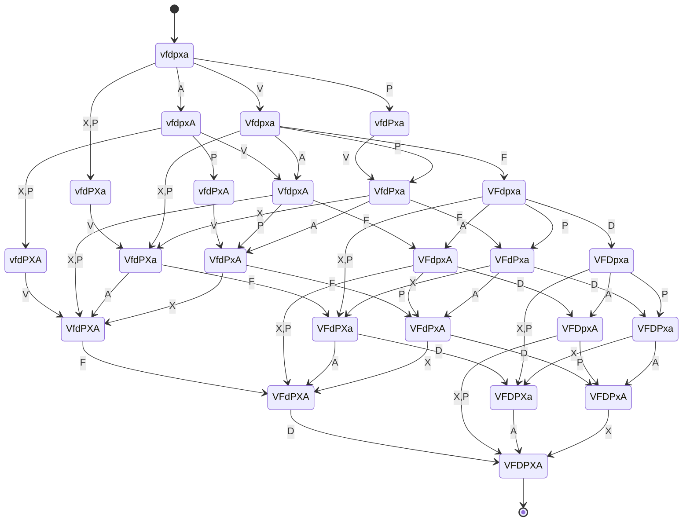

{== Clean up / verify / revise this diagram ==}

```mermaid
stateDiagram-v2
    [*] --> vfdpxa
    vfdpxa --> vfdPxa : P
    vfdpxa --> vfdPXa : X,P
    vfdpxa --> vfdpxA : A
    vfdpxA --> vfdPxA : P
    vfdpxA --> vfdPXA : X,P
 	vfdpxa --> Vfdpxa : V
	vfdpxA --> VfdpxA : V
	vfdPxa --> VfdPxa : V
	vfdPXa --> VfdPXa : V
	vfdPxA --> VfdPxA : V
	vfdPXA --> VfdPXA : V
    Vfdpxa --> VfdPxa : P
    Vfdpxa --> VfdPXa : X,P
    Vfdpxa --> VfdpxA : A
    VfdpxA --> VfdPxA : P
    VfdpxA --> VfdPXA : X,P
    VfdPxa --> VfdPxA : A
    VfdPxa --> VfdPXa : X
    VfdPXa --> VfdPXA : A
    VfdPxA --> VfdPXA : X
	Vfdpxa --> VFdpxa : F
	VfdpxA --> VFdpxA : F
	VfdPxa --> VFdPxa : F
	VfdPXa --> VFdPXa : F
	VfdPxA --> VFdPxA : F
	VfdPXA --> VFdPXA : F
    VFdpxa --> VFdPxa : P
    VFdpxa --> VFdPXa : X,P
    VFdpxa --> VFdpxA : A
    VFdpxA --> VFdPxA : P
    VFdpxA --> VFdPXA : X,P
    VFdPxa --> VFdPxA : A
    VFdPxa --> VFdPXa : X
    VFdPXa --> VFdPXA : A
    VFdPxA --> VFdPXA : X
	VFdpxa --> VFDpxa : D
	VFdpxA --> VFDpxA : D
	VFdPxa --> VFDPxa : D
	VFdPXa --> VFDPXa : D
	VFdPxA --> VFDPxA : D
	VFdPXA --> VFDPXA : D
    VFDpxa --> VFDPxa : P
    VFDpxa --> VFDPXa : X,P
    VFDpxa --> VFDpxA : A
    VFDpxA --> VFDPxA : P
    VFDpxA --> VFDPXA : X,P
    VFDPxa --> VFDPxA : A
    VFDPxa --> VFDPXa : X
    VFDPXa --> VFDPXA : A
    VFDPxA --> VFDPXA : X
    VFDPXA --> [*]
```
