# EM Model {#ch:embargo}

!!! note "TODO"
    - [x] regex replace acronym pointers with the acronym
    - [ ] replace first use of an acronym on a page with its expansion (if not already done)
    - [ ] OR replace acronym usage with link to where it's defined
    - [ ] reproduce diagrams using mermaid
    - [ ] replace text about figures to reflect mermaid diagrams
    - [ ] replace latex tables with markdown tables
    - [ ] replace some equations with diagrams (especially for equations describing state changes)
    - [ ] move latex math definitions into note blocks `???+ note _title_` to offset from text
    - [ ] move MUST SHOULD MAY etc statements into note blocks with empty title `!!! note ""` to offset from text
    - [ ] revise cross-references to be links to appropriate files/sections
    - [ ] replace latex citations with markdown citations (not sure how to do this yet)
    - [ ] review text for flow and readability as a web page
    - [ ] add section headings as needed for visual distinction
    - [ ] add links to other sections as needed
    - [ ] add links to external resources as needed
    - [ ] replace phrases like `this report` or `this section` with `this page` or similar
    - [ ] add `above` or `below` for in-page cross-references if appropriate (or just link to the section)
    - [ ] reduce formality of language as needed
    - [ ] move diagrams to separate files and `include-markdown` them

In this chapter, we describe the basic primitives necessary for the
CVD Embargo Management (EM) process. For our purposes, an embargo is an *informal* agreement among peer
CVD case Participants to refrain from publishing information about a vulnerability until some future point in time relative to the report at
hand. Once an embargo has expired, there is no further restriction on
publishing information about the vulnerability.

!!! tip inline end "Reminder"

    Exploits are information about vulnerabilities too.

CVD case Participants must be able to propose, accept, and reject embargo timing
proposals according to their individual needs. Additionally,
Participants may want to attempt to gain agreement that enables specific
details about a vulnerability to be shared with other Participants or
made public. Such content considerations are outside the scope of this
proposal. We focus our discussion on the *when* of an embargo, not the
*what*.

Unlike the [RM](../rm/) model, in which each Participant has their own instance of the
[RM](../rm/) DFA, EM states are a global property of a CVD case. 

!!! note ""
    A CVD case SHALL NOT have more than one active embargo at a time.

Even in an MPCVD case having a [vertical supply chain](https://vuls.cert.org/confluence/display/CVD/5.4+Multiparty+CVD)
---in which Vendors must wait on their upstream suppliers to produce fixes before they can take action on
their own, as in {== Figure [\[fig:mpcvd_supply_chain\]](#fig:mpcvd_supply_chain){reference-type="ref"
reference="fig:mpcvd_supply_chain"} ==} ---our intent is that the embargo
period terminates when as many Vendors as possible have been given an
adequate opportunity to produce a fix.

!!! info "CVD Embargoes Are Not NDAs"

    CVD embargoes are *not* NDAs. An NDA (also known as a Confidentiality agreement) is 
    a legally binding contract between parties, often accompanied by a reward for compliance and/or some penalty in the event
    of unauthorized disclosure. NDAs do, on occasion, have a place in CVD processes, but
    the relatively rapid pace and scale of most MPCVD embargoes makes per-case NDAs prohibitively
    difficult. As a result, we are intentionally setting aside NDA negotiation as beyond the scope of this proposal.

    On the surface, many bug bounty programs may appear to fall outside our
    scope because they are often structured as NDAs in which compliance is rewarded. For some
    bounty programs, the penalty for non-compliance or early disclosure is
    limited to the loss of the reward. For others, non-compliance can lead
    to the forfeiture of a promise of amnesty from the pursuit of civil or
    criminal charges that might otherwise apply because of security or
    acceptable-use policy violations. Nevertheless, we are optimistic that
    the bulk of this protocol (i.e., the parts that do not interfere with
    the contractual provisions of bounty-associated
    NDAs) will be found
    to be compatible with the full variety of bounty-oriented
    CVD programs
    existing now and in the future.

## EM State Machine

As with our definition of the [RM](../rm/) model, we describe our
EM model using DFA notation.



### EM States

CVD cases are either subject to an active embargo or they are not. 
We begin with a simple two-state model for the embargo state:

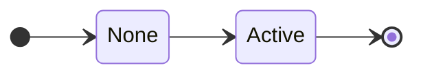

However, because embargo management is a process of coordinating across
Participants, it will be useful to distinguish between the _None_ state
and an intermediate state in which an embargo has been proposed but not
yet accepted or rejected. We might call this the _None + Proposed_
state, but we shortened it to _Proposed_.

Similarly, we want to be able to discriminate between an _Active_
embargo state and one in which a revision has been proposed but is not
yet accepted or rejected, which we will denote as the _Active + Revise_
state, shortened to _Revise_. Finally, we wish to distinguish between
the state in which no embargo has ever been established (_None_), and
the final state after an active embargo has ended (_eXited_). Combining
these, we get the following set of EM states, which we denote as
$\mathcal{Q}^{em}$.

???+ note inline end "EM States ($\mathcal{Q}^{em}$) Defined"
    $\label{eq:em_states}
    \begin{split}
        \mathcal{Q}^{em} = \{ & \underline{N}one, \\
        & \underline{P}roposed, \\
        & \underline{A}ctive, \\
        & \underline{R}evise, \\
        & e\underline{X}ited \}
    \end{split}$

As a reminder, we use the underlined capital letters as shorthand for
EM state names later in the document. Also note that $q^{em} \in A$ is distinct from
$q^{rm} \in A$. An embargo can be _Active_, while a Report can be
_Accepted_, and these are independent states. Be sure to check which
model a state's shorthand notation is referring to.

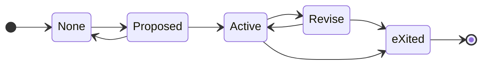

##### Start and Final States.

???+ note inline end "EM Start and Final States Defined"
    $q^{em}_0 = None$
    
    $\mathcal{F}^{em} = \{None,~eXited\}$

The EM process starts in the _None_ state. The process ends in one of two states: If an
embargo agreement is eventually reached, the EM process ends in the _eXited_ state.
Otherwise, if no agreement is ever reached, the EM process ends in the _None_ state. Formal
definitions of each are shown in the box at right.

### EM State Transitions



The symbols of our EM DFA are the actions that cause transitions
between the states:

!!! note ""
    An embargo MAY be _proposed_.

!!! note ""
    Once proposed, it MAY be _accepted_ or _rejected_.

!!! note ""
    Once accepted, revisions MAY be _proposed_, which MAY, in turn, be
    _accepted_ or _rejected_.

!!! note ""
    Finally, accepted embargoes MUST eventually _terminate_.

A summary of the available actions is shown as $\Sigma^{em}$ below.

???+ note "EM Symbols ($\Sigma^{em}$) Defined"
    $\label{eq:em_symbols}
        \begin{split}
            \Sigma^{em} = \{
             ~\underline{p}ropose, 
             ~\underline{r}eject, 
             ~\underline{a}ccept, 
             ~\underline{t}erminate
            \}
        \end{split}$

Once again, the underlined lowercase letters will be used as shorthand
for the EM
transition names in the remainder of the document.

#### EM Transitions Defined

Now we define the possible state transitions. Figure
[\[fig:em_states_dense\]](#fig:em_states_dense){reference-type="ref"
reference="fig:em_states_dense"} summarizes the EM process DFA states and transitions.



##### Propose Embargo

Propose a new embargo when none exists:

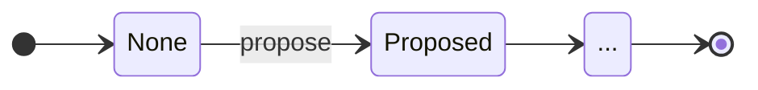

##### Accept or Reject Embargo Proposal

Accept or reject a proposed embargo:

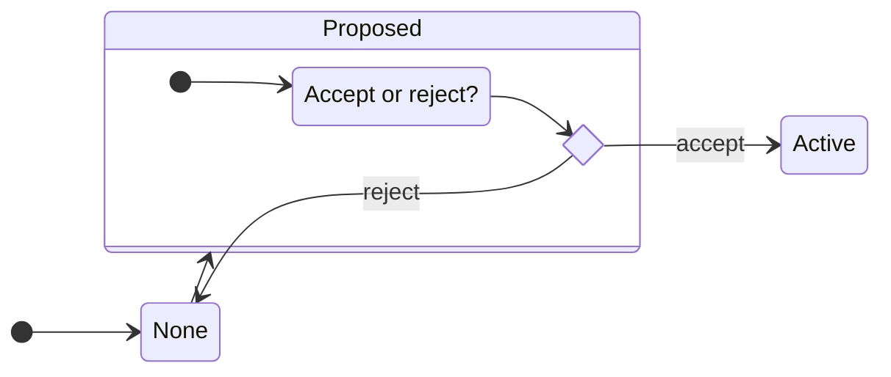

##### Embargo Revision

An existing embargo can also be renegotiated by proposing a new embargo.
The existing embargo remains active until it is replaced by accepting
the revision proposal.
If the newly proposed embargo is accepted, then the old one is
abandoned. On the other hand, if the newly proposed embargo is rejected,
the old one remains accepted.

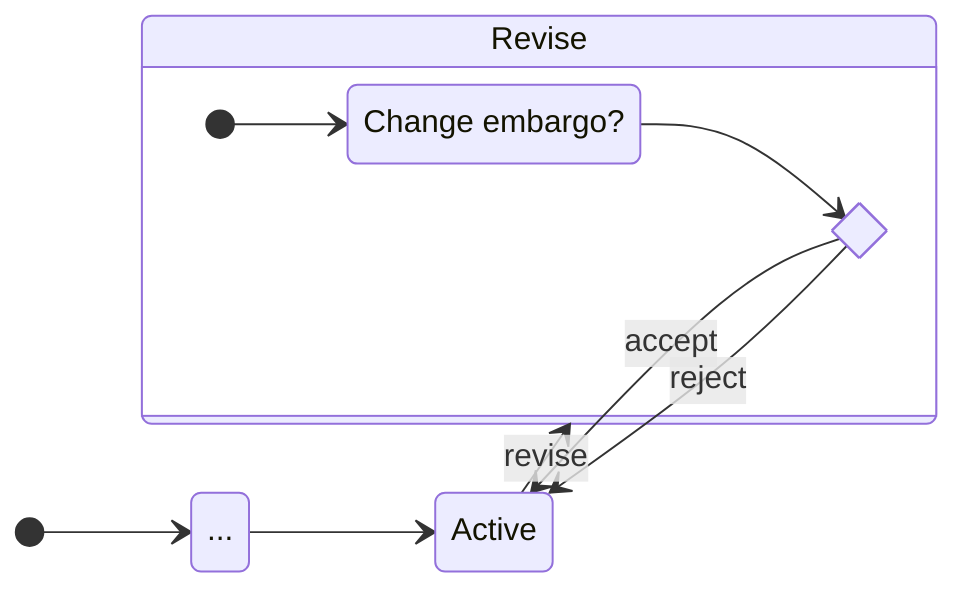

##### Terminate Embargo

Existing embargoes can terminate due to timer expiration or other
reasons to be discussed in
{== §[1.2.7](#sec:early_termination){reference-type="ref"
reference="sec:early_termination"} ==}. Termination can occur even if there
is an open revision proposal.

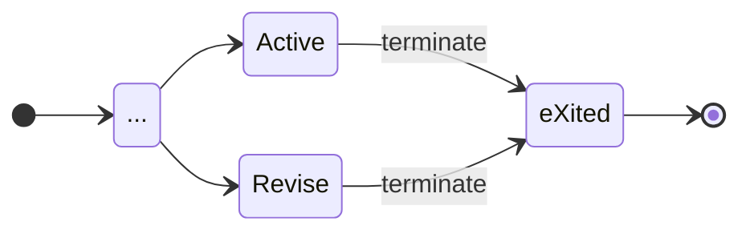

#### A Regular Grammar for EM {#sec:em_grammar}

Based on the actions and corresponding state transitions just described,
we define the transition function $\delta^{em}$ for the
EM process as a set
of production rules for the right-linear grammar using our
single-character shorthand in
[\[eq:em_transition_function\]](#eq:em_transition_function){reference-type="eqref"
reference="eq:em_transition_function"}.

???+ note inline end "EM Transition Function ($\delta^{em}$) Defined"
    $\label{eq:em_transition_function}
        \delta^{em} = 
        \begin{cases}
            % \epsilon \to & N \\
                   N \to ~pP~|~\epsilon \\
                   P \to ~pP~|~rN~|~aA \\
                   A \to ~pR~|~tX \\
                   R \to ~pR~|~aA~|~rA~|~tX \\
                   X \to ~\epsilon \\
        \end{cases}$

Due to the numerous loops in the DFA shown in Figure
[\[fig:em_states_dense\]](#fig:em_states_dense){reference-type="ref"
reference="fig:em_states_dense"}, the EM grammar is capable of generating
arbitrarily long strings of _propose_-_propose_ and _propose_-_reject_
histories matching the regular expression `(p*r)*(pa(p*r)*(pa)?t)?`. As
an example, here is an exhaustive list of all the possible traces of
length seven or fewer:

> _pr_, _pat_, _ppr_, _ppat_, _papt_, _prpr_, _pppr_, _ppppr_, _pprpr_,
> _prppr_, _pappt_, _ppapt_, _pppat_, _papat_, _paprt_, _prpat_,
> _pppppr_, _papppt_, _prpppr_, _ppprpr_, _ppappt_, _pppapt_, _prprpr_,
> _papapt_, _pprppr_, _pappat_, _paprpt_, _prppat_, _prpapt_, _ppaprt_,
> _pprpat_, _ppapat_, _papprt_, _ppppat_, _pprprpr_, _prprppr_,
> _paprppt_, _prpprpr_, _pappprt_, _papppat_, _ppppapt_, _prpaprt_,
> _papappt_, _pappapt_, _pppappt_, _pprpppr_, _pppprpr_, _prppppr_,
> _ppprppr_, _ppapppt_, _ppaprpt_, _papprpt_, _ppapprt_, _ppappat_,
> _prpppat_, _prpapat_, _ppprpat_, _ppppppr_, _pprppat_, _papapat_,
> _paprpat_, _ppapapt_, _prprpat_, _paprprt_, _prppapt_, _pppapat_,
> _pprpapt_, _pppaprt_, _pppppat_, _prpappt_, _papaprt_, _pappppt_

However, because EM
is a human-oriented scheduling process, our experience suggests that we
should expect there to be a natural limit on CVD Participants' tolerance for churn during
embargo negotiations. Hence, we expect most paths through the
EM DFA to be on the short end of this list in practice. We offer some thoughts on a
potential reward function over EM DFA strings in [Future Work](../../future_work.md).

For example, it is often preferable for a Vendor to accept whatever
embargo the Reporter initially proposes followed closely by proposing a
revision to their preferred timeline than it is for the Vendor and
Reporter to ping-pong proposals and rejections without ever establishing
an embargo in the first place. In the worst case (i.e., where the
Reporter declines to extend their embargo), a short embargo is
preferable to none at all. This implies a preference for strings
starting with _par_ over strings starting with _ppa_ or _prpa_, among
others. We will come back to this idea in [Default Embargoes](#default-embargoes)
and in the [worked protocol example](../../formal_protocol/worked_example/#vendor-accepts-then-proposes-revision).

### EM DFA Fully Defined

Taken together, the complete DFA specification for the
EM process is shown below right.

???+ note "EM DFA $(\mathcal{Q},q_0,\mathcal{F},\Sigma,\delta)^{em}$ Fully Defined"

    $$EM = 
        \begin{pmatrix}
                \begin{aligned}
                    \mathcal{Q}^{em} = & \{ N,P,A,R,X \}, \\
                    q^{em}_0 = & N, \\
                    \mathcal{F}^{em} = &\{ N,X \},  \\
                    \Sigma^{em} = &\{ p,r,a,t \}, \\
                    \delta^{em} = &
                        \begin{cases}
                           N \to ~pP~|~\epsilon \\
                           P \to ~pP~|~rN~|~aA \\
                           A \to ~pR~|~tX \\
                           R \to ~pR~|~aA~|~rA~|~tX \\
                           X \to ~\epsilon \\
                        \end{cases}
                \end{aligned}
        \end{pmatrix}$$

## EM Discussion {#sec:em_discussion}

Embargoes are a means of inhibiting public disclosure of a vulnerability
while defenses are prepared (e.g., until fix development has completed
for a reasonable quorum of Vendors). The goal of the
EM process is not to
establish an exact publication schedule for every Participant to adhere
to. Rather, it is to establish a window spanning from the present to
some future time, during which Participants are expected not to publish
or otherwise disclose information about the vulnerability to
non-Participants outside of the CVD case.

### Embargo Principles {#sec:embargo_principles}

An embargo is a social agreement between independent parties acting in
the interest of providing vulnerability fixes to users in a timely
manner while minimizing attacker advantage in the interim. However,
embargoes are not always appropriate or useful within the context of any
given CVD case.

With that in mind, we offer the following principles as guidance. We
begin with some behavioral norms that define what it means to cooperate
with an embargo.

!!! note ""

    Embargo Participants SHOULD NOT knowingly release information about
    an embargoed case until either

    1.  all proposed embargoes have been explicitly rejected

    2.  no proposed embargo has been explicitly accepted in a timely
        manner

    3.  the expiration date/time of an accepted embargo has passed

    4.  an accepted embargo has been terminated prior to the embargo
        expiration date and time due to other reasons (e.g., those
        outlined in
        {== §[1.2.7](#sec:early_termination){reference-type="ref"
        reference="sec:early_termination"} ==})

!!! note ""
    Additional Participants MAY be added to an existing embargo upon
    accepting the terms of that embargo.

!!! note ""
    Adding Participants to an existing embargo SHALL NOT constitute
    "release" or "publication" so long as those Participants accept the
    terms of the embargo.

See
    {== §[1.2.10](#sec:inviting_others){reference-type="ref"
    reference="sec:inviting_others"} ==}.

Furthermore, we need to establish a few norms related to embargo timing.

!!! note ""  
    An embargo SHALL specify an unambiguous date and time as its
    endpoint.

!!! note ""
    An embargo SHALL NOT be used to indefinitely delay publication of
    vulnerability information, whether through repeated extension or by
    setting a long-range endpoint.

!!! note ""
    An embargo SHALL begin at the moment it is accepted.

!!! note ""
    Embargoes SHOULD be of short duration, from a few days to a few
    months.

### Embargo Scale and Duration

Given all other facts about a vulnerability report being equal, there
are two factors that contribute significantly to the success or failure
of an embargo: scale and duration. The more people involved in an
embargo, the more likely the embargo is to fail.

!!! note ""
    Embargo participation SHOULD be limited to the smallest possible set
    of individuals and organizations needed to adequately address the
    vulnerability report.

Similarly, the longer an embargo lasts, the more likely it is to fail.

!!! note ""
    Embargo duration SHOULD be limited to the shortest duration possible
    to adequately address the vulnerability report.

### Embargo Participants Are Free to Engage or Disengage {#sec:embargo_engagement}

As we described [above](#cvd-embargoes-are-not-ndas), an embargo is not the
same thing as an NDA, even if they have similar effects.
Because it is a contract, an NDA can carry civil or even criminal
penalties for breaking it. CVD embargoes have no such legal framework.
Hence, CVD
Participants are free to enter or exit an embargo at any time, for any
reason. In fact, CVD Participants are not obliged to agree to
any embargo at all. However, regardless of their choices, Participants
should be clear about their status and intentions with other
Participants. There are a few good reasons to exit an embargo early.
(See {== §[1.2.7](#sec:early_termination){reference-type="ref"
reference="sec:early_termination"} ==}.)
 
!!! note ""
    Participants MAY propose a new embargo or revision to an existing
    embargo at any time within the constraints outlined in
    {== §[1.2.4](#sec:entering_an_embargo){reference-type="ref"
    reference="sec:entering_an_embargo"} ==}.

!!! note ""
    Participants MAY reject proposed embargo terms for any reason.

!!! note ""
    Participants in an embargo MAY exit the embargo at any time.

Note that a Participant leaving an embargo is not necessarily the same
as the embargo itself terminating. Embargo termination corresponds to
the $q^{em} \in \{A,R\} \xrightarrow{t} X$ transition in the
EM model and
reflects a consensus among case Participants that the embargo no longer
applies. A Participant leaving an *Active* embargo means that the
embargo agreement between other Participants remains intact, but that
the leaving Participant is no longer involved in the case.

!!! note ""
    Participants stopping work on a case SHOULD notify remaining
    Participants of their intent to adhere to or disregard any existing
    embargo associated with the case.

!!! note ""
    Participants SHOULD continue to comply with any active embargoes to
    which they have been a part, even if they stop work on the case.

!!! note ""
    Participants who leave an *Active* embargo SHOULD be removed by the
    remaining Participants from further communication about the case.

These points imply a need for Participants to track the status of other
Participants with respect to their adherence to the embargo and
engagement with the case. We will return to these concepts with the
$case\_engagement_ and _embargo\_adherence$ attributes described in
{== §[\[sec:case_object_participant_class\]](#sec:case_object_participant_class){reference-type="ref"
reference="sec:case_object_participant_class"} ==}.

CVD is an iterated
game, and actions have consequences. Leaving an embargo early in one
case may have repercussions to Participants' willingness to cooperate in
later cases.

!!! note ""
    A Participant's refusal to accept embargo terms MAY result in that
    Participant being left out of the CVD case entirely.

!!! note ""
    Participants SHOULD consider other Participants' history of
    cooperation when evaluating the terms of a proposed embargo.

Finally, embargo termination removes a constraint rather than adding an
obligation.

!!! note ""
    Participants SHOULD not publish information about the vulnerability
    when there is an active embargo.

!!! note ""
    Participants MAY publish information about the vulnerability when
    there is no active embargo.

!!! note ""
    Embargo termination SHALL NOT be construed as an obligation to
    publish.

A discussion of how to decide who to invite to participate in a
CVD case is addressed in {== §[1.2.10](#sec:inviting_others){reference-type="ref"
reference="sec:inviting_others"} ==}.

### Entering an Embargo {#sec:entering_an_embargo}

Negotiating and entering into a new embargo for a case is only possible
within an embargo "habitable zone" defined in terms of the
[Case State model](../cs/index.md) as laid out below. The notation for CS model states is explained in
[Case State model](../cs/index.md), but the contextual explanation below should
suffice for now.

!!! note ""

    CVD Participants MUST NOT *propose* or *accept* a new embargo
    negotiation when any of the following conditions are true:

    1.  Information about the vulnerability is already known to the
        public (${q^{cs} \in \cdot\cdot\cdot P \cdot\cdot}$).

    2.  An exploit for the vulnerability is publicly available
        (${q^{cs} \in \cdot\cdot\cdot\cdot X \cdot}$).

    3.  There is evidence that the vulnerability is being actively
        exploited by adversaries (${q^{cs} \in \cdot\cdot\cdot\cdot\cdot A}$).

!!! note ""

    CVD Participants SHOULD NOT *propose* or *accept* a new embargo
    negotiation when the fix for a vulnerability has already been
    deployed ($q^{cs} \in VFDpxa$). Counterexamples include

    - when an embargo is desired to allow for a downstream Vendor to synchronize
    their fix delivery or deployment
    - when a Vendor has deployed a fix but wants to complete their root cause analysis prior to
    releasing information about the vulnerability.
 
!!! note ""

    CVD Participants MAY *propose* or *accept* a new embargo when the fix
    for a vulnerability is ready but has neither been made public nor
    deployed ($q^{cs} \in VFdpxa$). Such an embargo SHOULD be brief and
    used only to allow Participants to prepare for timely publication or
    deployment.

!!! note ""

    CVD Participants MAY *propose* or *accept* an embargo in all other case
    states (${q^{cs} \in \cdot\cdot\cdot pxa}$).

### Negotiating Embargoes

Asymmetry is inherent in the CVD process because those who currently have
the vulnerability information get to decide with whom they will share it.
This asymmetry puts Reporters at somewhat of an advantage when it comes
to the initial report submission to another Participant. We will discuss
some ways to improve (but not fully remove) this asymmetry in
[Default Embargoes](#default-embargoes), but for now we just need to
acknowledge that it exists.

!!! note ""  
    
    Participants MAY *accept* or *reject* any proposed embargo as they
    see fit.

!!! note ""  
 
    Receivers SHOULD *accept* any embargo proposed by Reporters.

!!! note ""  

    Receivers MAY *propose* embargo terms they find more favorable as
    they see fit.

!!! note ""  
   
    Participants MAY withdraw (*reject*) their own unaccepted *Proposed*
    embargo.

##### Respond Promptly.

Timely response to embargo proposals is important. Explicit acceptance
is expected.

!!! note ""

    Participants SHOULD explicitly *accept* or *reject* embargo
    proposals in a timely manner. (For example, embargo agreement or
    rejection SHOULD NOT be tacit.)

!!! note ""
    Participants MAY interpret another Participant's failure to respond
    to an embargo proposal in a timely manner as a *reject*ion of that
    proposal.

!!! note ""
    In the absence of an explicit *accept* or *reject* response from a
    Receiver in a timely manner, the Sender MAY proceed in a manner
    consistent with an EM state of _None_ ($q^{em} \in N$).

##### Don't Give Up.

Once an embargo negotiation has failed the first time, Participants have
no further obligations. They are, however, encouraged to try again.

!!! note ""  

    In a case where the embargo state is _None_ and for which an embargo
    has been *propose*d and either explicitly or tacitly *reject*ed,
    Participants MAY take any action they choose with the report in
    question, including immediate publication.

!!! note ""  

    Participants SHOULD make reasonable attempts to retry embargo
    negotiations when prior proposals have been *reject*ed or otherwise
    failed to achieve *accept*ance.

##### Submitting a Report Before Embargo Negotiations Conclude

Participants need not wait for embargo negotiations to conclude before
submitting a report. However, by doing so, they might give up some of
their leverage over the Receiver in the embargo negotiations.

!!! note ""  

    Participants MAY withhold a report from a Recipient until an initial
    embargo has been accepted.

!!! note ""  

    Submission of a report when an embargo proposal is pending
    ($q^{em} \in P$) SHALL be construed as the Sender's acceptance
    ($q^{em} \in P \xrightarrow{a} A$) of the terms proposed regardless
    of whether the Sender or Receiver was the proposer.

##### Addressing Validation Uncertainty.

Participants might prefer to delay accepting or rejecting a proposed
embargo until after they have had an opportunity to review the report
through the validation and (possibly) prioritization processes. However,
because other Participants are under no obligation to withhold
publication of cases not covered by an active embargo, we recommend that
a short embargo be used until the validation process concludes, at which
point, it can be extended with a revision.

!!! note ""

    Participants MAY use short embargo periods to cover their report
    validation process, and subsequently revise the embargo terms
    pending the outcome of their report validation and/or prioritization
    processes.

!!! note ""  

    Participants SHOULD remain flexible in adjusting embargo terms as
    the case evolves.

### Default Embargoes

As described in {== §[1.1.2.2](#sec:em_grammar){reference-type="ref"
reference="sec:em_grammar"} ==}, the EM process has the potential for unbounded
*propose-reject* churn. To reduce the potential for this churn and
increase the likelihood that *some* embargo is established rather than a
stalemate of unaccepted proposals, we offer the following guidance.

##### Declaring Defaults.

First, we note that all CVD Participants (including Reporters) are
free to establish their own default embargo period in a published
vulnerability disclosure policy. In particular, we recommend that
CVD report
recipients (typically Vendors and Coordinators) do so.

!!! note ""  

    Participants MAY include a default embargo period as part of a
    published Vulnerability Disclosure Policy.

!!! note ""  

    Recipients SHOULD post a default embargo period as part of their
    Vulnerability Disclosure Policy to set expectations with potential
    Reporters.

##### Using Defaults.

Next, we work through the possible interactions of published policies
with proposed embargoes. Each of the following scenarios assumes a
starting state of $q^{em} \in N$, and a negotiation between two parties.
We cover the extended situation (adding parties to an existing embargo)
in [Inviting Others](#inviting-others-to-an-embargoed-case). For now, we begin with the simplest
case and proceed in an approximate order of ascending complexity.

In each of the following, subscripts on transitions indicate the
Participant whose proposal is being acted upon, not the Participant who
is performing the action. For example, $a_{sender}$ indicates acceptance
of the Sender's proposal, even if it is the Receiver doing the
accepting.

###### No Defaults, No Proposals

We begin with the simplest case, in which neither party has a default and no
embargo has been proposed.

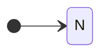

!!! note ""  

    ???+ note inline end "Formalism"

        $$q^{em} \in N$$

    If neither Sender nor Receiver proposes an embargo, and no policy
    defaults apply, no embargo SHALL exist.

###### Sender Proposes When Receiver Has No Default Embargo

Next, we consider the case where the Sender has a default embargo or otherwise proposes an embargo
and the Receiver has no default embargo specified by policy.

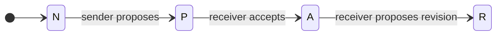

!!! note ""  

    ???+ note inline end "Formalism"

        $$q^{em} \in N \xrightarrow{p_{sender}} P \xrightarrow{a_{sender}} A$$

    If the Sender proposes an embargo and the Receiver has no default
    embargo specified by policy, the Receiver SHOULD accept the Sender's
    proposal.

!!! note ""  

    ???+ note inline end "Formalism"

        $$q^{em} \in A \xrightarrow{p_{receiver}} R$$

    The Receiver MAY then propose a revision.

###### Receiver Has Default Embargo, Sender Implies Acceptance

The next scenario is where the Receiver has a default embargo specified by
policy and the Sender does not propose an embargo.

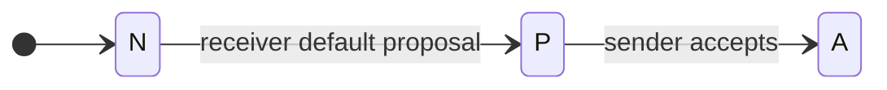

!!! note ""  

    ???+ note inline end "Formalism"

        $$q^{em} \in N \xrightarrow{p_{receiver}} P$$

    A Receiver's default embargo specified in its vulnerability
    disclosure policy SHALL be treated as an initial embargo proposal.

!!! note ""  

    ???+ note inline end "Formalism"

        $$q^{em} \in N \xrightarrow{p_{receiver}} P \xrightarrow{p_{sender}} P$$

    If the Receiver has declared a default embargo in its vulnerability
    disclosure policy and the Sender proposes nothing to the contrary,
    the Receiver's default embargo SHALL be considered as an accepted
    proposal.

###### Sender Proposes an Embargo Longer than the Receiver Default

Now we consider the case where the Sender proposes an embargo longer
than the Receiver's default.

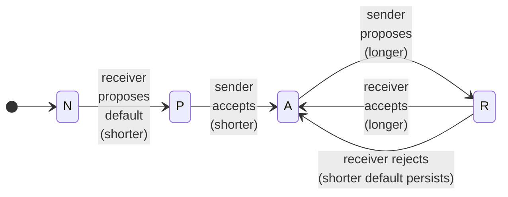

!!! note ""  

    If the Sender proposes an embargo *longer* than the Receiver's
    default embargo, the Receiver's default SHALL be taken as accepted
    and the Sender's proposal taken as a proposed revision.

    ???+ note "Formalism"

        $$q^{em} \in N \xrightarrow{p_{receiver}} P \xrightarrow{p_{sender}} P \xrightarrow{a_{receiver}} A \xrightarrow{r_{sender}} R$$

!!! note ""  

    ???+ note inline end "Formalism"

        $$q^{em} \in \begin{cases}
            R \xrightarrow{a_{sender}} A \\
            R \xrightarrow{r_{sender}} A
            \end{cases}$$

    The Receiver MAY then *accept* or *reject* the proposed extension.

###### Sender Proposes an Embargo Shorter than the Receiver Default

Finally, we reach a common scenario in which the Sender proposes an
embargo shorter than the Receiver's default.

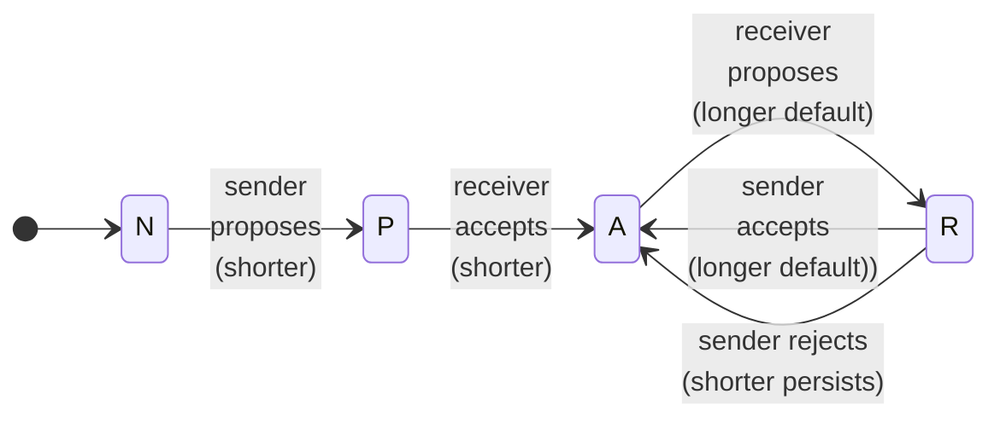

!!! note ""  

    If the Sender proposes an embargo *shorter* than the Receiver's
    default embargo, the Sender's proposal SHALL be taken as accepted
    and the Receiver's default taken as a proposed revision.

    ???+ note "Formalism"
    
        $$q^{em} \in N \xrightarrow{p_{receiver}} P \xrightarrow{p_{sender}} P \xrightarrow{a_{sender}} A \xrightarrow{r_{receiver}} R$$

!!! note ""  

    ???+ note inline end "Formalism"

        $$q^{em} \in \begin{cases}
            R \xrightarrow{a_{receiver}} A \\
            R \xrightarrow{r_{receiver}} A
            \end{cases}$$

    The Sender MAY then *accept* or *reject* the proposed extension.

!!! info "A Game Theory Argument for Accepting the Shortest Proposed Embargo"

    Readers may notice that we have taken a _shortest proposal wins_
    approach to the above guidance. This is intentional, and it results
    directly from the asymmetry mentioned in
    [Negotiating Embargoes](#negotiating-embargoes)
    The Receiver is faced with a
    choice to either *accept* the Reporter's proposal and attempt to extend
    it or to *reject* the proposal and end up with no embargo at all.
    Therefore, if we take the stance that for a vulnerability with no fix
    available, *any* embargo is better than *no* embargo, it should be
    obvious that it is in the Receiver's interest to *accept* even a short
    proposed embargo before immediately working to revise it.
    
    The alternative is impractical because the Reporter is not obligated to
    provide the report to the Receiver at all. In the scenario where a
    Reporter *proposes* a short embargo and the Receiver *rejects* it
    because it is not long enough, the Reporter might choose to exit the
    negotiation entirely and publish whenever they choose without ever
    providing the report to the Receiver. That is not to say that we
    recommend this sort of behavior from Reporters. In fact, we specifically
    recommend the opposite in
    [Negotiating Embargoes](#negotiating-embargoes). Rather, it once more
    acknowledges the time-dependent informational asymmetry inherent to the
    CVD process.

!!! info "A Logical Argument for Accepting the Shortest Proposed Embargo"

    Perhaps the above reasoning comes across as too Machiavellian for some
    readers. Here is a different perspective: Say a Reporter proposes an
    embargo of _n_ days, while the Vendor would prefer _m_ days. If _n_ and
    _m_ are given in units of days, we can look at them as a series of
    individual agreements, each of 1 day in length. We will represent each
    Participant as a vector representing that Participant's willingness to
    perpetuate the embargo on each day. Embargo willingness will be
    represented as a _1_ if the Participant is willing to commit to keeping
    the embargo on that day, and a _0_ if they are not. For simplicity's
    sake, we assume that each Participant is willing to maintain the embargo
    up to a certain point, and then their willingness goes away. In other
    words, each vector will be a series of zero or more _1_s followed by
    zero or more _0_s. For example, $[1,1,1,1,0,0,0]$ represents a
    Participant's willingness to engage in a 4-day embargo.
    
    For our two Participants, let $\mathbf{x}_ and _\mathbf{y}$ be
    zero-indexed vectors of length $max(n,m)$.
    
    $$\begin{aligned}
        |\mathbf{x}| &= max(n,m) \\
        |\mathbf{y}| &= max(n,m)
    \end{aligned}$$
    
    The elements of each vector represent each respective Participant's
    willingness for the embargo to persist on each consecutive day.
    
    $$\begin{aligned}
        \label{eq:x_i}
        \mathbf{x} = 
            \begin{bmatrix} x_i :
            x_i = 
            \begin{cases}
                1 &\text{if }i < n \\
                0 &\text{otherwise} \\
            \end{cases}
            & \text{for } 0 \leq i < max(n,m)
            \end{bmatrix} \\
        \label{eq:y_i}
        \mathbf{y} =
            \begin{bmatrix} y_i : 
            y_i = 
            \begin{cases}
                1 &\text{if }i < m \\
                0 &\text{otherwise}
            \end{cases}
            & \text{ for } 0 \leq i < max(n,m)
        \end{bmatrix}
    \end{aligned}$$
    
    Note that we have constructed these vectors so that each vector's scalar
    sum is just the length of embargo they prefer.
    
    $$\begin{aligned}
        \Sigma(\mathbf{x}) &= n \\
        \Sigma(\mathbf{y}) &= m 
    \end{aligned}$$
    
    Now we can define an agreement vector $\mathbf{z}$ as the pairwise
    logical *AND* ($\wedge$) of elements from $\mathbf{x}_ and _\mathbf{y}$:
    
    $$\begin{aligned}
        \label{eq:z_i}
        \mathbf{z} = 
        \begin{bmatrix} z_i : 
            z_i = x_i \land y_i
            & \text{for }0 \leq i < max(n,m)
        \end{bmatrix}
    \end{aligned}$$
    
    For example, if one party prefers an embargo of length $n=4$ days while
    another prefers one of length $m=7$ days, we can apply
    [\[eq:x_i\]](#eq:x_i){reference-type="eqref" reference="eq:x_i"},
    [\[eq:y_i\]](#eq:y_i){reference-type="eqref" reference="eq:y_i"}, and
    [\[eq:z_i\]](#eq:z_i){reference-type="eqref" reference="eq:z_i"} as
    follows:
    
    $$\begin{split}
        \mathbf{x} &= [1,1,1,1,0,0,0] \\
        \wedge~\mathbf{y} &= [1,1,1,1,1,1,1] \\
        \hline
        \mathbf{z} &= [1,1,1,1,0,0,0]
        \end{split}$$
    
    From this, we can see that the scalar sum of the agreement vector---and
    therefore the longest embargo acceptable to both parties---is simply the
    lesser of _n_ and _m_:
    
    $$\Sigma ( \mathbf{z} ) = min(n,m)$$

#### The Shortest Proposed Embargo Wins.

In other words, if a Reporter proposes a 90-day embargo, but the Vendor
prefers a 30-day embargo, we can think of this as a series of 1-day
agreements in which both parties agree to the first 30 days of the
embargo and disagree beyond that. By accepting the shorter 30-day
embargo, the Reporter now has 30 days to continue negotiations with the
Vendor to extend the embargo. Even if those continued negotiations fail,
both parties get at least the 30-day embargo period they agreed on in
the first place. This should be preferable to both parties versus the
alternative of no embargo at all were they to simply reject the shorter
proposal. Typically it is the Reporter who desires a shorter embargo
than the Vendor. We chose our example to demonstrate that this analysis
works between any two parties, regardless of which party wants the
shorter embargo.

!!! info "Resolving Multiple Proposals at Once"

    On our way to making this principle explicit, we immediately came across
    a second scenario worth a brief diversion: What to do when multiple
    revisions are up for negotiation simultaneously? Based on the idea of
    extending the above to an efficient pairwise evaluation of multiple
    proposals, we suggest the following heuristic:

    1.  Sort the proposals in order from earliest to latest according to
    their expiration date.
    2.  Set the current candidate to the earliest proposal.
    3.  Loop over each remaining (later) proposal, evaluating it against the
    current candidate.
    4.  If the newly evaluated proposal is accepted, it becomes the current
    candidate and the loop repeats.
    5.  Otherwise, the loop exits at the first *reject*ed proposal.
    6.  The current candidate (i.e., the latest *accept*ed proposal) becomes
    the new *Active* embargo.
    7.  If the earliest proposed revision is rejected---implying that none
    of the later ones would be acceptable either---then the existing
    *Active* embargo remains intact.

Summarizing the principles just laid out as rules

!!! note ""

    When two or more embargo proposals are open (i.e., none have yet
    been accepted) and $q^{em} \in P$, Participants SHOULD accept the
    shortest one and propose the remainder as revisions.

!!! note ""

    When two or more embargo revisions are open (i.e., an embargo is
    active yet none of the proposals have been decided) and
    $q^{em} \in R$, Participants SHOULD *accept* or *reject* them
    individually, in earliest to latest expiration order.

### Early Termination {#sec:early_termination}

Embargoes sometimes terminate prior to the agreed date and time. This is
an unavoidable, if inconvenient, fact arising from three main causes:

1.  Vulnerability discovery capability is widely distributed across the
    world, and not all Finders become cooperative Reporters.

2.  Even among otherwise cooperative CVD Participants, leaks sometimes happen.

3.  Adversaries are unconstrained by CVD in their vulnerability discovery,
    exploit code development, and use of exploit code in attacks.

While many leaks are unintentional and due to miscommunication or errors
in a Participant's CVD process, the effect is the same
regardless of the cause. As a result,

!!! note ""

    Participants SHOULD be prepared with contingency plans in the event
    of early embargo termination.

Some reasons to terminate an embargo before the agreed date include the
following:

!!! note ""
  
    Embargoes SHALL terminate immediately when information about the
    vulnerability becomes public. Public information may include reports
    of the vulnerability or exploit code.
    ($q^{cs} \in \{ \cdot\cdot\cdot P \cdot\cdot, \cdot\cdot\cdot\cdot X \cdot \}$)

!!! note ""

    Embargoes SHOULD terminate early when there is evidence that the
    vulnerability is being actively exploited by adversaries.
    ($q^{cs} \in \{ \cdot\cdot\cdot\cdot\cdot A \}$)

!!! note ""

    Embargoes SHOULD terminate early when there is evidence that
    adversaries possess exploit code for the vulnerability.

!!! note ""

    Embargoes MAY terminate early when there is evidence that
    adversaries are aware of the technical details of the vulnerability.

The above is not a complete list of acceptable reasons to terminate an
embargo early. Note that the distinction between the *SHALL* in the
first item and the *SHOULD* in the second is derived from the reasoning
given in
{== §[\[sec:transition_function\]](#sec:transition_function){reference-type="ref"
reference="sec:transition_function"} ==}, where we describe the
CS model's
transition function. Embargo termination is the set of transitions
described [above](#terminate-embargo).

##### Waiting for All Vendors to Reach Fix Ready May Be Impractical.

It is not necessary for all Vendor Participants to reach
$q^{cs} \in VF\cdot\cdot\cdot\cdot$ before publication or embargo termination.
Especially in larger MPCVD cases, there comes a point where the net
benefit of waiting for every Vendor to be ready is outweighed by the
benefit of delivering a fix to the population that can deploy it. No
solid formula for this exists, but factors to consider include the
market share of the Vendors in $q^{cs} \in VF \cdot\cdot\cdot\cdot$ compared to
those with $q^{cs} \in \cdot f\cdot\cdot\cdot\cdot$; the software supply chain for
fix delivery to Deployers; the potential impact to critical
infrastructure, public safety/health, or national security; etc.

!!! note ""

    Embargoes MAY terminate early when a quorum of Vendor Participants
    is prepared to release fixes for the vulnerability
    ($q^{cs}  \in VF\cdot\cdot\cdot\cdot$), even if some Vendors remain
    unprepared ($q^{cs} \in \cdot f \cdot\cdot\cdot\cdot$).

!!! note ""

    Participants SHOULD consider the software supply chain for the
    vulnerability in question when determining an appropriate quorum for
    release.

### Impact of Case Mergers on Embargoes

While relatively rare, it is sometimes necessary for two independent
CVD cases to be
merged into a single case. This can happen, for example, when two
Finders independently discover vulnerabilities in separate products and
report them to their respective (distinct) Vendors. On further
investigation, it might be determined that both reported problems stem
from a vulnerability in a library shared by both products. In this
scenario, each Reporter-Vendor pair might have already negotiated an
embargo for the case. Once the cases merge, the best option is usually
to renegotiate a new embargo for the new case.

!!! note ""

    A new embargo SHOULD be proposed when any two or more
    CVD cases are to be merged into a single case and multiple parties have agreed to
    different embargo terms prior to the case merger.

!!! note ""

    If no new embargo has been proposed, or if agreement has not been
    reached, the earliest of the previously accepted embargo dates SHALL
    be adopted for the merged case.

!!! note ""

    Participants MAY propose revisions to the embargo on a merged case
    as usual.

### Impact of Case Splits on Embargoes

It is also possible that a single case needs to be split into multiple
cases after an embargo has been agreed to. For example, consider a
vulnerability that affects two widely disparate fix supply chains, such
as a library used in both SAAS and OT environments. The
SAAS Vendors might
be well positioned for a quick fix deployment while the
OT Vendors might
need considerably longer to work through the logistics of delivering
deployable fixes to their customers. In such a case, the case
Participants might choose to split the case into its respective supply
chain cohorts to better coordinate within each group.

!!! note ""

    When a case is split into two or more parts, any existing embargo
    SHOULD transfer to the new cases.

!!! note ""

    If any of the new cases need to renegotiate the embargo inherited
    from the parent case, any new embargo SHOULD be later than the
    inherited embargo.

!!! note ""

    In the event that an earlier embargo date is needed for a child
    case, consideration SHALL be given to the impact that ending the
    embargo on that case will have on the other child cases retaining a
    later embargo date. In particular, Participants in each child case
    should assess whether earlier publication of one child case might
    reveal the existence of or details about other child cases.

!!! note ""

    Participants in a child case SHALL communicate any subsequently
    agreed changes from the inherited embargo to the Participants of the
    other child cases.

Note that it may not always be possible for the split cases to have
different embargo dates without the earlier case revealing the existence
of a vulnerability in the products allocated to the later case. For this
reason, it is often preferable to avoid case splits entirely.

### Inviting Others to an Embargoed Case

As anyone who has tried to schedule a meeting with multiple attendees
can attest, multi-party scheduling can be difficult. When that schedule
must also accommodate work completion schedules for an
MPCVD case, it becomes even harder. In [Default Embargoes](#default-embargoes), 
we laid out a heuristic for resolving multiple embargo proposals, "The Shortest Embargo Proposed
Wins." More specifically, we recommended that Participants *accept* the
earliest proposed end date and immediately propose and evaluate the rest
as potential revisions. This principle applies to any
MPCVD case, even at its outset.

Embargo negotiations can become contentious in larger cases. Many
MPCVD cases grow over time, and it is usually easier to establish an embargo with a
smaller group than a larger one. Conflict resolution via consensus
agreement is fine if it works. In fact, in scenarios where Participants
who have already agreed to an embargo get to choose who else to add to
the embargo, the existing consensus can be a strong influence for the
new Participant to consent to the existing agreement.

In other words, it is usually preferable to present an already-accepted
embargo to new Participants and get their agreement before potentially
revising the embargo than it is to wait for a large multi-party
negotiation to succeed before establishing an embargo in the first
place. When consensus fails, however, it may be helpful for the group to
appoint a case lead to resolve any conflicts. Such scenarios are often
an opportunity for a third-party Coordinator to be engaged [@ISO29147].

Therefore,

!!! note ""

    Participants SHOULD attempt to establish an embargo as early in the
    process of handling the case as possible.

!!! note ""

    Participants SHOULD follow consensus agreement to decide embargo
    terms.

!!! note ""

    When consensus fails to reach agreement on embargo terms,
    Participants MAY appoint a case lead to resolve conflicts.

!!! note ""

    Participants MAY engage a third-party Coordinator to act as a
    neutral third-party case lead to resolve conflicts between
    Participants during the course of handling a case.

#### Who to Invite

The Finder/Reporter is, by definition, a Participant in any
CVD case by virtue
of their knowledge of the vulnerability in the first place. Additional
Participants usually fall into one of three categories:

!!! note ""

    All known Vendors of affected software SHOULD be included as
    Participants.

!!! note ""

    Third-party Coordinators MAY be included as Participants.

!!! note ""

    Other parties MAY be included as Participants when necessary and
    appropriate. Examples we have observed in past cases include
    Deployers, subject matter experts, and government agencies with
    relevant regulatory oversight or critical infrastructure protection
    responsibilities.

#### Adding Participants to an Existing Embargo

Adding new Participants to a case with an existing embargo might require
the new Participant to accept the embargo prior to receiving the report.

!!! note ""

    When inviting a new Participant to a case with an existing embargo,
    the inviting Participant SHALL propose the existing embargo to the
    invited Participant.

!!! note ""

    A newly invited Participant to a case with an existing embargo
    SHOULD accept the existing embargo.

!!! note ""

    The inviting Participant SHOULD NOT share the vulnerability report
    with the newly invited Participant unless the new Participant has
    accepted the existing embargo.

!!! note ""

    The inviting Participant MAY interpret the potential Participant's
    default embargo contained in their published vulnerability
    disclosure policy in accordance with the default acceptance
    strategies listed in [Default Embargoes](#default-embargoes).

!!! note ""

    A newly invited Participant to a case with an existing embargo MAY
    propose a revision after accepting the existing embargo.

#### When to Invite Participants

In MPCVD there are practical considerations to be made regarding the timing of *when*
to notify individual Participants. The primary factor in these decisions
stems from the interaction of the *Active* embargo with the potential
Participant's existing (explicit or implicit) disclosure policy.

##### Participants with Disclosure Policies Shorter Than an Existing Embargo.

Adding a potential Participant with a known default disclosure policy
*shorter* than an extant embargo leaves Participants with these options
to choose from:

1.  Shorten the existing embargo to match the potential Participant's
    policy.

2.  Propose the existing embargo to the potential Participant, and, upon
    acceptance, share the report with them.

3.  Delay notifying the potential Participant until their default policy
    aligns with the existing embargo.

4.  Avoid including the potential Participant in the embargo entirely.

For example, say a Vendor has a seven-day maximum public disclosure
policy. Participants in a case with an existing embargo ending in three
weeks might choose to notify that Vendor two weeks from now to ensure
that even the default disclosure timeline remains compatible with the
extant embargo.

!!! note ""

    Participants with short default embargo policies SHOULD consider
    accepting longer embargoes in MPCVD cases.

!!! note ""

    Participants in an MPCVD case MAY delay notifying potential
    Participants with short default embargo policies until their policy
    aligns with the agreed embargo.

##### Participants with Disclosure Policies Longer Than an Existing Embargo.

Similarly, adding a Participant with a known default disclosure policy
*longer* than an extant embargo leaves Participants with the following
options to choose from:

1.  Lengthen the existing embargo to match the potential Participant's
    policy.

2.  Propose the existing embargo to the potential Participant, and, upon
    acceptance, share the report with them.

3.  Avoid including the potential Participant in the embargo entirely.

In the case of a Vendor with a *longer* default policy than the existing
embargo, it is still preferable to give them as much lead time as
possible *even* if it is not possible to extend the embargo to their
preferred timing.

!!! note ""
   
    In the interest of receiving the report in the first place,
    potential Participants with a longer default policy than an existing
    case SHOULD accept the embargo terms offered.

!!! note ""

    After accepting an existing embargo, newly invited Participants with
    a longer default policy than an existing case MAY propose a revision
    to the existing embargo, if desired, to accommodate their
    preferences.

!!! note ""

    Existing Participants MAY *accept* or *reject* such a proposed
    revision as they see fit.

!!! note ""

    Participants in a case with an existing embargo SHOULD notify
    Vendors with a longer default embargo policy.

!!! note ""

    Participants in a case with an existing embargo MAY choose to extend
    the embargo to accommodate a newly added Participant.

##### Untrustworthy Participants.

Unfortunately, not all potential CVD Participants are equally trustworthy with
vulnerability information. For example, a Vendor might have sub-par
operational security or even business practices that result in
adversaries often finding out about vulnerabilities in their products
before the end of an embargo period. Participants might also be subject
to regulatory regimes in which they are required by law to share known
vulnerabilities with government agencies having oversight
responsibilities.

!!! note ""

    Participants that are known to leak or provide vulnerability
    information to adversaries either as a matter of policy or
    historical fact SHOULD be treated similar to Participants with brief
    disclosure policies.

Acknowledging that *adversary* is not a universally agreed-upon
category, the definition of *adversary* in the above is left to
individual Participants.

The maximal interpretation of the above is that untrustworthy
Participants are left to be notified by the publication of the
vulnerability report. This is the equivalent of treating them like a
Participant with a default zero-day maximum embargo policy.

##### Coordinators.

Third-party Coordinators, as Participants who are neither Finders nor
Vendors, often play an important role in MPCVD cases, especially those with broad impact
across the software supply chain or with acute critical infrastructure
or public safety impacts. Most Coordinators strive to be consistent in
their MPCVD
practices and have well-documented disclosure policies along with
significant histories of handling previous cases. All of these factors
make the argument for including third-party Coordinators in
CVD cases of
sufficient complexity, impact, or importance.

##### Other Parties.

Some Participants in CVD have their own policies that prohibit
notification of any parties unable to directly contribute to the
development of a fix for a particular vulnerability. Typically, these
policies take the form of "only Vendors of affected products" or similar
such restrictions.

The [CERT/CC]{acronym-label="CERT/CC" acronym-form="singular+short"}'s
position as a third-party Coordinator in numerous cases is that this
approach can be appropriate for straightforward scenarios, such as those
in which a Vendor is in direct contact with their downstream Vendors and
can coordinate the response within that community. However, it falls
short in some cases, such the following:

-   Vulnerabilities are found to affect a broad spectrum of Vendors and
    products, especially when cases cross industry sectors or otherwise
    include Participants having widely divergent operational tempos or
    software delivery models.

-   Vulnerabilities affect systems deployed in high-impact niches, such
    as critical infrastructure, public safety, and national security.

-   Outside expertise is needed to understand the implications or impact
    of a vulnerability beyond the participating Vendors; sometimes the
    most knowledgeable parties work for someone else.

### Consequences of Non-Compliance

Considering multiple cases over time, MPCVD can be thought of as an iterated game
analogous to the Prisoner's Dilemma. One notable strategy for the
Prisoner's Dilemma is *tit for tat* in which non-cooperation from one
party in one round can be met with non-cooperation from the opposite
party in the next. While MPCVD is usually much bigger than a toy
two-player game, we feel it is necessary to encode the possibility that
non-cooperation will have downstream consequences.

!!! note ""

    Participants MAY decline to participate in future
    CVD cases involving parties with a history of violating previous embargoes.

