# Model Interactions {#ch:interactions}

Here we reflect on the interactions between the [RM](../rm/), [EM](../em/), and [CS](../cs/) models within the
overall MPCVD process.

## Global vs Participant Specific Aspects

Some aspects of the MPCVD process are global, while others are specific to a
Participant.  The following diagram illustrates this distinction.

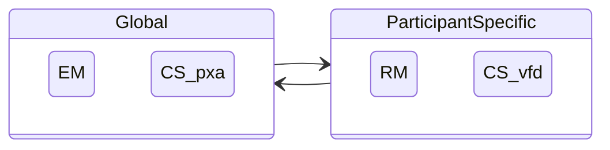

## Interactions Between the RM and EM Models {#sec:rm_em_interactions}

There are additional constraints on how the [RM](../rm/) and [EM](../em/) processes interact.

### Start Embargo Negotiations As Early as Possible

!!! note ""

    The [EM](../em/) process
    MAY begin (i.e., the initial _propose_ transition
    $q^{em} \in N \xrightarrow{p} P$) prior to the report being sent to
    a potential Participant ($q^{rm} \in S$), for example, when a
    Participant wishes to ensure acceptable embargo terms prior to
    sharing a report with a potential recipient.

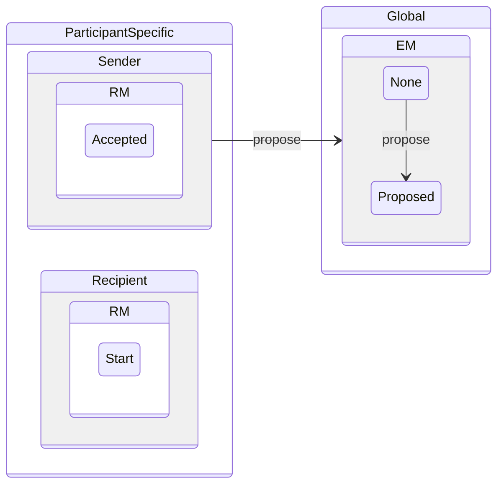

!!! note ""

    If it has not already begun, the [EM](../em/) process SHOULD begin when a recipient
    is in RM _Received_ ($q^{rm} \in R$) whenever possible.


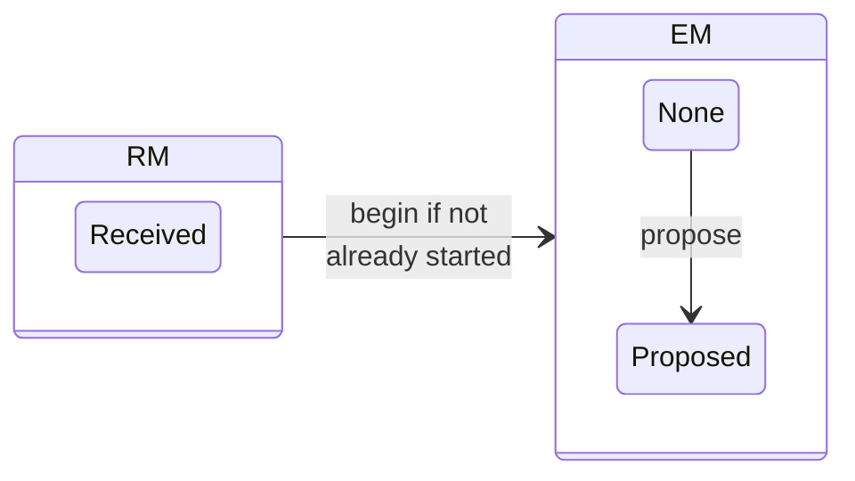

### Negotiate Embargoes for Active Reports

!!! note ""

    Embargo Management MAY begin in any of the active RM states
    ($q^{rm} \in \{ R,V,A \}$).

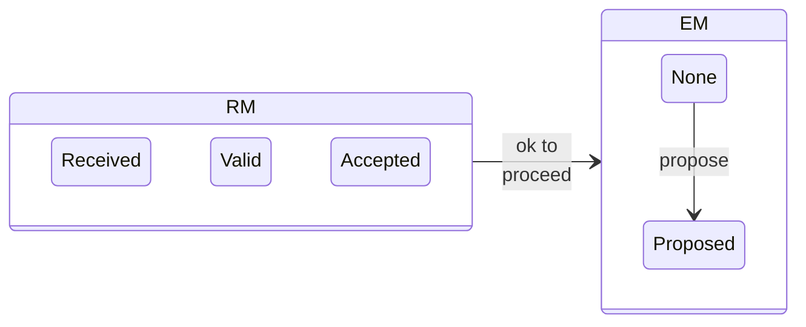

!!! note ""

    Embargo Management SHOULD NOT begin in an inactive RM state
    ($q^{rm} \in \{ I,D,C \}$).

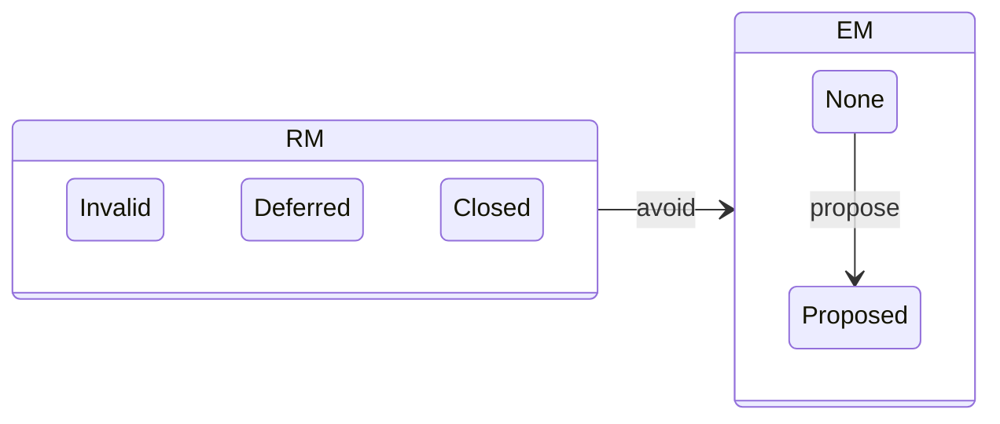


### Negotiate Embargoes Through Validation and Prioritization

!!! note ""

    Embargo Management MAY run in parallel to validation
    ($q^{rm} \in \{R,I\} \xrightarrow{\{v,i\}} \{V,I\}$) and
    prioritization ($q^{rm} \in V \xrightarrow{\{a,d\}} \{A,D\}$)
    activities.


### Renegotiate Embargoes While Reports Are Valid Yet Unclosed

!!! note ""

    EM revision proposals ($q^{em} \in A \xrightarrow{p} R$) and
    acceptance or rejection of those proposals
    (${q^{em} \in R \xrightarrow{\{a,r\}} A}$) MAY occur during any of
    the valid yet unclosed RM states (${q_{rm} \in \{ V,A,D \} }$).

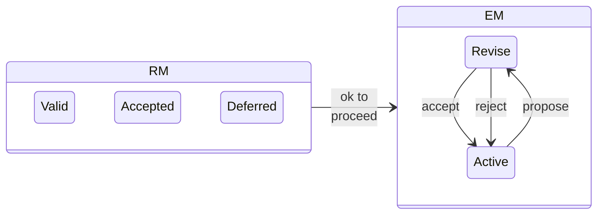

### Avoid Embargoes for Invalid Reports...

!!! note ""

    Embargo Management SHOULD NOT begin with a proposal from a
    Participant in RM _Invalid_ ($q^{rm} \in I$).

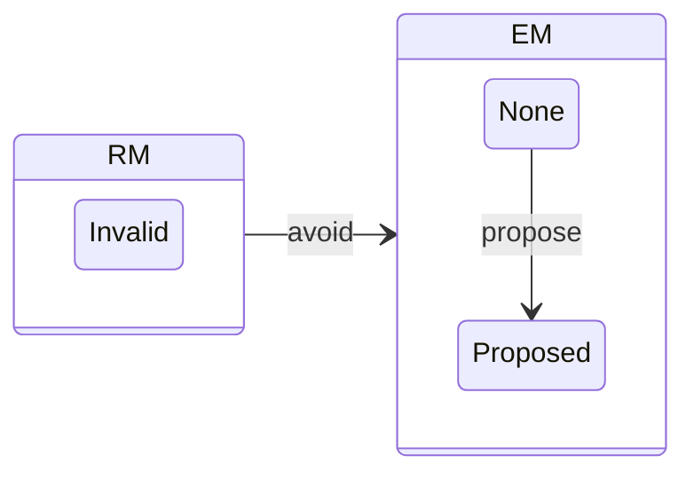

### ...but Don't Lose Momentum if Validation Is Pending

!!! note ""

    Outstanding embargo negotiations
    ($q^{em} \in P \xrightarrow{\{r,p\}} \{N,P\}$) MAY continue in
    RM _Invalid_
    ($q^{rm} \in I$) (e.g., if it is anticipated that additional
    information may be forthcoming to promote the report from _Invalid_
    to _Valid_) ($q^{rm} \in I \xrightarrow{v} V$).

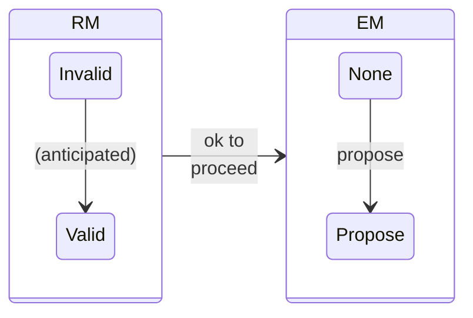

### Only Accept Embargoes for Possibly Valid Yet Unclosed Reports

!!! note ""

    Embargo Management MAY proceed from EM _Proposed_ to EM _Accepted_
    ($q^{em} \in P \xrightarrow{a} A$) when RM is neither _Invalid_ nor _Closed_
    ($q^{rm} \in \{R,V,A,D\}$).

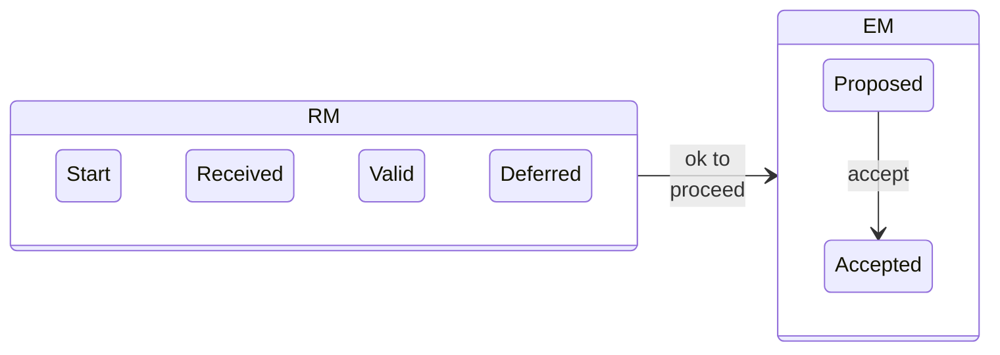

!!! note ""

    Embargo Management SHOULD NOT proceed from EM _Proposed_ to EM _Accepted_ when
    RM is _Invalid_
    or _Closed_ ($q^{rm} \in \{I,C\}$).

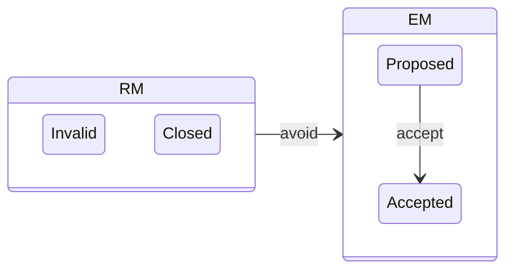

!!! note ""

    Embargo Management MAY proceed from EM _Proposed_ to EM _None_
    ($q^{em} \in P \xrightarrow{r} N$) when RM is _Invalid_ or _Closed_.

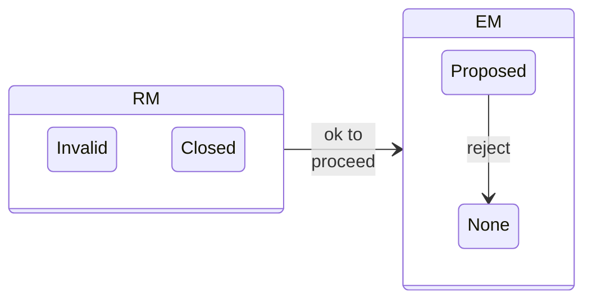

### Report Closure, Deferral, and Active Embargoes

!!! note ""

    Participants SHOULD NOT close reports
    ($q^{rm} \in \{I,D,A\} \xrightarrow{c} C$) while an embargo is
    active ($q^{em} \in \{ A,R \}$).

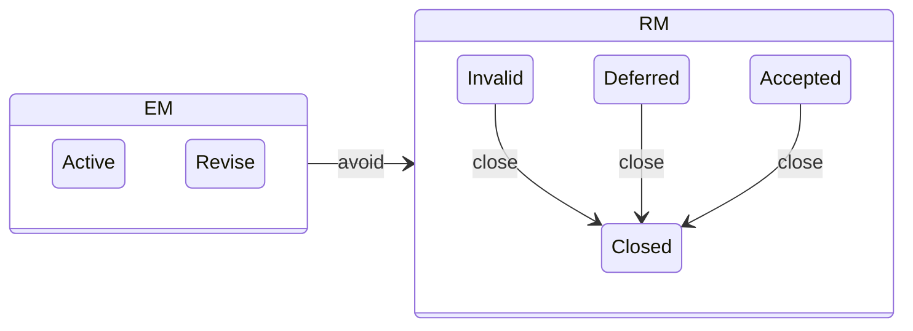


!!! note ""
  
    Instead, reports with no further tasks SHOULD be held in either
    _Deferred_ or _Invalid_ (${q^{rm} \in \{ D,I\}}$) (depending on the
    report validity status) until the embargo has terminated
    (${q^{em} \in X}$). This allows Participants to stop work on a
    report but still maintain their participation in an extant embargo.

!!! note ""

    Notwithstanding, Participants who choose to close a report
    ($q^{rm} \in \{I,D,A\} \xrightarrow{c} C$) while an embargo remains
    in force ($q^{em} \in \{A,R\}$) SHOULD communicate their intent to
    either continue to adhere to the embargo or terminate their
    compliance with it.

!!! note ""
  
    Report closure or deferral does not terminate an embargo. A
    Participant's closure or deferral ($q^{rm} \in \{C,D\}$) of a report
    while an embargo remains active ($q^{em} \in \{A,R\}$) and while
    other Participants remain engaged ($q^{rm} \in \{R,V,A\}$) SHALL NOT
    automatically terminate the embargo.

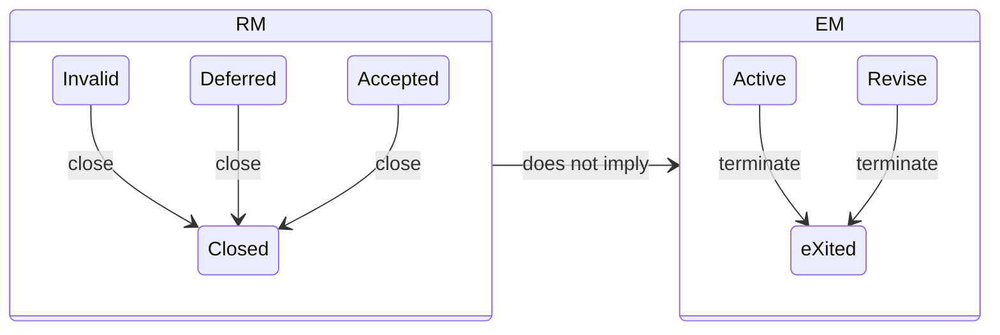
    

!!! note ""

    Any changes to a Participant's intention to adhere to an active
    embargo SHOULD be communicated clearly in addition to any necessary
    notifications regarding RM or EM state changes.

## RM - CVD and EM - CVD Model Interactions {#sec:rm_cvd}

???+ note inline end "CS Transition Symbols Defined"

    As a reminder, the CS transition symbols ($\Sigma^{cs}$) from the Householder and Spring 2021 report
    [@householder2021state] are represented as bold capital letters.

    $$\Sigma^{cs} = \{ \mathbf{V},~\mathbf{F},~\mathbf{D},~\mathbf{P},~\mathbf{X},~\mathbf{A} \}$$

The [RM](../rm/) and [EM](../em/) models interact with the [Case State Model](../cs/index.md).
Here we will review the constraints arising from the interaction of the [RM](../rm/) and [EM](../em/) 
models with each of the CS transition events represented by its symbols.

### Global vs. Participant-Specific Aspects of the CS Model.

The [CS model](../cs/index.md) encompasses both Participant-specific and global aspects of a
CVD case. In particular, the Vendor fix path substates&mdash;Vendor unaware (_vfd_),
Vendor aware (_Vfd_), fix ready (_VFd_), and fix deployed (_VFD_)&mdash;are
specific to each Vendor Participant in a case. On the other hand, the
remaining substates represent global facts about the case
status&mdash;public awareness (_p,P_), exploit public (_x,X_), and attacks
observed (_a,A_). This local versus global distinction will become
important in the [Formal Protocol](../../formal_protocol/) definition.

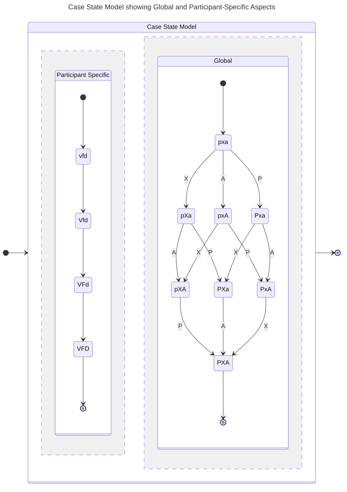

### Vendor Notification

???+ note inline end "Vendor Notification Formalized"

    $$q^{rm} \in S \xrightarrow{r} R$$
    
    $$q^{cs} \in vfd\cdot\cdot\cdot \xrightarrow{\mathbf{V}} Vfd\cdot\cdot\cdot$$


Vendor Awareness (**V**) occurs when a Participant&mdash;typically a
Finder, Coordinator, or another Vendor&mdash;is in RM _Accepted_ and notifies the Vendor.
In turn, the Vendor starts in $q^{rm} = Received$ and proceeds to follow their validation and prioritization routines.
We previously outlined this in Table
{== [\[tab:participant_rm_actions\]](#tab:participant_rm_actions){reference-type="ref"
reference="tab:participant_rm_actions"} ==}.

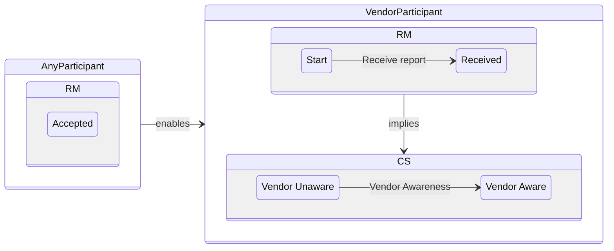

Depending on which parties are involved in a CVD case, the [EM](../em/) process might already be underway prior
to Vendor notification (e.g., $q^{em} \in \{P,A,R\}$). For example, a
Reporter and Coordinator might have already agreed to a disclosure
timeline. Or, in an MPCVD case, other Vendors may have already been
coordinating the case under an embargo and only recently realized the
need to engage with a new Vendor on the case. The latter example is
consistent with public narratives about the Meltdown/Spectre
vulnerabilities [@wright2018meltdown].


!!! note ""

    Once a case has reached $q^{cs} \in Vfdpxa$ for at least one Vendor,
    if the EM process has not started, it SHOULD begin as soon as possible.

!!! note ""

    Any proposed embargo SHOULD be decided (_accept_, _reject_) soon
    after the first Vendor is notified.

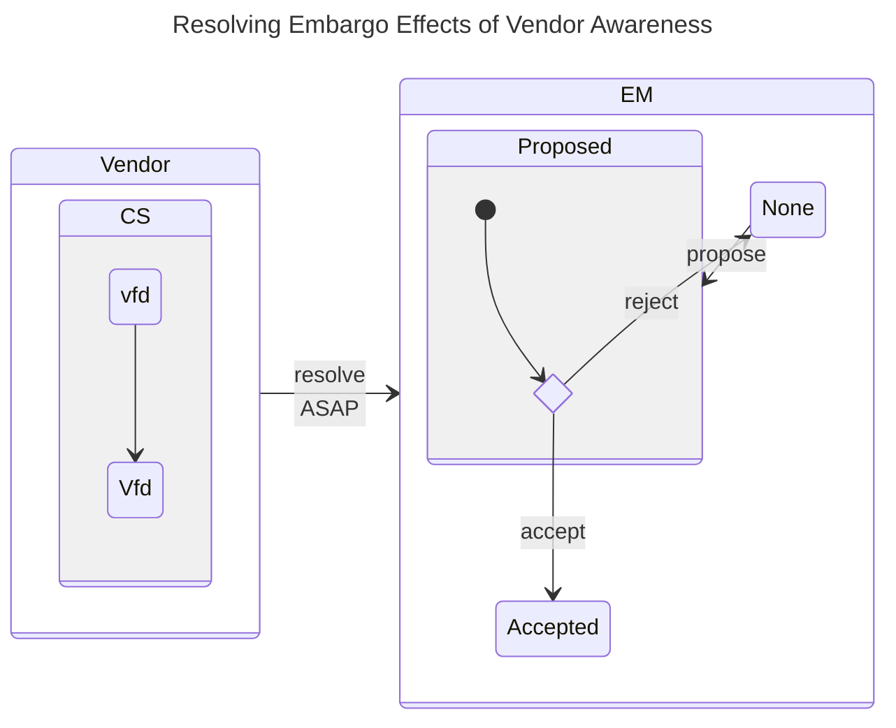

???+ note "Embargo Effects of Vendor Awareness Formalized"
    
    $$q^{cs} \in Vfdpxa \implies q^{em} \in
        \begin{cases}
            None \xrightarrow{propose} Proposed \\
            Proposed \begin{cases}
                \xrightarrow{reject} None \\
                \xrightarrow{accept} Accepted \\
            \end{cases} \\
            Accepted \\
            Revise \\
        \end{cases}$$

### Fix Ready {#sec:cs_f_em}

Fix Readiness (**F**) can occur only when a Vendor is in the
_Accepted_ state. As a reminder, in MPCVD cases, each affected Vendor has their own
[RM](../rm/) state, so this constraint applies to each Vendor individually.
With respect to [EM](../em/), when the case state is $q^{cs} \in VF\cdot pxa$, it's usually too late to
start a new embargo.

!!! note ""

     Once a case has reached _Fix Ready_ ($q^{cs} \in VF\cdot pxa$),

    - New embargo negotiations SHOULD NOT start.
    - Proposed but not-yet-agreed-to embargoes SHOULD be rejected.
    - Existing embargoes ($q^{em} \in \{Active,~Revise\}$) MAY continue but SHOULD prepare to _terminate_ soon.

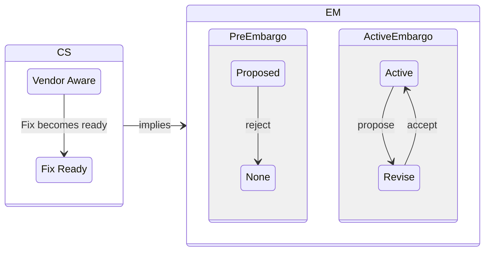

???+ note "Embargo Effects of Fix Readiness Formalized" 

    $$q^{cs} \in VF\cdot pxa \implies q^{em} \in
        \begin{cases}
            None \\
            Proposed \xrightarrow{reject} None \\
            Accepted \\
            Revise \\
        \end{cases}$$

!!! note ""
    
    In MPCVD cases, where some Vendors are likely to reach $q^{cs} \in VF\cdot\cdot\cdot\cdot$
    before others,

    -   Participants MAY propose an embargo extension to allow trailing
    Vendors to catch up before publication.
    -   Participants SHOULD accept reasonable extension proposals for such
    purposes when possible (e.g., when other constraints could still be
    met by the extended deadline).

### Fix Deployed

For vulnerabilities in systems where the Vendor controls deployment, the
Fix Deployment (**D**) event can only occur if the Vendor is in
$q^{rm} = Accepted$.

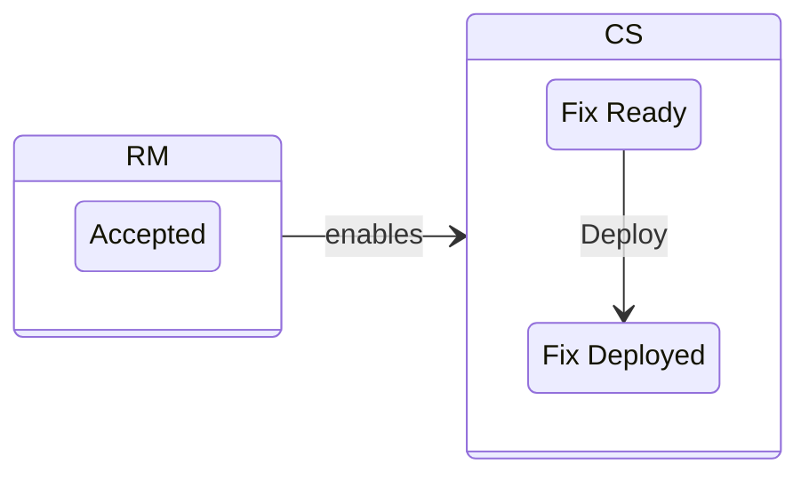

For vulnerabilities in systems where Public Awareness must precede
Deployment ($\mathbf{P} \prec \mathbf{D}$), the Vendor status at the
time of deployment might be irrelevant---assuming, of course, that they
at least passed through $q^{rm} = Accepted$ at some point as is required
for Fix Ready (**F**), which, in turn, is a prerequisite for
deployment (**D**).

!!! note ""

    As regards [EM](../em/), by
    the time a fix has been deployed ($q^{cs} \in VFD\cdot\cdot\cdot$),
    
    -   New embargoes SHOULD NOT be sought.
    -   Any existing embargo SHOULD terminate.

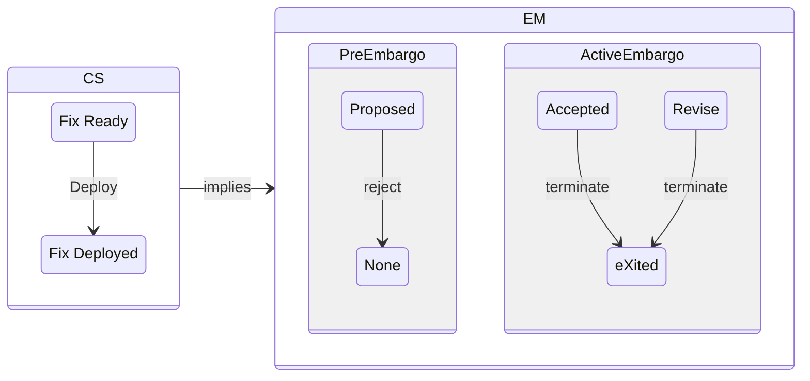

???+ note "Embargo Effects on reaching Fix Deployment Formalized"

    $$q^{cs} \in {VFD} \cdot\cdot\cdot \implies q^{em} \in
        \begin{cases}
            None \\
            Proposed \xrightarrow{reject} None \\
            Accepted \xrightarrow{terminate} eXited \\
            Revise \xrightarrow{terminate} eXited \\
        \end{cases}$$

As with the *Fix Ready* scenario in
§[1.2.2](#sec:cs_f_em){reference-type="ref" reference="sec:cs_f_em"},
MPCVD cases may
have Vendors in varying states of *Fix Deployment*. Therefore the
embargo extension caveats from that section apply to the *Fix Deployed*
state as well.

### Public Awareness

Within the context of a coordinated publication process, (**P**)
requires at least one Participant to be in the $q^{rm} = Accepted$ state
because Participants are presumed to publish only on cases they have
accepted. Ideally, the Vendor is among those Participants, but as
outlined in the *CERT Guide to Coordinated Vulnerability Disclosure*
[@householder2017cert], that is not strictly necessary.

That said, the publishing party might be outside of *any* existing
coordination process. For example, this is the situation when a report
is already in the midst of a CVD process and a party outside the
CVD case reveals the vulnerability publicly (e.g., parallel discovery, embargo leaks).

As for [EM](../em/), the whole point of an embargo is to prevent **P** from occurring until
other objectives (e.g., $q^{cs} \in VF\cdot px \cdot$) have been met. Therefore,

!!! note ""

    Once _Public Awareness_ has happened and the case state reaches
    $q^{cs} \in \cdot\cdot\cdot P \cdot\cdot$,

    -   New embargoes SHALL NOT be sought.
    -   Any existing embargo SHALL terminate.

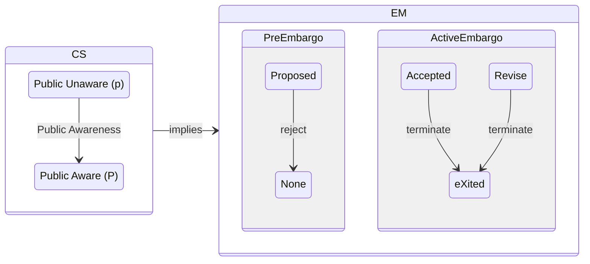

???+ note "Embargo Effects on reaching Public Awareness Formalized"

    $$q^{cs} \in \cdot\cdot\cdot P \cdot\cdot \implies q^{em} \in
        \begin{cases}
            None \\
            Proposed \xrightarrow{reject} None \\
            Accepted \xrightarrow{terminate} eXited \\
            Revise \xrightarrow{terminate} eXited \\
        \end{cases}$$

### Exploit Public

Exploit publishers may also be presumed to have a similar [RM](../rm/) state model for their own work.
Therefore, we can expect them to be in an RM _Accepted_ state at the time of exploit code publication (**X**).
However, we cannot presume that those who publish exploit code will be Participants in a pre-public CVD process.
That said,

!!! note ""  

    Exploit Publishers who *are* Participants in pre-public CVD cases ($q^{cs} \in \cdot\cdot\cdot p \cdot\cdot$)
    SHOULD comply with the protocol described here, especially when they also fulfill other roles 
    (e.g., Finder, Reporter, Coordinator, Vendor) in the process.

For example, as described in the Householder and Spring 2021 report [@householder2021state], the preference for
$\mathbf{P} \prec \mathbf{X}$ dictates that

!!! note ""

    Exploit Publishers SHOULD NOT release exploit code while an embargo
    is active ($q^{em} \in \{A,R\}$).

```mermaid
stateDiagram-v2
    direction LR
    state EM {
        state ActiveEmbargo {
            direction LR
            Accepted 
            Revise
            Revise --> Accepted
            Accepted --> Revise
        }
    }
    nox: Do not publish exploit
    EM --> nox

```

In the Householder and Spring 2021 report [@householder2021state], the
authors argue that public exploit code is either preceded by Public
Awareness (**P**) or immediately leads to it. Therefore,

!!! note ""

    Once Exploit Publication has occurred and the case state reaches $q^{cs} \in \cdot\cdot\cdot\cdot X \cdot$,
    
    - New embargoes SHALL NOT be sought.
    - Any existing embargo SHALL terminate.

```mermaid
stateDiagram-v2
    direction LR
    state CS {
        x: No Public Exploit (x)
        X: Exploit Public (X)

        x --> X : Exploit Publication
    }
    state EM {
        state PreEmbargo{ 
            Proposed --> None: reject
        }
        state ActiveEmbargo {
            Accepted --> eXited: terminate
            Revise --> eXited: terminate
        }
    }
    CS --> EM: implies
```

???+ note "Embargo Effects on reaching Exploit Public Formalized"

    $$q^{cs} \in \cdot\cdot\cdot\cdot X \cdot \implies q^{em} \in
        \begin{cases}
            None \\
            Proposed \xrightarrow{reject} None \\
            Accepted \xrightarrow{terminate} eXited \\
            Revise \xrightarrow{terminate} eXited \\
        \end{cases}$$

### Attacks Observed

Nothing in this or any other CVD process model should be interpreted as
constraining adversary activity.

!!! note ""

    Participants MUST treat attacks as an event that could occur at any
    time and adapt their process as needed in light of the available
    information.

As we outlined in [Early Termination](../em/early_termination.md), when attacks are occurring,
embargoes can often be of more benefit to adversaries than defenders.
However, we also acknowledged in
{== §[\[sec:transition_function\]](#sec:transition_function){reference-type="ref"
reference="sec:transition_function"} ==} that narrowly scoped attacks need
not imply widespread adversary knowledge of the vulnerability. In such
scenarios, it is possible that early embargo termination&mdash;leading to
publication&mdash;might be of more assistance to other adversaries than it
is to defenders. Thus, we need to allow room for Participant judgment
based on their case-specific situation awareness. Formally, 

!!! note ""

    Once Attacks have been observed and the case state reaches $q^{cs} \in \cdot\cdot\cdot\cdot\cdot A$,

    - New embargoes SHALL NOT be sought.
    - Any existing embargo SHOULD terminate.


```mermaid
stateDiagram-v2
    direction LR
    state CS {
        a: No Attacks Observed
        A: Attacks Observed

        a --> A : Attack Observation
    }
    state EM {
        state PreEmbargo{ 
            Proposed --> None: reject
        }
        state ActiveEmbargo {
            Accepted --> eXited: terminate
            Revise --> eXited: terminate
        }
    }
    CS --> EM: implies
```

???+ note "Embargo Effects on reaching Attacks Observed Formalized"
    $$q^{cs} \in \cdot\cdot\cdot\cdot\cdot A \implies q^{em} \in
        \begin{cases}
            None \\
            Proposed \xrightarrow{reject} None \\
            Accepted \xrightarrow{terminate} eXited \\
            Revise \xrightarrow{terminate} eXited \\
        \end{cases}$$
