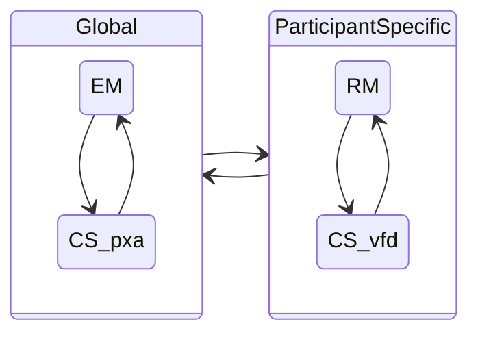

# Model Interactions {#ch:interactions}

Here we reflect on the interactions between the [RM](../rm/), [EM](../em/), and [CS](../cs/) models within the
overall MPCVD process.

## Global vs Participant Specific Aspects

Some aspects of the MPCVD process are global, while others are specific to a
Participant. Specifically, the [RM](../rm/) process is unique to each Participant, while the
[EM](../em/) process is global to all Participants in a case.
The [CS](../cs/) process is a hybrid: some aspects are global, while others are
Participant-specific, which we will discuss in more detail below.
Interactions between all these processes affect the overall MPCVD process for a case. 
The following diagram illustrates this distinction.

### Global vs. Participant-Specific Aspects of the CS Model.

The [CS model](../cs/) encompasses both Participant-specific and global aspects of a
CVD case. In particular, the Vendor fix path substates&mdash;Vendor unaware (_vfd_),
Vendor aware (_Vfd_), fix ready (_VFd_), and fix deployed (_VFD_)&mdash;are
specific to each Vendor Participant in a case. On the other hand, the
remaining substates represent global facts about the case
status&mdash;public awareness (_p,P_), exploit public (_x,X_), and attacks
observed (_a,A_). This local versus global distinction will become
important in the [Formal Protocol](../../formal_protocol/) definition.



